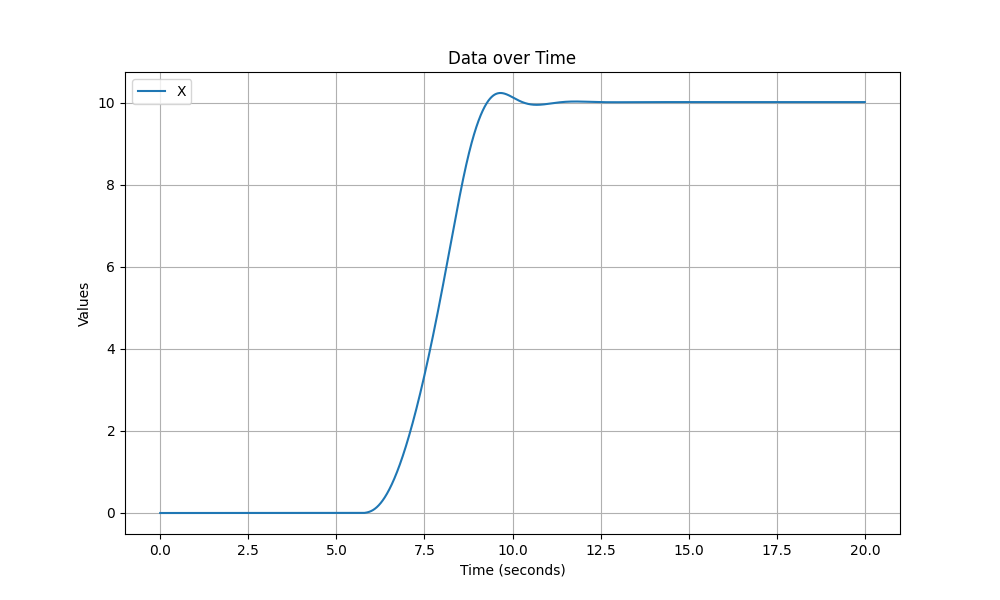

[English](README.md) ｜ 日本語

# これは何？

箱庭のドローン制御設計を理解するとともに、その制御パラメータを評価・シミュレーションする方法を説明します。

- [ドローン制御設計](#ドローン制御設計)
- [パラメータ評価用のツール](#パラメータ評価用のツール)
- [評価ツール実行方法](#評価ツール実行方法)
- [eval-ctrl.bash](#eval-ctrlbash)

# ドローン制御設計

箱庭ドローンシミュレータは、Python API を利用して、ドローンを飛行させることができます。
このドローン飛行において、機体の位置や速度制御は箱庭内部の制御プログラムがその役割をになっています。

機体制御の設計は下図のとおりです。


制御プログラムは、Python API と PS4コントローラから入力を受け付けることができます。

Python API の場合は、目標値をそのまま制御プログラムに渡します。
PS4コントローラの場合は、Radio Control側で目標値を内部管理し、制御プログラムに渡します。

各目標値に従い、機体制御プログラムはそれぞれPID制御を行い、最終的にドローン物理モデルに推力とトルクを与えます。そして、物理モデルは、数値シミュレーション結果を制御プラグラムにフィードバックします。

物理モデルおよび制御プログラムには様々なパラメータがあり、以下のファイルで管理しています。

- Python API 制御向け
  - 物理：[hakoniwa/config/api_sample/drone_config_0.json](../../hakoniwa/config/api_sample/drone_config_0.json)
  - 制御：[drone_control/config/param-api.txt](../../drone_control/config/param-api.txt)
- PS4コントローラ制御向け
  - 物理：[hakoniwa/config/rc/drone_config_0.json](../../hakoniwa/config/rc/drone_config_0.json)
  - 制御：[drone_control/config/param-rc.txt](../../drone_control/config/param-rc.txt)

物理向けのパラメータ説明は[こちら](https://github.com/toppers/hakoniwa-px4sim/blob/main/hakoniwa/README-ja.md#%E6%A9%9F%E4%BD%93%E3%81%AE%E3%83%91%E3%83%A9%E3%83%A1%E3%83%BC%E3%82%BF%E8%AA%AC%E6%98%8E)を参照ください。

制御向けのパラメータ説明は[data-flow.xlsx](./data-flow.xlsx)の`Param`シートを参照ください。

# パラメータ評価用のツール

パラメータ評価のツールとして以下を用意しています。

- 姿勢角度制御評価ツール
- 速度制御評価ツール
- 位置制御評価ツール

各種評価ツールは、bashスクリプト[eval-ctrl.bash](../../hakoniwa/eval-ctrl.bash)がフロントエンドとして提供されています。スクリプト仕様は[こちら](#eval-ctrl.bash)を参照ください。


# 評価ツール実行方法

評価ツールを実行するための手順を説明します。

先述の通り、評価ツール `eval-ctrl.bash` は、全ての制御を評価できます。実行ディレクトリは、`hakniwa-px4sim/hakoniwa`としてください。

## 事前準備

本ツール実行時、以下のパラメータファイルを設定する必要があります。

- Python API 制御向けで、位置制御を評価します。
  - 物理：[hakoniwa/config/api_sample/drone_config_0.json](../../hakoniwa/config/api_sample/drone_config_0.json)
  - 制御：[drone_control/config/param-api.txt](../../drone_control/config/param-api.txt)
- PS4コントローラ制御向けで、姿勢角度制御と速度制御を評価します。
  - 物理：[hakoniwa/config/rc/drone_config_0.json](../../hakoniwa/config/rc/drone_config_0.json)
  - 制御：[drone_control/config/param-rc.txt](../../drone_control/config/param-rc.txt)

また、合否判定を行うパラメータファイル[control_evaluate_sample.json](../../hakoniwa/python/control_evaluate_sample.json)を編集してください。編集対象となるパラメータについては、[eval-ctrl.bash](#eval-ctrlbash)の説明を参照ください。なお、合否判定が不要な場合は、編集不要です。

なお、PS4コントローラ制御向けの評価をする場合、[drone_control/config/param-rc.txt](../../drone_control/config/param-rc.txt)の`RADIO_CONTROL_USE_SPD_CTRL`を制御内容に応じて変更してください。

- 姿勢角度制御の評価の場合：0
- 速度制御の評価の場合：1

## 姿勢角度制御の評価方法

ロール角を10度にする場合は以下のように実行します。

```
bash eval-ctrl.bash -1 Rx:10 Ry:0
```

成功すると以下のように出力されます。

出力：
```
OK c(Steady state value)  : 10.001   (Target: 10±0.100 m)
OK T_r(Rise time)         : 0.348 s (Target: ≤ 10.000 s)
OK T_d(Delay time)        : 0.105 s (Target: ≤ 5.000 s)
OK O_s(Maximum overshoot) : 0.002   (Target: ≤ 1.000 m)
OK T_s(5% settling time)  : 0.534 s (Target: ≤ 20.000 s)
```

また、以下のコマンドでグラフ化できます。

```
python python/hako_TimelineAnalyzer.py --columns Rx --diff  drone_log0/drone_dynamics.csv  --start_time 0 --duration 10
```


## 速度制御の評価方法


北方向の速度を5m/secにする場合は以下のように実行します。

```
bash eval-ctrl.bash -1 Vx:5 Vy:0
```

成功すると以下のように出力されます。

出力：
```
NG c(Steady state value)  : 4.608   (Target: 5±0.050 m)
OK T_r(Rise time)         : 1.719 s (Target: ≤ 10.000 s)
OK T_d(Delay time)        : 1.038 s (Target: ≤ 5.000 s)
OK O_s(Maximum overshoot) : 0.021   (Target: ≤ 1.000 m)
OK T_s(5% settling time)  : 2.172 s (Target: ≤ 20.000 s)
```

また、以下のコマンドでグラフ化できます。

```
python python/hako_TimelineAnalyzer.py --columns Vx --diff  drone_log0/drone_dynamics.csv  --start_time 0 --duration 10
```


## 位置制御の評価方法


北方向に位置を10mまで、5m/secで移動させる場合は以下のように実行します。

```
bash eval-ctrl.bash -1 X:10 Y:0 S:5
```

成功すると以下のように出力されます。

出力：
```
OK c(Steady state value)  : 10.010   (Target: 10±0.100 m)
OK T_r(Rise time)         : 2.112 s (Target: ≤ 10.000 s)
OK T_d(Delay time)        : 2.175 s (Target: ≤ 5.000 s)
OK O_s(Maximum overshoot) : 0.226   (Target: ≤ 1.000 m)
OK T_s(5% settling time)  : 3.285 s (Target: ≤ 20.000 s)
```

また、以下のコマンドでグラフ化できます。

```
python python/hako_TimelineAnalyzer.py --columns X --diff  drone_log0/drone_dynamics.csv  --start_time 0 --duration 20
```




# eval-ctrl.bash

## 概要
`eval-ctrl.bash`スクリプトは、箱庭ドローンシミュレーターの制御パラメータを評価するためのツールです。このスクリプトは、指定された条件でシミュレーションを実行し、その結果を評価します。

## 使用法
```bash
eval-ctrl.bash <stop_time> <tkey:tvalue> <key:value> <S:targetSpeed>
```

## 引数
- `<stop_time>`: 指定した目標値を0にするまでの時間を秒単位で指定します。急停止させた時の性能を測定するために使用します。目標値を0にしない場合、-1を設定してください。
- `<tkey:tvalue>`: 評価対象とする軸とその目標値を指定します。例: `Rx:20`。
- `<key:value>`: テスト軸と一緒に設定する目標値を指定します。例: `Ry:10`。
- `<S:targetSpeed>`: (オプション) 位置制御の場合のみ使用します。目標速度を指定できます。例：`S:5`。未指定の場合は5m/secが使用されます。


**姿勢角度制御の評価をする場合:**

Rx, Ryを設定してください。Rxがロール角度、Ryがピッチ角度になります。単位は、degreeです。

**速度制御の評価をする場合:**

Vx, Vyを設定してください。Vxが北方向の速度、Vyが東方向の速度になります。単位は、m/secです。

**位置制御の評価をする場合:**

X, Y, および S を設定してください。Xが北方向の位置、Yが東方向の位置になります。単位は、mです。
Sは移動速度で、単位は、m/secです。


## 出力

評価結果は、標準出力に以下の形式で出力されます。

```
OK c(Steady state value)  : 0.007   (Target: 0±0.250 m)
OK T_r(Rise time)         : 5.328 s (Target: ≤ 10.000 s)
OK T_d(Delay time)        : 3.456 s (Target: ≤ 5.000 s)
OK O_s(Maximum overshoot) : 0.234   (Target: ≤ 1.000 m)
OK T_s(5% settling time)  : 6.549 s (Target: ≤ 20.000 s)
```

- cは、制御対象の目標値です。
- T_r は、立ち上がり時間です。
- T_d は、遅れ時間です。
- O_s は、オーバーシュート量です。
- T_s は、制定時間です。

合否判定は、[control_evaluate_sample.json](../../hakoniwa/python/control_evaluate_sample.json)のパラメータで制御できます。

- T_r: TARGET_TR
- T_d: TARGET_TD
- O_s: TARGET_OS
- T_s: TARGET_TS
- 目標値からのズレ幅(分散): TARGET_CV
