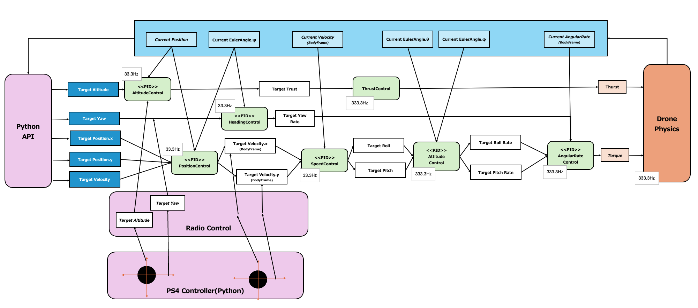
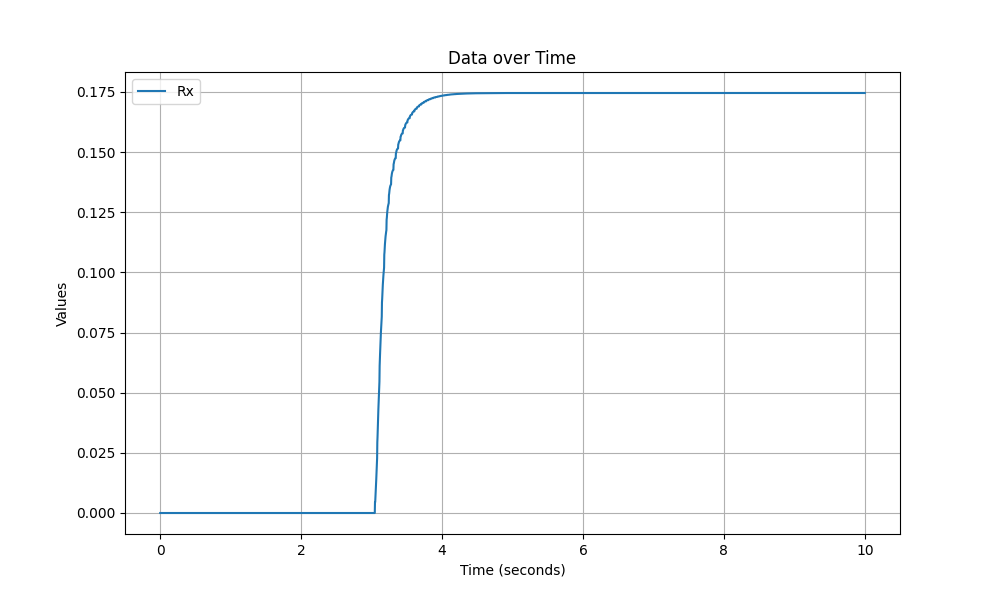
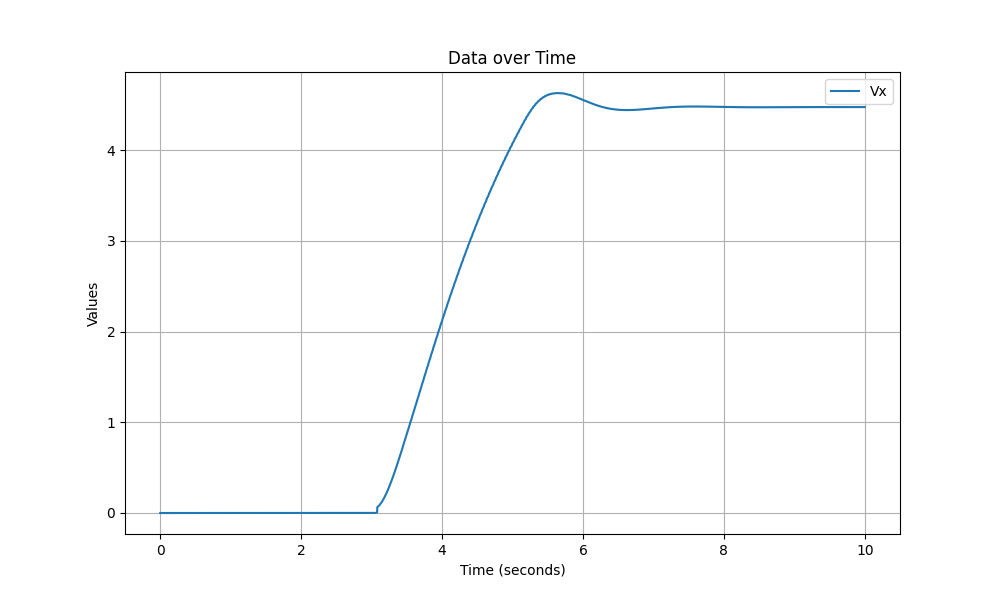
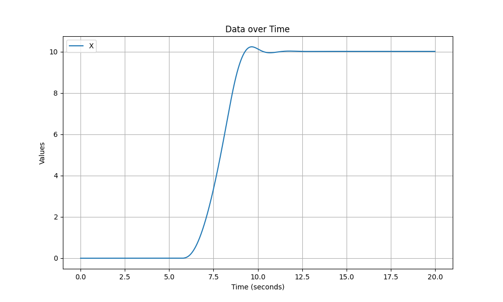

English ｜ [日本語](README-ja.md)

# What is this?

This document explains the design of Hakoniwa drone control, as well as how to evaluate and simulate its control parameters.

- [Drone Control Design](#drone-control-design)
- [Tools for Parameter Evaluation](#tools-for-parameter-evaluation)
- [How to Run the Evaluation Tool](#how-to-run-the-evaluation-tool)
- [eval-ctrl.bash](#eval-ctrlbash)

# Drone Control Design

The Hakoniwa Drone Simulator can be used to fly drones using the Python API. In this drone flight, the internal control program of Hakoniwa plays a role in controlling the position and speed of the aircraft.

The design of the aircraft control is as shown in the diagram below.



The control program can receive input from the Python API and the PS4 controller.

- **Python API**: Passes the target value directly to the control program.
- **PS4 Controller**: Manages the target value internally on the Radio Control side and passes it to the control program.

According to each target value, the aircraft control program performs PID control, ultimately applying thrust and torque to the drone's physical model. The physical model then provides feedback on the numerical simulation results to the control program.

Various parameters for the physical model and control program are managed in the following files.

- **For Python API Control**:
  - Physical: [hakoniwa/config/api_sample/drone_config_0.json](../../hakoniwa/config/api_sample/drone_config_0.json)
  - Control: [drone_control/config/param-api.txt](../../drone_control/config/param-api.txt)
- **For PS4 Controller Control**:
  - Physical: [hakoniwa/config/rc/drone_config_0.json](../../hakoniwa/config/rc/drone_config_0.json)
  - Control: [drone_control/config/param-rc.txt](../../drone_control/config/param-rc.txt)

For descriptions of physical parameters, refer to [this link](https://github.com/toppers/hakoniwa-px4sim/blob/main/hakoniwa/README-ja.md#%E6%A9%9F%E4%BD%93%E3%81%AE%E3%83%91%E3%83%A9%E3%83%A1%E3%83%BC%E3%82%BF%E8%AA%AC%E6%98%8E).

For descriptions of control parameters, refer to the `Param` sheet in [data-flow.xlsx](./data-flow.xlsx).

# Tools for Parameter Evaluation

The following tools are available for parameter evaluation.

- Attitude Angle Control Evaluation Tool
- Speed Control Evaluation Tool
- Position Control Evaluation Tool

Each evaluation tool is provided with the bash script [eval-ctrl.bash](../../hakoniwa/eval-ctrl.bash) as the frontend. For the script specification, see [here](#eval-ctrlbash).

# How to Run the Evaluation Tool

This section explains the steps to run the evaluation tool.

As mentioned earlier, the evaluation tool `eval-ctrl.bash` can evaluate all controls. The execution directory should be `hakniwa-px4sim/hakoniwa`.

## Preparation

Before running this tool, you need to set the following parameter files.

- **For Python API Control to evaluate position control**:
  - Physical: [hakoniwa/config/api_sample/drone_config_0.json](../../hakoniwa/config/api_sample/drone_config_0.json)
  - Control: [drone_control/config/param-api.txt](../../drone_control/config/param-api.txt)
- **For PS4 Controller Control to evaluate attitude angle control and speed control**:
  - Physical: [hakoniwa/config/rc/drone_config_0.json](../../hakoniwa/config/rc/drone_config_0.json)
  - Control: [drone_control/config/param-rc.txt](../../drone_control/config/param-rc.txt)

Additionally, edit the parameter file [control_evaluate_sample.json](../../hakoniwa/python/control_evaluate_sample.json) for pass/fail judgment. For details on the parameters to be edited, refer to the description of [eval-ctrl.bash](#eval-ctrlbash). If pass/fail judgment is not required, editing is unnecessary.

When evaluating with the PS4 controller control, change `RADIO_CONTROL_USE_SPD_CTRL` in [drone_control/config/param-rc.txt](../../drone_control/config/param-rc.txt) according to the control content.

- **For evaluating attitude angle control**: 0
- **For evaluating speed control**: 1

## How to Evaluate Attitude Angle Control

To set the roll angle to 10 degrees, execute the following command:

```bash
bash eval-ctrl.bash -1 Rx:10 Ry:0
```

If successful, the following output will be displayed:

```
OK c(Steady state value)  : 10.001   (Target: 10±0.100 m)
OK T_r(Rise time)         : 0.348 s (Target: ≤ 10.000 s)
OK T_d(Delay time)        : 0.105 s (Target: ≤ 5.000 s)
OK O_s(Maximum overshoot) : 0.002   (Target: ≤ 1.000 m)
OK T_s(5% settling time)  : 0.534 s (Target: ≤ 20.000 s)
```

You can also graph it with the following command:

```bash
python python/hako_TimelineAnalyzer.py --columns Rx --diff  drone_log0/drone_dynamics.csv  --start_time 0 --duration 10
```



## How to Evaluate Speed Control

To set the speed in the north direction to 5 m/sec, execute the following command:

```bash
bash eval-ctrl.bash -1 Vx:50 Vy:0
```

If successful, the following output will be displayed:

```
NG c(Steady state value)  : 4.608   (Target: 5±0.050 m)
OK T_r(Rise time)         : 1.719 s (Target: ≤ 10.000 s)
OK T_d(Delay time)        : 1.038 s (Target: ≤ 5.000 s)
OK O_s(Maximum overshoot) : 0.021   (Target: ≤ 1.000 m)
OK T_s(5% settling time)  : 2.172 s (Target: ≤ 20.000 s)
```

You can also graph it with the following command:

```bash
python python/hako_TimelineAnalyzer.py --columns Vx --diff  drone_log0/drone_dynamics.csv  --start_time 0 --duration 10
```



## How to Evaluate Position Control

To move to a position 10m in the north direction at a speed of 5m/sec, execute the following command:

```bash
bash eval-ctrl.bash -1 X:5 Y:0 S:5
```

If successful, the following output will be displayed:

```
OK c(Steady state value)  : 10.010   (Target: 10±0.100 m)
OK T_r(Rise time)         : 2.112 s (Target: ≤ 10.000 s)
OK T_d(Delay time)        : 2.175 s (Target: ≤ 5.000 s)
OK O_s(Maximum overshoot) : 0.226   (Target: ≤ 1.000 m)
OK T_s(5% settling time)  : 3.285 s (Target: ≤ 20.000 s)
```

You can also graph it with the following command:

```bash
python python/hako_TimelineAnalyzer.py --columns X --

```bash
diff  drone_log0/drone_dynamics.csv  --start_time 0 --duration 20
```



# eval-ctrl.bash

## Overview
The `eval-ctrl.bash` script is a tool for evaluating the control parameters of the Hakoniwa Drone Simulator. This script runs the simulation under specified conditions and evaluates the results.

## Usage
```bash
eval-ctrl.bash <stop_time> <tkey:tvalue> <key:value> <S:targetSpeed>
```

## Arguments
- `<stop_time>`: Specifies the time in seconds to stop the simulation. Use to measure performance when stopping suddenly. If the target value is not set to zero, use -1.
- `<tkey:tvalue>`: Specifies the axis to be evaluated and its target value. Example: `Rx:20`.
- `<key:value>`: Specifies the target value to set along with the test axis. Example: `Ry:10`.
- `<S:targetSpeed>`: (Optional) Used only for position control. You can specify the target speed. Example: `S:5`. If not specified, 5m/sec will be used.

**To evaluate attitude angle control:**

Set Rx and Ry. Rx is the roll angle, and Ry is the pitch angle. The unit is degrees.

**To evaluate speed control:**

Set Vx and Vy. Vx is the speed in the north direction, and Vy is the speed in the east direction. The unit is m/sec.

**To evaluate position control:**

Set X, Y, and S. X is the position in the north direction, Y is the position in the east direction. The unit is meters. S is the moving speed, and the unit is m/sec.

## Output

The evaluation results are output in the following format on the standard output.

```
OK c(Steady state value)  : 0.007   (Target: 0±0.250 m)
OK T_r(Rise time)         : 5.328 s (Target: ≤ 10.000 s)
OK T_d(Delay time)        : 3.456 s (Target: ≤ 5.000 s)
OK O_s(Maximum overshoot) : 0.234   (Target: ≤ 1.000 m)
OK T_s(5% settling time)  : 6.549 s (Target: ≤ 20.000 s)
```

- `c` is the steady state value of the control target.
- `T_r` is the rise time.
- `T_d` is the delay time.
- `O_s` is the maximum overshoot.
- `T_s` is the 5% settling time.

The pass/fail criteria can be controlled by the parameters in [control_evaluate_sample.json](../../hakoniwa/python/control_evaluate_sample.json).

- `T_r`: TARGET_TR
- `T_d`: TARGET_TD
- `O_s`: TARGET_OS
- `T_s`: TARGET_TS
- Deviation from the target value (variance): TARGET_CV

