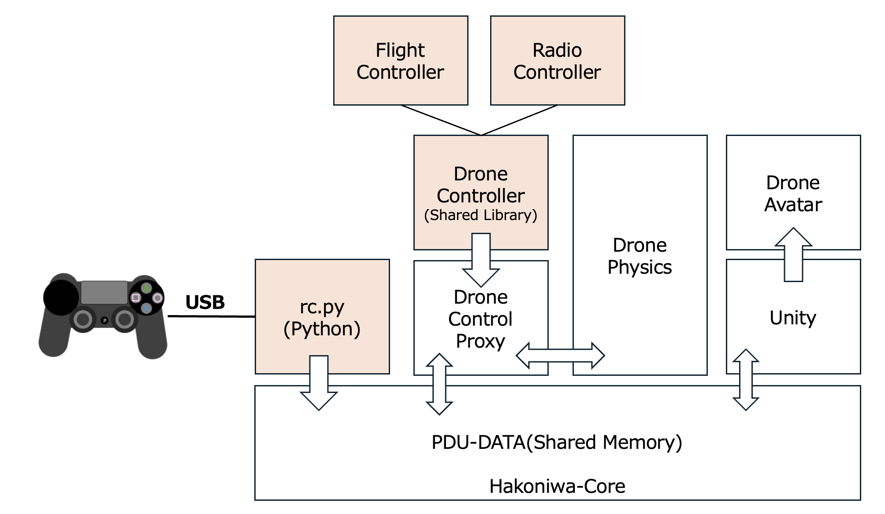
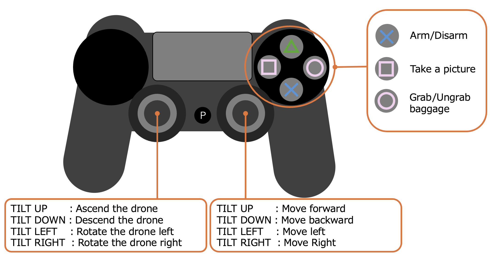

English ｜ [日本語](README-ja.md)

# Introduction
This manual explains how to operate drones using a PS4 controller.

# Setup

## Required Equipment

* PS4 controller
* USB connection cable

## Required Software

* Python 3.12
* [Expected environment for Hakoniwa Drone Simulator](https://github.com/toppers/hakoniwa-px4sim/blob/main/README.md)

# Architecture

## Configuration

The configuration for operating the Hakoniwa Drone Simulator with a PS4 controller is illustrated below.



The operations on the USB-connected PS4 controller are analyzed by the Python program [rc.py](https://github.com/toppers/hakoniwa-px4sim/blob/main/drone_api/sample/rc.py), and transmitted as PDU data to Hakoniwa.

The transmitted PDU data is received by the DroneControlProxy program. DroneControlProxy loads the user-defined drone control model as a loadable module and bypasses the control data. The loadable module to be loaded is specified in the drone's parameter definition file. The control programs that enable operation via the PS4 controller are RadioController and FlightController.

* [RadioController](https://github.com/toppers/hakoniwa-px4sim/tree/main/drone_control/workspace/RadioController)
  * A control program that operates the drone from the perspective of the body coordinate system (provides a traditional drone remote control experience).
* [FlightController](https://github.com/toppers/hakoniwa-px4sim/tree/main/drone_control/workspace/FlightController)
  * A control program that operates the drone from the perspective of the ground coordinate system.

The control data propagates to DronePhysics, where it affects the drone's position and posture according to its physical model. Unity periodically receives this data and visualizes it as a DroneAvatar.

## Installation Instructions

1. [Install the Hakoniwa Drone Simulator](https://github.com/toppers/hakoniwa-px4sim/blob/main/hakoniwa/README.md)
2. [Build the Hakoniwa Drone Control Program](https://github.com/toppers/hakoniwa-px4sim/blob/main/drone_control/README.md)
3. [Install the Hakoniwa Drone Python Library](https://github.com/toppers/hakoniwa-px4sim/blob/main/drone_api/README.md)

# How to Run the Simulation

Open two terminals and start the programs in the following order:

Terminal A:
```
cd hakoniwa
bash drone-app.bash <path/to>/hakoniwa-unity-drone-model ./config/rc
```


Terminal B:
```
cd drone_api/sample
python3.12 rc.py <path/to>/hakoniwa-unity-drone-model/custom.json
```


Next, launch Unity and click the START button to begin the simulation.

To stop the simulation, shut down the programs in the reverse order of startup.

# Basic Operation

The drone operation conforms to [Mode 2](https://atcl-dsj.com/useful/2264/#:~:text=%E3%83%BB%E3%83%A2%E3%83%BC%E3%83%89%EF%BC%92%E3%81%AE%E6%93%8D%E4%BD%9C%E6%96%B9%E6%B3%95&text=%E3%83%A2%E3%83%BC%E3%83%89%EF%BC%92%E3%81%AE%E6%93%8D%E4%BD%9C%E6%96%B9%E6%B3%95%E3%81%A8%E3%81%97%E3%81%A6%E3%81%AF%E3%80%81%E3%83%A2%E3%83%BC%E3%83%89%EF%BC%91%E3%81%A8,%E3%82%92%E8%A1%8C%E3%81%A3%E3%81%A6%E3%81%84%E3%81%8D%E3%81%BE%E3%81%99%E3%80%82) specifications (see below).



Follow these steps to verify the drone's operation:

1. Start the Hakoniwa Drone Simulation.
2. Press the X button to rotate the propellers.
3. Tilt the left stick UP to ascend.
4. Tilt the left stick DOWN to descend.
5. Tilt the left stick LEFT/RIGHT to turn left or right.
6. Tilt the right stick UP to move forward.
7. Tilt the right stick DOWN to move backward.
8. Tilt the right stick LEFT/RIGHT to move left or right.

## Advanced Operations

In the Hakoniwa Drone Simulator, you can interact with objects on Unity with the drone:

* Press the square button to take a picture with the camera in front of the drone and output it as the file `drone_api/sample/scene.png`.
* Press the circle button to pick up cargo placed within 50 cm below the drone. Pressing the button again releases the cargo.


Here's the English translation of your text:

During flight, you can realistically display the camera mounted in front of the drone.

Terminal C:
```
cd drone_api/sample
python3.12 camera.py <path/to>/hakoniwa-unity-drone-model/custom.json
```

If successful, the camera footage will pop up.
