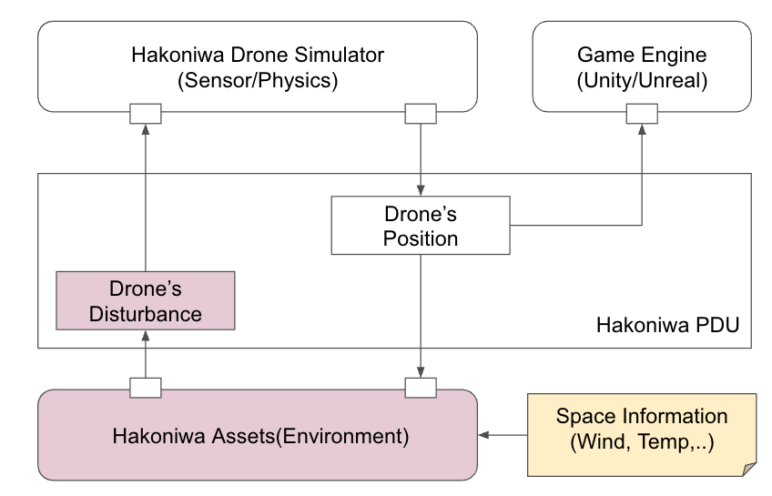
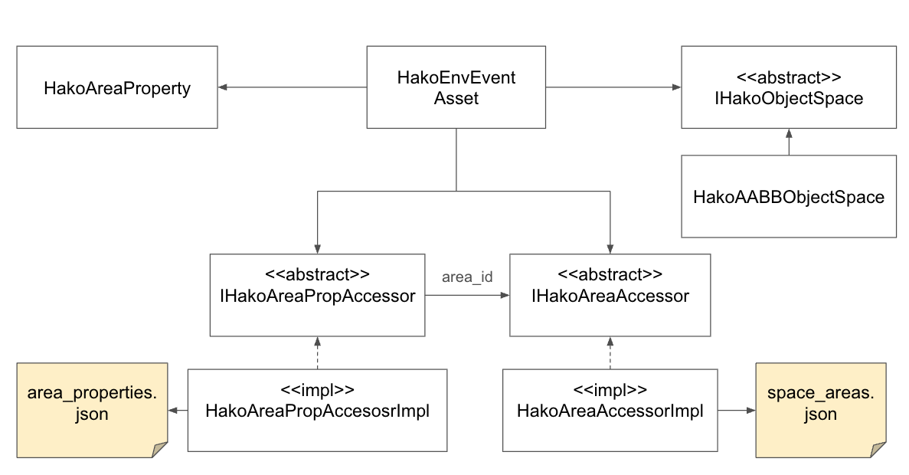

[English](README.md) ｜ 日本語

# これは何？

このドキュメントは、箱庭ドローンシミュレータでの環境要因に基づくシミュレーション機能について説明します。
例えば、風の影響をシミュレーション環境内で再現し、ドローンの飛行挙動にリアルな風力を適用することを目的としています。

# 箱庭の環境の考え方

箱庭では、特定の技術に依存せず、再利用可能な機能を提供することを目指しています。
そのため、環境データは`json`のようなプログラムで扱いやすいフォーマットで管理し、様々なプログラミング言語から柔軟に利用できる形にしたいと考えています。

ドローンのシミュレーションにおける環境要因を考慮する際、静的情報と動的情報を分けて管理することが効率的です。
例えば、位置情報は静的なものであり、データベース化しやすい要素です。
一方、天候情報（風、温度、湿度、雨など）は動的な要素であり、時間や場所に応じて変化します。

そこで、箱庭では、以下のように環境情報を管理することにしました。

- **空間情報**  
  空間情報として、任意の領域に一意のID（エリアID）を割り当てます。このエリアIDを用いることで、空間ごとの情報を簡単に参照できます。
  
- **空間プロパティ情報**  
  空間ごとのプロパティ情報として、風や温度、湿度などの静的・動的データがあります。これらはエリアIDとリンクし、特定の空間に関連付けられます。

箱庭では、これらの設計を基に、より柔軟かつ再利用可能な環境シミュレーションを提供します。

# アーキテクチャ




このアーキテクチャ図は、箱庭ドローンシミュレータにおける環境シミュレーションの全体的な流れを示しています。

1. **環境情報の処理**  
   環境（箱庭アセット）では、箱庭PDUデータを監視し、ドローンの位置情報から対応するエリアIDを空間情報から取得します。そして、そのエリアIDのプロパティ情報（風、温度、湿度など）を読み取ることで、対象のドローンの外乱情報としてイベントを発生させます。

2. **外乱の適用とシミュレーション**  
   箱庭ドローンシミュレータは、環境から受け取った外乱（例：風の影響）を使用して、ドローンのセンサーや物理挙動をシミュレーションします。この際、実際のドローンの操作や動作に近い挙動がシミュレートされます。

3. **ドローンの位置情報の取得と伝達**  
   外乱によるシミュレーション結果は、ドローンの位置・姿勢情報として箱庭PDUデータに書き込みされます。そして、このデータは、ゲームエンジン（UnityまたはUnreal Engine）側でビジュアライズする仕組みになっていますので、外乱イベントが自動的にビジュアライズされます。

# 空間情報のデータ構造定義

- **座標系**は、ROS座標系とします。
- **空間定義**は`space_areas.json`にて管理し、AABBで範囲を定義します。
- **プロパティ定義**は`area_properties.json`に分けて、空間ごとに風や温度といった属性を`area_id`で関連付けます。

1. **`space_areas.json`**:
   - 各空間の定義を行います。`area_id`で各空間に一意の識別子を与え、`bounds`でAABB（最小点、最大点）による空間の範囲を定義します。

2. **`area_properties.json`**:
   - 空間に対するプロパティ（例：風、温度）を定義します。各プロパティは`area_id`によって`space_areas.json`の空間にリンクします。これにより、空間ごとに異なるプロパティを簡単に設定できます。


## 1. 空間定義（`space_areas.json`）


```json
{
  "space_areas": [
    {
      "area_id": "area_1",
      "bounds": {
        "min": { "x": 0, "y": 0, "z": 0 },   // 最小点
        "max": { "x": 100, "y": 100, "z": 50 } // 最大点
      }
    },
    {
      "area_id": "area_2",
      "bounds": {
        "min": { "x": 101, "y": 0, "z": 0 },
        "max": { "x": 200, "y": 100, "z": 50 }
      }
    }
  ]
}
```

## 2. プロパティ定義（`area_properties.json`）


```json
{
  "area_properties": [
    {
      "area_id": "area_1",
      "properties": {
        "wind": { 
          "velocity": { "x": 5.0, "y": 2.0, "z": -1.0 }  // 風速 (m/s)
        },
        "temperature": 20.0  // 温度 (摂氏)
      }
    },
    {
      "area_id": "area_2",
      "properties": {
        "wind": { 
          "velocity": { "x": -3.0, "y": 1.0, "z": 0.0 }
        },
        "temperature": 25.0
      }
    }
  ]
}
```

# 空間情報を扱うためのクラス設計




このクラス設計は、箱庭の空間情報定義を柔軟に拡張可能な構造にすることを意図しています。
特に、本物の空間情報定義や異なる環境設定を組み込めるように設計されています。
そのため、具体的な実装は箱庭仕様をベースとしつつ、将来的に差し替えが可能な構造を目指しています。

1. **`HakoEnvEvent`**  
   - 環境イベントのメインクラスであり、環境要因（風、温度など）を管理します。
   - ドローンやその他のシミュレーション要素に環境情報を適用する役割を担います。

2. **`IHakoAreaPropAccessor`** と **`IHakoAreaAccessor`**（抽象クラス）  
   - `area_properties.json` や `space_areas.json` のデータを抽象的に扱うためのインターフェースです。
   - 空間情報やプロパティ情報の取得を統一的な方法でアクセスできるように設計されています。
   - この抽象クラスにより、異なる空間情報ソースやプロパティソースを将来的に差し替えできる拡張性を提供します。

3. **`HakoAreaPropAccessorImpl` と `HakoAreaAccessorImpl`**  
   - 具体的な実装クラスであり、箱庭の仕様に基づいて空間情報やプロパティ情報を取得します。
   - `space_areas.json` や `area_properties.json` ファイルからデータを取得し、それをシミュレーションに反映します。

4. **`HakoAABBObjectSpace`**  
   - 軸平行バウンディングボックス（AABB）を使って空間領域を定義するクラスです。これにより、各空間の領域が効率的に定義・管理されます。

この設計では、`area_id`によって空間情報とプロパティ情報をリンクさせるため、異なる空間領域ごとに異なるプロパティ（風速や温度など）を容易に適用できます。また、抽象クラスを使うことで、今後の拡張や他の仕様への対応も可能にしています。


# サンプル実装

サンプル実装はこちらで公開しています: [Hakoniwa Drone's Environment Assets](https://github.com/toppers/hakoniwa-px4sim/tree/main/drone_api/assets)

- **`hako_env_event.py`**: 箱庭アセットであるHakoEnvEventの実装が含まれています。これは環境イベントをシミュレートするための主要なモジュールです。
- **`lib`**: クラス設計に基づいてPythonで実装されたコードが格納されています。ここでは、空間情報やプロパティ情報のアクセスロジックが記述されています。
- **`config`**: サンプルの環境データが格納されています。`space_areas.json`や`area_properties.json`のようなデータファイルが含まれています。
- **`tests`**: テストコードが格納されており、実装の動作確認や挙動をテストするためのスクリプトが含まれています。

このサンプル実装に基づいて、必要に応じて環境を構築し、シミュレーションを試してみることができます。

# デモ

箱庭ドローンシミュレータに環境モデルとして、風を追加できるようにしたデモです。斜め方向に1m/secの風が来るので、ドローンが流されている様子です。

[デモ動画](https://www.youtube.com/watch?v=KBPrrA1XC4U)

