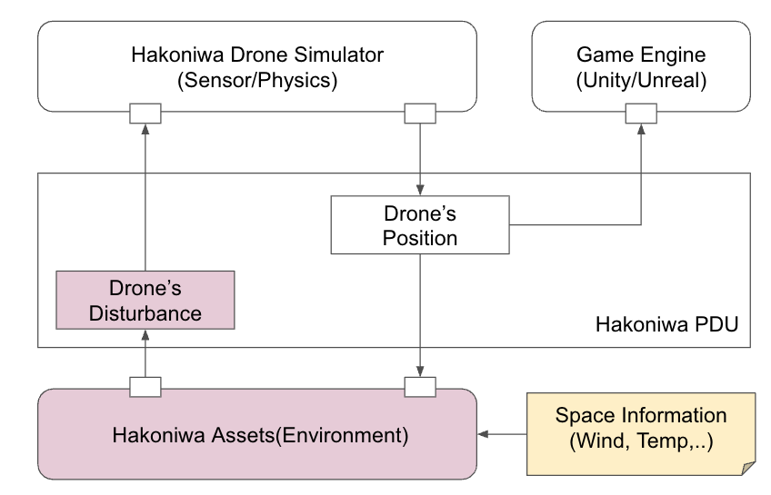

English ｜ [日本語](README-ja.md)

# What is this?

This document explains the environmental simulation features of the Hakoniwa Drone Simulator, such as simulating wind effects. The goal is to apply realistic environmental disturbances like wind to the drone’s flight behavior within the simulation environment.

# Hakoniwa’s Approach to Environmental Simulation

Hakoniwa aims to provide reusable functionality without depending on specific technologies. Therefore, environmental data is managed in program-friendly formats like `json`, allowing for flexible use across different programming languages.

When considering environmental factors in drone simulations, it is efficient to separate static and dynamic information. For example, position data is static and can easily be stored in a database. On the other hand, weather information (e.g., wind, temperature, humidity, rain) is dynamic and varies by time and location.

Thus, Hakoniwa manages environmental information as follows:

- **Spatial Information**  
  Spatial information assigns a unique ID (area ID) to any given region. This area ID allows easy reference to information for different spaces.

- **Spatial Property Information**  
  Property information such as wind, temperature, and humidity is tied to specific areas. These properties are linked to spatial information using area IDs.

Based on this design, Hakoniwa provides flexible and reusable environmental simulations.

# Architecture



This architecture diagram shows the overall flow of environmental simulation in the Hakoniwa Drone Simulator.

1. **Processing Environmental Information**  
   Hakoniwa assets monitor Hakoniwa PDU data and obtain the corresponding area ID based on the drone's position. Using this area ID, the system reads the property data (e.g., wind, temperature, humidity) and triggers environmental disturbance events for the drone.

2. **Applying Disturbances and Running the Simulation**  
   The Hakoniwa Drone Simulator uses the disturbances (e.g., wind effects) received from the environment to simulate the drone’s sensor data and physical behavior, providing a realistic simulation of drone operations.

3. **Retrieving and Transmitting Drone Position Information**  
   The simulation results, including the drone’s position and orientation data, are written to the Hakoniwa PDU data. This data is then visualized in the game engine (Unity or Unreal Engine), where the environmental disturbances are automatically reflected.

# Data Structure Definition for Spatial Information

- **Coordinate System**: ROS coordinate system is used.
- **Spatial Definition**: Defined in `space_areas.json`, where regions are specified using AABB (axis-aligned bounding box).
- **Property Definition**: Defined in `area_properties.json`, associating attributes like wind and temperature with specific areas using `area_id`.

1. **`space_areas.json`**:
   - Defines each region’s spatial boundaries. Each area is assigned a unique `area_id`, and the bounds are specified using AABB (minimum and maximum points).

2. **`area_properties.json`**:
   - Defines properties (e.g., wind, temperature) for each area. Properties are linked to spatial information using `area_id`, making it easy to assign different properties to different regions.

## 1. Spatial Definition (`space_areas.json`)

```json
{
  "space_areas": [
    {
      "area_id": "area_1",
      "bounds": {
        "min": { "x": 0, "y": 0, "z": 0 },   // Minimum point
        "max": { "x": 100, "y": 100, "z": 50 } // Maximum point
      }
    },
    {
      "area_id": "area_2",
      "bounds": {
        "min": { "x": 101, "y": 0, "z": 0 },
        "max": { "x": 200, "y": 100, "z": 50 }
      }
    }
  ]
}
```

## 2. Property Definition (`area_properties.json`)

```json
{
  "area_properties": [
    {
      "area_id": "area_1",
      "properties": {
        "wind": { 
          "velocity": { "x": 5.0, "y": 2.0, "z": -1.0 }  // Wind speed (m/s)
        },
        "temperature": 20.0  // Temperature (Celsius)
      }
    },
    {
      "area_id": "area_2",
      "properties": {
        "wind": { 
          "velocity": { "x": -3.0, "y": 1.0, "z": 0.0 }
        },
        "temperature": 25.0
      }
    }
  ]
}
```

# Class Design for Handling Spatial Information


This class design aims to provide a flexible structure for managing spatial information in Hakoniwa. The design is based on Hakoniwa’s specifications, but is intended to allow future replacement and customization of spatial information or environmental settings.

1. **`HakoEnvEvent`**  
   - Main class for managing environmental events, such as wind and temperature.
   - It applies environmental information to drones and other simulation elements.

2. **`IHakoAreaPropAccessor` and `IHakoAreaAccessor` (Abstract Classes)**  
   - Interfaces for handling data from `area_properties.json` and `space_areas.json`.
   - They provide a unified way to access spatial and property information.
   - These abstract classes allow for future extensibility and the replacement of different spatial or property data sources.

3. **`HakoAreaPropAccessorImpl` and `HakoAreaAccessorImpl`**  
   - Concrete implementation classes for retrieving spatial and property information based on Hakoniwa specifications.
   - They fetch data from `space_areas.json` and `area_properties.json` and apply it to the simulation.

4. **`HakoAABBObjectSpace`**  
   - A class that defines spatial regions using axis-aligned bounding boxes (AABB). This allows efficient definition and management of spatial areas.

This design links spatial and property information via `area_id`, making it easy to apply different properties (e.g., wind speed and temperature) to different areas. By using abstract classes, this design also supports future expansion and compatibility with other specifications.

# Sample Implementation

The sample implementation is available here: [Hakoniwa Drone's Environment Assets](https://github.com/toppers/hakoniwa-px4sim/tree/main/drone_api/assets)

- **`hako_env_event.py`**: Contains the implementation of the HakoEnvEvent, which simulates environmental events.
- **`lib`**: Contains the Python implementations based on the class designs, including access logic for spatial and property information.
- **`config`**: Contains sample environment data, including `space_areas.json` and `area_properties.json`.
- **`tests`**: Contains test scripts to verify the functionality and behavior of the implementation.

Based on this sample implementation, you can set up the environment and try the simulation as needed.

# Sample Execution Method

## Prerequisites

- Python 3.12 must be installed
- Unity application must be installed
- `bash` must be available
- Supported OS: macOS, Ubuntu 22.0.4
- This sample uses remote control
- You will need four terminals to run this sample

## Overview

This sample allows you to control the Hakoniwa drone simulation using a remote control. The setup requires four terminals, with the following setup steps:

1. Terminal A: Start the simulation
2. Terminal B: Manage environment events
3. Terminal C: Start the Unity application
4. Terminal D: Operate the remote control

## Terminal A

Start the Hakoniwa simulation on Terminal A. This command initializes the drone simulation.

```bash
cd hakoniwa-px4sim/hakoniwa
```

```bash
bash drone-app.bash ../../hakoniwa-unity-drone-model/simple-demo config/rc
```

## Terminal B

Start the HakoEnvEvent asset on Terminal B. This asset generates environment events such as wind and obstacles.

```bash
cd hakoniwa-px4sim/drone_api/assets
```

Set the `PYTHONPATH`.

```bash
export PYTHONPATH=${PYTHONPATH}:`pwd`:`pwd`/lib
```

```bash
python hako_env_event.py ../../../hakoniwa-unity-drone-model/DroneAppAppleSilicon/custom.json 3 config
```

## Terminal C

Start the Unity application on Terminal C, then press the `START` button.

```bash
cd hakoniwa-unity-drone-model
```

```bash
bash plugin/activate_app.bash DroneAppAppleSilicon
```

## Terminal D

Start the remote control application on Terminal D.

```bash
cd hakoniwa-px4sim/drone_api/sample
```

```bash
python rc.py ../../../hakoniwa-unity-drone-model/simple-demo/custom.json
```

# Demo

The demo video below shows the addition of wind as an environmental model in the Hakoniwa Drone Simulator. The drone is being pushed by a 1 m/sec diagonal wind, causing it to drift.

[Demo Video](https://www.youtube.com/watch?v=KBPrrA1XC4U)
