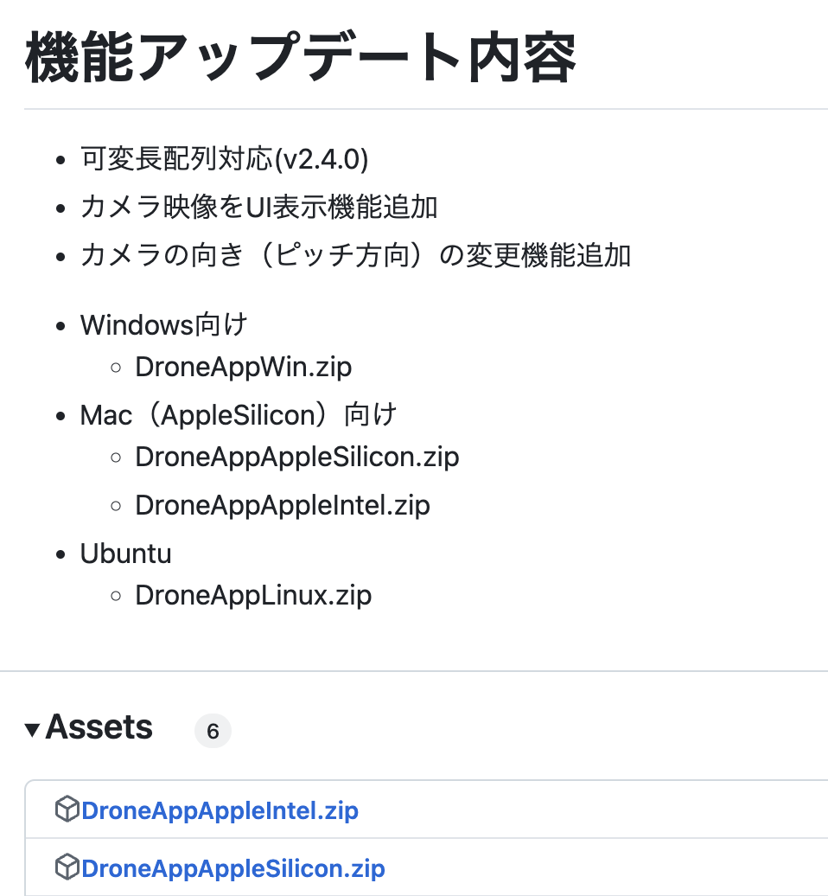
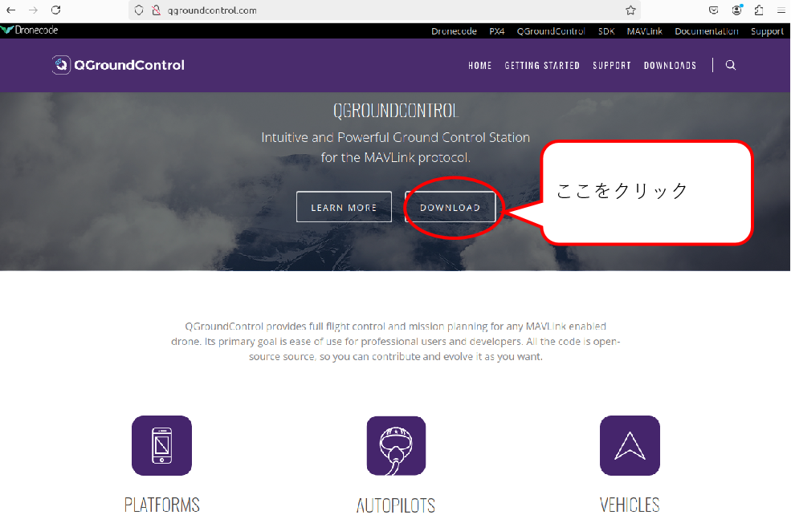
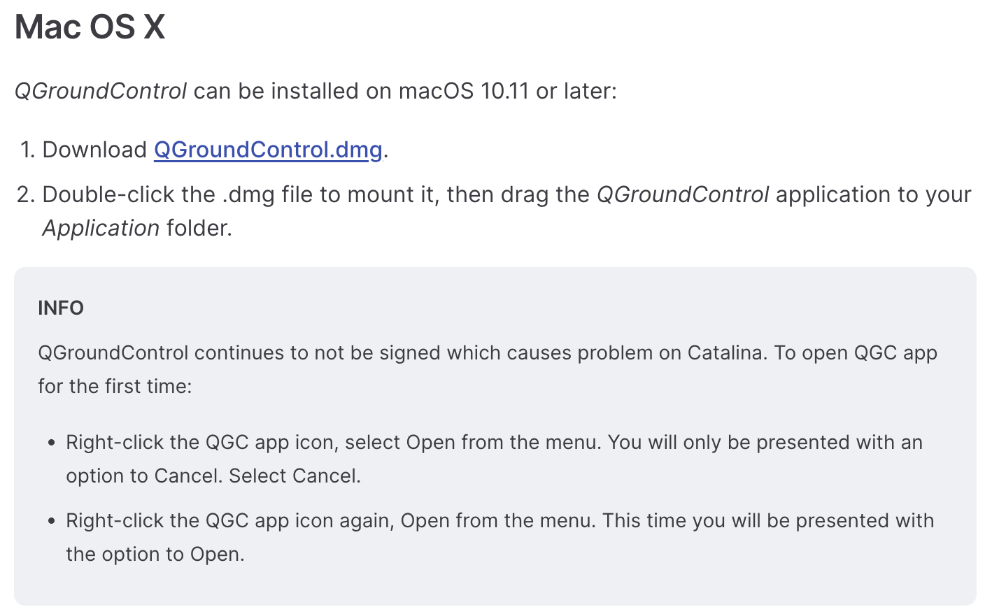
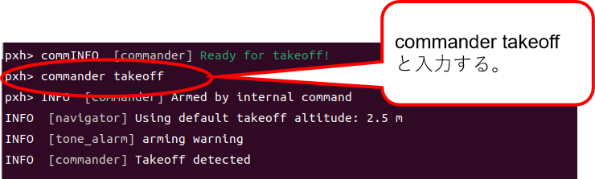
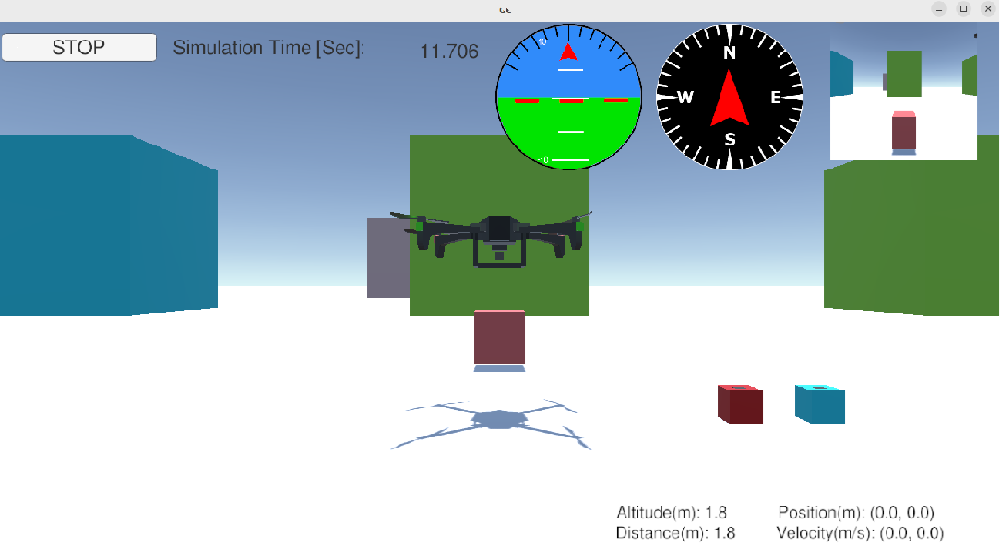
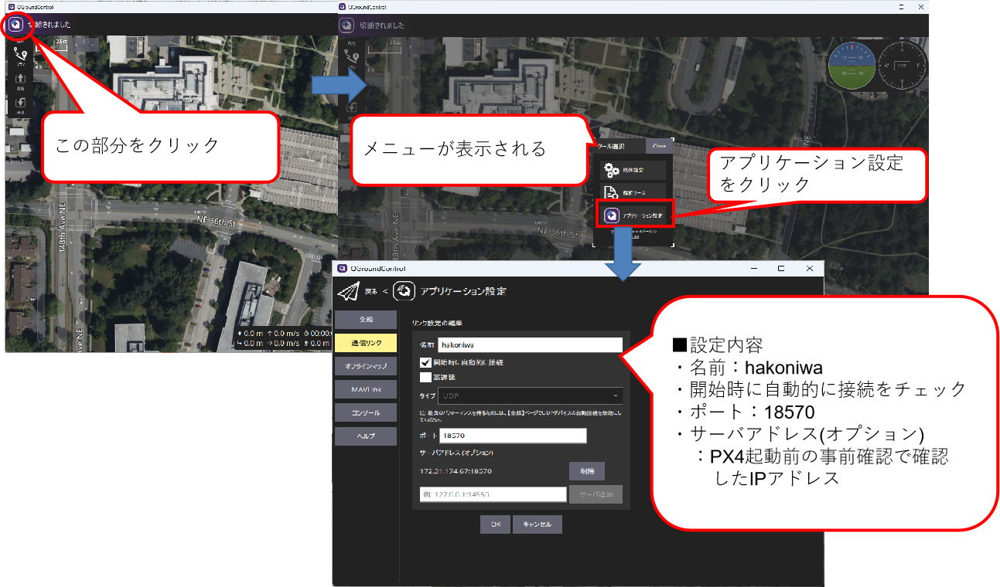
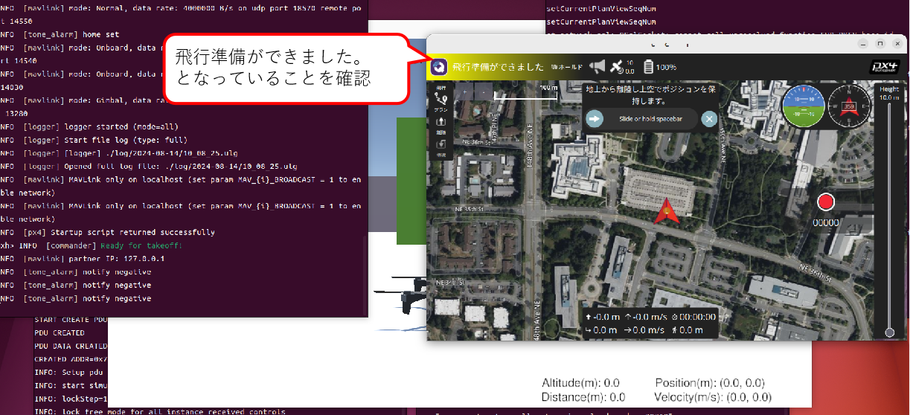
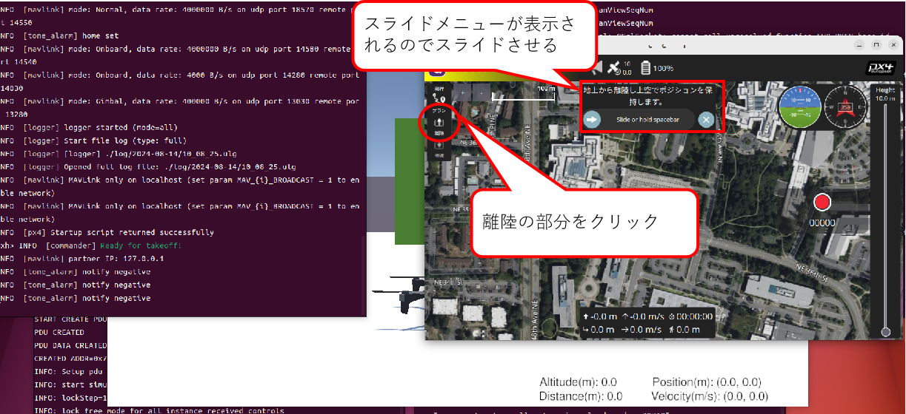
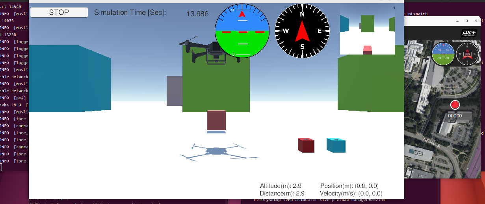

<div class="box-title">
    <p>
    <div style="font-size:18pt;font-weight:bold;text-align:center;margin-top:150px"><span class="title">箱庭ドローンシミュレータ PX4利用編</span></div>
    </p>
    <p>
    <div style="font-size:14pt;font-weight:bold;text-align:center;margin-top:20px"><span class="sub-title">Mac環境の利用セットアップと動作検証</span></div>
    </p>
    <p>
    <div style="font-size:12pt;font-weight:bold;text-align:center;margin-top:500px"><span class="author">箱庭WG</span></div>
    </p>
    <p>
    <div style="font-size:12pt;font-weight:bold;text-align:center;margin-top:10px"><span class="date">2024年09月15日</span></div>
    </p>
</div>

<!-- 改ページ -->
<div style="page-break-before:always"></div>

<div style="font-size:18pt;font-weight:bold;text-align:left;"><span class="contents">目次</span></div>
<!-- TOC -->

- [1. 本ドキュメントについて](#1-本ドキュメントについて)
  - [1.1. Mac環境上での箱庭ドローンシミュレータ環境構築の事前知識](#11-mac環境上での箱庭ドローンシミュレータ環境構築の事前知識)
  - [1.2. Mac環境のセットアップ](#12-Mac環境のセットアップ)
    - [1.2.1. dash→bashへの切り替え](#121-dashbashへの切り替え)
    - [1.2.2. Mac環境の事前セットアップ](#122-Mac環境の事前セットアップ)
    - [1.2.3. gitの設定](#123-gitの設定)
  - [1.3. 箱庭ドローンシミュレータのセットアップ](#13-箱庭ドローンシミュレータのセットアップ)
    - [1.3.1. 箱庭コア機能用のコマンドインストール](#131-箱庭コア機能用のコマンドインストール)
    - [1.3.2. 箱庭コア機能のビルド](#132-箱庭コア機能のビルド)
      - [1.3.2.1. 箱庭コア機能のビルド確認](#1321-箱庭コア機能のビルド確認)
    - [1.3.3. 箱庭コア機能のインストール](#133-箱庭コア機能のインストール)
    - [1.3.4. 環境変数の設定](#134-環境変数の設定)
    - [1.3.5. 箱庭ドローン Unityアプリのセットアップ](#135-箱庭ドローン-unityアプリのセットアップ)
    - [1.3.6. フライトコントローラ PX4のビルド](#136-フライトコントローラ-px4のビルド)
      - [1.3.6.1. 機体情報の書き換え](#1361-機体情報の書き換え)
    - [1.3.7. PX4のビルド](#137-px4のビルド)
    - [1.3.8. QGC(QGroundContorl)ソフトウェアのインストール](#138-qgcqgroundcontorlソフトウェアのインストール)
  - [1.4. 箱庭ドローンシミュレータの動作確認](#14-箱庭ドローンシミュレータの動作確認)
    - [1.4.1. PX4の起動](#141-px4の起動)
    - [1.4.2. 箱庭コア機能の起動](#142-箱庭コア機能の起動)
    - [1.4.3. Unityアプリの起動](#143-unityアプリの起動)
    - [1.4.4. PX4 ドローン操作](#144-px4-ドローン操作)
  - [1.5. QGCとPX4の接続と動作確認](#15-qgcとpx4の接続と動作確認)
    - [1.5.1. IPアドレスの確認](#151-ipアドレスの確認)
    - [1.5.2. QGCの事前設定](#152-qgcの事前設定)
    - [1.5.3. QGCとPX4の動作確認](#153-qgcとpx4の動作確認)

<!-- /TOC -->

<!-- 改ページ -->
<div style="page-break-before:always"></div>


<div style="font-size:18pt;font-weight:bold;text-align:left;"><span class="contents">用語集・改版履歴</span></div>


|略語|用語|意味|
|:---|:---|:---|
||||


|No|日付|版数|変更種別|変更内容|
|:---|:---|:---|:---|:---|
|1|2024/09/15|0.1|新規|新規作成|
||||||

<!-- 改ページ -->
<div style="page-break-before:always"></div>

# 1. 本ドキュメントについて

本ドキュメントは、箱庭ドローンシミュレータ上で、実空間でのドローン飛行に近づけるように、ドローンの飛行に必要になる要素を、事前準備編でインストールした各要素を使って、箱庭シミュレータハブエンジン上で表現し、ドローン飛行にあたっての安全性の検証、ドローンと他の機器との連携によるサービス検証をするために、箱庭ドローンシミュレータのインストールと実際の箱庭ドローンシミュレータでのドローン飛行の利用方法に関してのドキュメントとなります。

本ドキュメントでは、以下のOSバージョンとPC環境を想定としています。

|No|対象|内容|
|:---|:---|:---|
|1|OS|Mac(AppleSilicon/Intel)|
|2|PC|32Gbyteのメモリ推奨|
|3|PC|SSD 512Gbyte以上|

## 1.1. Mac環境上での箱庭ドローンシミュレータ環境構築の事前知識

Mac上でのインストールと操作にあたっては、コマンドラインが前提となります。前提知識として、Linux OSのコマンド操作のオペレーションができることや、gitコマンドを利用したダウンロード、ソフトウェアのコンパイルなどソフトウェア開発に関する知識が必要になります。

## 1.2. Mac環境のセットアップ

箱庭ドローンシミュレータを動作させるために必要なソフトウェアをTOPPERS 箱庭WGのGithubから入手して、コンパイルやインストールやMac側のシステム設定などを実施します。

### 1.2.1. Mac環境の事前セットアップ

箱庭ドローンシミュレータ環境を構築するために必要となるパッケージを事前に導入しておきます。

- Homebrewのインストール
``` bash
/bin/bash -c "$(curl -fsSL https://raw.githubusercontent.com/Homebrew/install/HEAD/install.sh)"
```

- 必要なパッケージの導入

``` bash
brew update
```
``` bash
brew install gcc make cmake
```
``` bash
brew install git jq googletest pyenv
```

- Pythonのインストール

環境変数の設定
```bash
echo 'export PYENV_ROOT="$HOME/.pyenv"' >> ~/.zshrc
```
```bash
echo 'export PATH="$PYENV_ROOT/bin:$PATH"' >> ~/.zshrc
```
```bash
echo 'eval "$(pyenv init --path)"' >> ~/.zshrc
```
```bash
echo 'eval "$(pyenv init -)"' >> ~/.zshrc
```
```bash
source ~/.zshrc
```

Pythonのインストール
```bash
pyenv install 3.12.3
```
```bash
pyenv global 3.12.3
```

### 1.2.3. gitの設定

箱庭ドローンシミュレータは、githubからソフトウェアを入手します。入手にあたってはgitコマンドを利用しますので、gitコマンドの初期化をしておきます。

``` bash
$ git config --global user.name ”ユーザ名”
$ git config --global user.email ”emailアドレス”
```

## 1.3. 箱庭ドローンシミュレータのセットアップ

gitコマンドを使って箱庭ドローンシミュレータのソフトウェアを入手します。

``` bash
mkdir work
```
``` bash
cd work
```
``` bash
git clone --recursive https://github.com/toppers/hakoniwa-px4sim.git
```
``` bash
git clone --recursive https://github.com/toppers/hakoniwa-unity-drone-model.git
```

### 1.3.1. 箱庭コア機能用のコマンドインストール

最初に箱庭ドローンシミュレータ環境を利用できるようにするために、箱庭用のコマンドセットをインストールします。

- 該当ディレクトリに移動

```bash
cd ~/work/hakoniwa-px4sim
```
```bash
cd hakoniwa/third-party/hakoniwa-core-cpp-client
```

- ビルド手順

```bash
bash build.bash
```

- インストール手順

```bash
bash install.bash
```

### 1.3.2. 箱庭コア機能のビルド

ビルド方法には２種類あります。MATLABで生成したコードを利用しない場合と利用する場合で箱庭コア機能のビルドがことなります。MATLABを利用しない場合が多いと思いますので、通常はMATLABなしのパターンでビルドを実行してください。

- MATLAB生成コードを利用しない場合 ← 通常はこちら

``` bash
cd ~/work/hakoniwa-px4sim/hakoniwa
```
``` bash
bash build.bash
```

- MATLAB生成コードを利用する場合

``` bash
cd ~/work/hakoniwa-px4sim/hakoniwa
```
``` bash
bash build.bash HAKONIWA_MATLAB_BUILD=true
```

#### 1.3.2.1. 箱庭コア機能のビルド確認

ビルドが完了して成功すると、以下のディレクトリが作成されますので、確認します。

``` bash
ls cmake-build/src/hako-px4sim 
cmake-build/src/hako-px4sim
```

### 1.3.3. 箱庭コア機能のインストール

最初に箱庭コア機能のインストールを実行します。

``` bash
cd ~/work/hakoniwa-px4sim/hakoniwa
```
``` bash
bash install.bash
```

インストール結果の確認をします。すべてがOKとなっていることを確認してください。

``` bash
bash third-party/hakoniwa-core-cpp-client/hako-setup-check.bash
```

インストール結果：
```bash
OK Directory exists: /usr/local/bin
OK Directory exists: /usr/local/bin/hakoniwa
OK Directory exists: /usr/local/lib
OK Directory exists: /usr/local/lib/hakoniwa
OK Directory exists: /etc/hakoniwa
OK Directory exists: /var/lib/hakoniwa
OK Directory exists: /var/lib/hakoniwa/mmap
OK File exists: /etc/hakoniwa/cpp_core_config.json
OK File exists: /usr/local/bin/hakoniwa/hako-cmd
OK File exists: /usr/local/lib/hakoniwa/libhakoarun.a
OK File exists: /usr/local/lib/hakoniwa/libshakoc.dylib
OK File exists: /usr/local/lib/hakoniwa/hakoc.so
OK File exists: /usr/local/lib/hakoniwa/libassets.dylib
OK File exists: /usr/local/lib/hakoniwa/libconductor.dylib
OK File exists: /usr/local/lib/hakoniwa/py
OK File exists: /usr/local/bin/hakoniwa/hako-proxy
Check complete.
```

### 1.3.4. 環境変数の設定

各インストールした結果を反映させるため、環境変数の設定を実施します。

``` bash
vi ~/.bashrc
```

- 環境変数の設定内容

``` txt
export DYLD_LIBRARY_PATH=/usr/local/lib/hakoniwa:$DYLD_LIBRARY_PATH
export DYLD_LIBRARY_PATH=/usr/local/lib/hakoniwa/py:$DYLD_LIBRARY_PATH
export PATH=/usr/local/bin/hakoniwa:$PATH
export PYTHONPATH=/usr/local/lib/hakoniwa:${PYTHONPATH}
export PYTHONPATH=/usr/local/lib/hakoniwa/py:${PYTHONPATH}
```

設定後、設定内容を反映させるため、シェルを再起動してください。

### 1.3.5. 箱庭ドローン Unityアプリのセットアップ

箱庭ドローンシミュレータでのビジュアライズするためのUnityアプリをセットアップします。箱庭ドローンシミュレータ用の各OS対応のUnityアプリを入手します。

[箱庭ドローンシミュレータ Unityアプリリリースページ](https://github.com/toppers/hakoniwa-unity-drone-model/releases)

上記のページにアクセスして、該当のOS用のUnityアプリを入手します。



DroneAppSilicon.zipを入手します。入手後、解凍します。解凍は、`hakoniwa-unity-drone-model`のディレクトリ配下に解凍してください。

``` bash
cd ~/work/hakoniwa-unity-drone-model
```
``` bash
unzip ~/Downloads/DroneAppSilicon.zip
```

### 1.3.6. フライトコントローラ PX4のビルド

ドローンのフライトコントローラ PX4ファームウェアのビルドを実行します。

#### 1.3.6.1. 機体情報の書き換え

箱庭ドローンシミュレータ用の機体に合わせた設定に変更します。以下の手順にて機体情報を書き換えてください。

```bash
cd ~/work/hakoniwa-px4sim/px4
```
```bash
cp hakoniwa-apps/10016_none_iris PX4-Autopilot/ROMFS/px4fmu_common/init.d-posix/airframes/10016_none_iris 
```
```bash
cp hakoniwa-apps/rcS PX4-Autopilot/ROMFS/px4fmu_common/init.d-posix/rcS
```

### 1.3.7. PX4のビルド

以下の手順でビルドを実行します。

```bash
cd PX4-Autopilot
```
```bash
sh Tools/setup/macos.sh --no-nuttx --no-sim-tools
```
```bash
make px4_sitl_default
```

### 1.3.8. QGC(QGroundContorl)ソフトウェアのインストール

QGC(QGroundControl)は、地上からドローンを操作するための運行管理用のソフトウェアになります。箱庭ドローンシミュレータでは、PX4とQGCを連携させて、QGCから箱庭上のドローンを操作することをできるようにします。

QGCの公式ページアクセスして、`DOWNLOAD`をクリックします。



`DOWNLOAD`をクリックしたら、DOWNLOADページの`Mac OS X`の場所に移動して、手順に従ってインストールを実施します。




## 1.4. 箱庭ドローンシミュレータの動作確認

ここからは、Unbuntu上での箱庭ドローンシミュレータのPX4とQGCを連携させた動作確認をしていきます。

### 1.4.1. PX4の起動

ドローンフライトコントローラのPX4ファームウェアを起動します。

```bash
cd ~/work/hakoniwa-px4sim/px4/PX4-Autopilot
```
```bash
bash ../sim/simstart.bash
```

以下のような画面が起動されます。

```bash
INFO: SINGLE INSTANCE MODE
[0/1] launching px4 none_iris (SYS_AUTOSTART=10016)

______  __   __    ___ 
| ___ \ \ \ / /   /   |
| |_/ /  \ V /   / /| |
|  __/   /   \  / /_| |
| |     / /^\ \ \___  |
\_|     \/   \/     |_/

px4 starting.

INFO  [px4] startup script: /bin/sh etc/init.d-posix/rcS 0
env SYS_AUTOSTART: 10016
INFO  [param] selected parameter default file parameters.bson
INFO  [param] selected parameter backup file parameters_backup.bson
  SYS_AUTOCONFIG: curr: 0 -> new: 1
  SYS_AUTOSTART: curr: 0 -> new: 10016
  CAL_ACC0_ID: curr: 0 -> new: 1310988
  CAL_GYRO0_ID: curr: 0 -> new: 1310988
  CAL_ACC1_ID: curr: 0 -> new: 1310996
  CAL_GYRO1_ID: curr: 0 -> new: 1310996
  CAL_ACC2_ID: curr: 0 -> new: 1311004
  CAL_GYRO2_ID: curr: 0 -> new: 1311004
  CAL_MAG0_ID: curr: 0 -> new: 197388
  CAL_MAG0_PRIO: curr: -1 -> new: 50
  CAL_MAG1_ID: curr: 0 -> new: 197644
  CAL_MAG1_PRIO: curr: -1 -> new: 50
  SENS_BOARD_X_OFF: curr: 0.0000 -> new: 0.0000
  SENS_DPRES_OFF: curr: 0.0000 -> new: 0.0010
INFO  [dataman] data manager file './dataman' size is 7868392 bytes
INFO  [init] PX4_SIM_HOSTNAME: 127.0.0.1
INFO  [simulator_mavlink] using TCP on remote host 127.0.0.1 port 4560
WARN  [simulator_mavlink] Please ensure port 4560 is not blocked by a firewall.
INFO  [simulator_mavlink] Resolved host '127.0.0.1' to address: 127.0.0.1
INFO  [simulator_mavlink] Waiting for simulator to accept connection on TCP port 4560
```


### 1.4.2. 箱庭コア機能の起動

最初に箱庭コア機能を起動します。

``` bash
cd ~/work/hakoniwa-px4sim/hakoniwa
```
``` bash
bash run.bash
```

```bash
./src/hako-px4sim 127.0.0.1 4560 sim
hakoniwa master is enabled
HAKO_CAPTURE_SAVE_FILEPATH : ./capture.bin
HAKO_BYPASS_IPADDR : 127.0.0.1
HAKO_CUSTOM_JSON_PATH : ../config/custom.json
DRONE_CONFIG_PATH : ../config
HAKO_BYPASS_PORTNO : 54001
INFO: LOADED drone config file: ../config/drone_config_0.json
INFO: hako_master_init() success
INFO: setup start
INFO: create directory ./drone_log0
INFO: px4sim_receiver_init() i = 0
DroneDynamicType: BodyFrame
INFO: logpath: ./drone_log0/drone_dynamics.csv
Rotor vendor: None
Thruster vendor: None
param_A: 1.53281e-08
param_B: 3e-11
param_Jr: 1e-10
INFO: mixer is not enabled
Robot: DroneTransporter, PduWriter: DroneTransporter_drone_motor
channel_id: 0 pdu_size: 112
INFO: DroneTransporter create_lchannel: logical_id=0 real_id=0 size=112
Robot: DroneTransporter, PduWriter: DroneTransporter_drone_pos
channel_id: 1 pdu_size: 72
INFO: DroneTransporter create_lchannel: logical_id=1 real_id=1 size=72
Robot: DroneTransporter, PduWriter: DroneTransporter_drone_manual_pos_att_control
channel_id: 3 pdu_size: 80
INFO: DroneTransporter create_lchannel: logical_id=3 real_id=2 size=80
Robot: DroneTransporter, PduWriter: DroneTransporter_drone_cmd_takeoff
channel_id: 5 pdu_size: 64
INFO: DroneTransporter create_lchannel: logical_id=5 real_id=3 size=64
Robot: DroneTransporter, PduWriter: DroneTransporter_drone_cmd_move
channel_id: 6 pdu_size: 80
INFO: DroneTransporter create_lchannel: logical_id=6 real_id=4 size=80
Robot: DroneTransporter, PduWriter: DroneTransporter_drone_cmd_land
channel_id: 7 pdu_size: 64
INFO: DroneTransporter create_lchannel: logical_id=7 real_id=5 size=64
Robot: DroneTransporter, PduWriter: DroneTransporter_hako_cmd_game
channel_id: 8 pdu_size: 136
INFO: DroneTransporter create_lchannel: logical_id=8 real_id=6 size=136
Robot: DroneTransporter, PduWriter: DroneTransporter_hako_cmd_camera
channel_id: 9 pdu_size: 44
INFO: DroneTransporter create_lchannel: logical_id=9 real_id=7 size=44
Robot: DroneTransporter, PduWriter: DroneTransporter_hako_cmd_camera_move
channel_id: 11 pdu_size: 64
INFO: DroneTransporter create_lchannel: logical_id=11 real_id=8 size=64
Robot: DroneTransporter, PduWriter: DroneTransporter_hako_cmd_magnet_holder
channel_id: 13 pdu_size: 40
INFO: DroneTransporter create_lchannel: logical_id=13 real_id=9 size=40
WAIT START
```

PX4の起動画面に”ERROR [simulator_mavlink] poll timeout 0, 22”が表示されますが、現時点では気にしなくて大丈夫です。次のUnityアプリ手順を実施すればERRORは解消されます。

### 1.4.3. Unityアプリの起動

箱庭ドローンシミュレータのビジュアライズするUnityアプリを起動します。

``` bash
cd ~/work/hakoniwa-unity-drone-model
```
``` bash
bash ./plugin/activate_app.bash DroneAppLinux
```

Unityアプリが起動したら、STARTボタンを押して、待機します。


### 1.4.4. PX4 ドローン操作

PX4の起動画面に戻って、以下のコマンドを入力します。

```px4
pxh> commander takeoff
```



コマンドが成功すると、Unity上のドローンがテイクオフします。



## 1.5. QGCとPX4の接続と動作確認

QGCからPX4に指示を出して、箱庭ドローンシミュレータ上のドローンの飛行をさせることができます。

### 1.5.1. IPアドレスの確認

QGCとPX4は、UDPを使って通信をします。通信にはIPアドレスが必要のため、環境上のIPアドレスを確認します。


### 1.5.2. QGCの事前設定

QGCを立ち上げ、画面向かって左側のアイコンをクリックします。クリックするとメニューが表示されるので、アプリケーション設定をクリックします。

アプリケーション設定の通信リンクをクリックして、以下の設定内容を設定します。新規に設定する場合は、下の追加ボタンを押して設定をします。設定が完了したら一旦、QGCを終了させておきます。



- 通信リンクの設定内容

|No|設定名|設定値|
|:---|:---|:---|
|1|名前|hakoniwa|
|2|開始時に自動的に接続|チェックボックスにチェック|
|3|ポート|18570|
|4|サーバアドレス(オプション)|IPアドレス確認手順で確認したIPアドレス|

### 1.5.3. QGCとPX4の動作確認

PX4起動→箱庭コア機能起動→Unityアプリ起動の各手順に従って、各機能を起動します。起動後に、QGCを起動します。
立ち上げていたPX4/箱庭コア/Unityを終了せずにQGCのみを起動し直すとtakeoffした状態でQGCにUnityが接続されて、QGC画面左のメニューではLandを実行できるはずです。


QGCが起動したら、PX4との通信ができている状態になっていることを確認します。QGCの上部のが黄色くなっており、”飛行準備ができました”となっていれば問題ありません。なってない場合は、IPアドレスの設定 or ポート番号の指定が間違っている可能性がありますのでｋ確認してください。




飛行準備ができた状態で、画面向かって左側の離陸ボタンをクリックします。クリック後、スライドバーが表示されるので、スライドを右側に移動させます。




スライド操作が完了すれば、Unity上のドローンがホバリングをして、Takeoffします。


