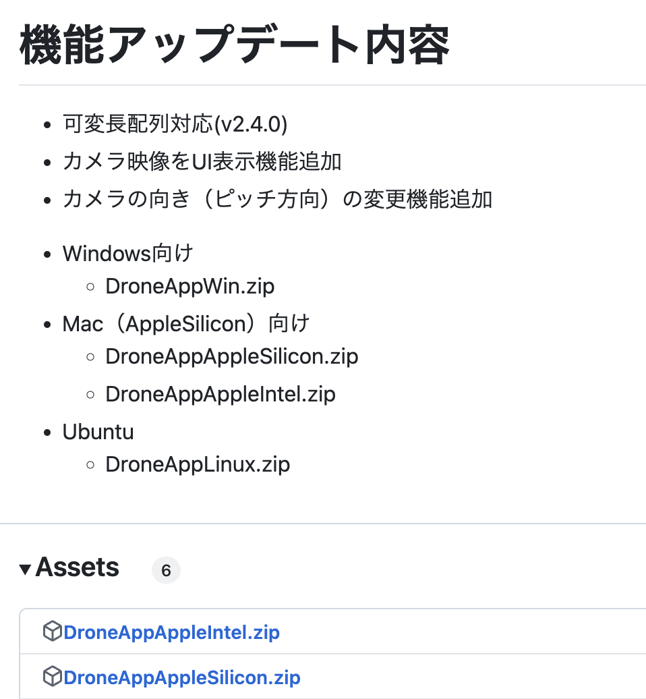
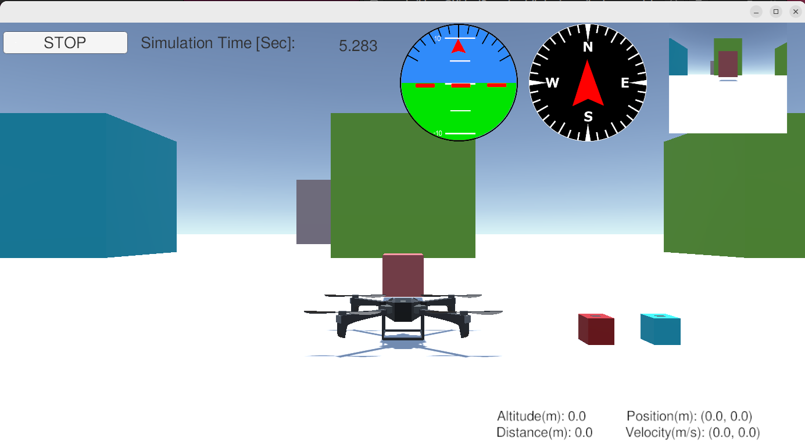
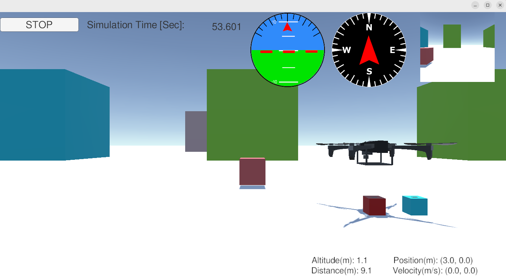
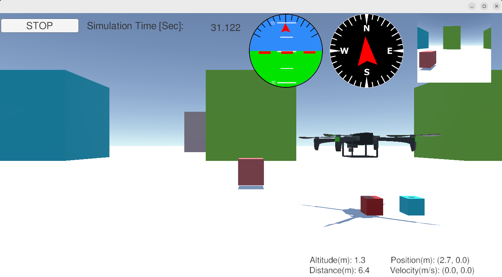
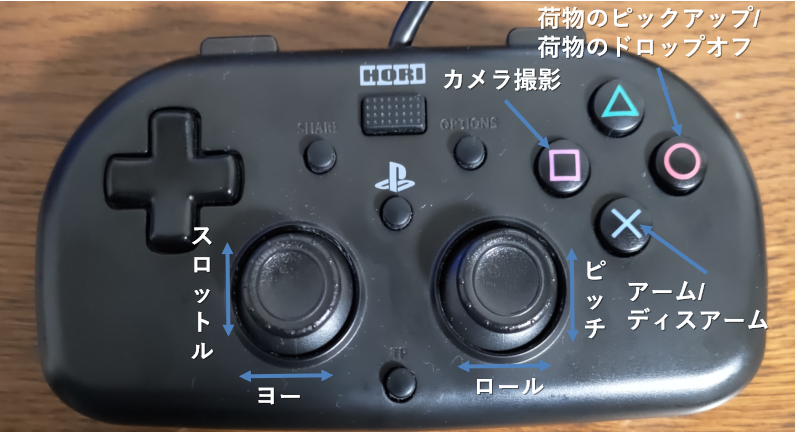

<div class="box-title">
    <p>
    <div style="font-size:18pt;font-weight:bold;text-align:center;margin-top:150px"><span class="title">箱庭ドローンシミュレータ pythonAPI利用編</span></div>
    </p>
    <p>
    <div style="font-size:14pt;font-weight:bold;text-align:center;margin-top:20px"><span class="sub-title">Mac環境の利用セットアップと動作検証</span></div>
    </p>
    <p>
    <div style="font-size:12pt;font-weight:bold;text-align:center;margin-top:500px"><span class="author">ドローンWG</span></div>
    </p>
    <p>
    <div style="font-size:12pt;font-weight:bold;text-align:center;margin-top:10px"><span class="date">2024年09月15日</span></div>
    </p>
</div>

<!-- 改ページ -->
<div style="page-break-before:always"></div>

<div style="font-size:18pt;font-weight:bold;text-align:left;"><span class="contents">目次</span></div>

<!-- TOC -->

- [1. 本ドキュメントについて](#1-本ドキュメントについて)
  - [1.1. Mac環境上での箱庭ドローンシミュレータ環境構築の事前知識](#11-mac環境上での箱庭ドローンシミュレータ環境構築の事前知識)
  - [1.2. Mac環境のセットアップ](#12-Mac環境のセットアップ)
    - [1.2.1. dash→bashへの切り替え](#121-dashbashへの切り替え)
    - [1.2.2. Mac環境の事前セットアップ](#122-Mac環境の事前セットアップ)
    - [1.2.3. gitの設定](#123-gitの設定)
  - [1.3. 箱庭ドローンシミュレータのセットアップ](#13-箱庭ドローンシミュレータのセットアップ)
    - [1.3.1. 箱庭コア機能用のコマンドインストール](#131-箱庭コア機能用のコマンドインストール)
    - [1.3.2. 箱庭コア機能のビルド](#132-箱庭コア機能のビルド)
      - [1.3.2.1. 箱庭コア機能のビルド確認](#1321-箱庭コア機能のビルド確認)
    - [1.3.3. 箱庭コア機能のインストール](#133-箱庭コア機能のインストール)
    - [1.3.4. Python用のAPIインストール](#134-python用のapiインストール)
    - [1.3.5. 環境変数の設定](#135-環境変数の設定)
    - [1.3.6. 箱庭ドローン Unityアプリのセットアップ](#136-箱庭ドローン-unityアプリのセットアップ)
  - [1.4. 箱庭ドローンシミュレータでの動作確認](#14-箱庭ドローンシミュレータでの動作確認)
    - [1.4.1. 箱庭コア機能の起動](#141-箱庭コア機能の起動)
    - [1.4.2. Unityアプリの起動](#142-unityアプリの起動)
    - [1.4.3. sampleアプリの起動](#143-sampleアプリの起動)
    - [1.4.4. PS4のコントローラでのドローン操作](#144-ps4のコントローラでのドローン操作)
  - [1.5. 箱庭ドローンシミュレータのログリプレイ機能](#15-箱庭ドローンシミュレータのログリプレイ機能)
    - [1.5.1. ログリプレイの動作確認確認](#151-ログリプレイの動作確認確認)
    - [1.5.2. ログの記録場所](#152-ログの記録場所)

<!-- /TOC -->

<!-- 改ページ -->
<div style="page-break-before:always"></div>


<div style="font-size:18pt;font-weight:bold;text-align:left;"><span class="contents">用語集・改版履歴</span></div>


|略語|用語|意味|
|:---|:---|:---|
||||


|No|日付|版数|変更種別|変更内容|
|:---|:---|:---|:---|:---|
|1|2024/09/15|0.1|新規|新規作成|
||||||

<!-- 改ページ -->
<div style="page-break-before:always"></div>

# 1. 本ドキュメントについて

本ドキュメントは、箱庭ドローンシミュレータ上で、実空間でのドローン飛行に近づけるように、ドローンの飛行に必要になる要素を、事前準備編でインストールした各要素を使って、箱庭シミュレータハブエンジン上で表現し、ドローン飛行にあたっての安全性の検証、ドローンと他の機器との連携によるサービス検証をするために、箱庭ドローンシミュレータのインストールと実際の箱庭ドローンシミュレータでのドローン飛行の利用方法に関してのドキュメントとなります。

本ドキュメントでは、以下のOSバージョンとPC環境を想定としています。

|No|対象|内容|
|:---|:---|:---|
|1|OS|Mac(AppleSilicon/Intel)|
|2|PC|32Gbyteのメモリ推奨|
|3|PC|SSD 512Gbyte以上|


## 1.1. Mac環境上での箱庭ドローンシミュレータ環境構築の事前知識

Mac上でのインストールと操作にあたっては、コマンドラインが前提となります。前提知識として、MacOSのコマンド操作のオペレーションができることや、gitコマンドを利用したダウンロード、ソフトウェアのコンパイルなどソフトウェア開発に関する知識が必要になります。

## 1.2. Mac環境のセットアップ

箱庭ドローンシミュレータを動作させるために必要なソフトウェアをTOPPERS 箱庭WGのGithubから入手して、コンパイルやインストールやMac側のシステム設定などを実施します。

### 1.2.1. Mac環境の事前セットアップ

箱庭ドローンシミュレータ環境を構築するために必要となるパッケージを事前に導入しておきます。

- Homebrewのインストール
``` bash
/bin/bash -c "$(curl -fsSL https://raw.githubusercontent.com/Homebrew/install/HEAD/install.sh)"
```

- 必要なパッケージの導入

``` bash
brew update
```
``` bash
brew install gcc make cmake
```
``` bash
brew install git jq googletest pyenv
```

- Pythonのインストール

環境変数の設定
```bash
$ echo 'export PYENV_ROOT="$HOME/.pyenv"' >> ~/.zshrc
```
```bash
$ echo 'export PATH="$PYENV_ROOT/bin:$PATH"' >> ~/.zshrc
```
```bash
$ echo 'eval "$(pyenv init --path)"' >> ~/.zshrc
```
```bash
$ echo 'eval "$(pyenv init -)"' >> ~/.zshrc
```
```bash
$ source ~/.zshrc
```

Pythonのインストール
```bash
pyenv install 3.12.3
```
```bash
pyenv global 3.12.3
```

### 1.2.3. gitの設定

箱庭ドローンシミュレータは、githubからソフトウェアを入手します。入手にあたってはgitコマンドを利用しますので、gitコマンドの初期化をしておきます。

``` bash
$ git config --global user.name ”ユーザ名”
$ git config --global user.email ”emailアドレス”
```

## 1.3. 箱庭ドローンシミュレータのセットアップ

gitコマンドを使って箱庭ドローンシミュレータのソフトウェアを入手します。

``` bash
mkdir work
```
``` bash
cd work
```
``` bash
git clone --recursive https://github.com/toppers/hakoniwa-px4sim.git
```
``` bash
git clone --recursive https://github.com/toppers/hakoniwa-unity-drone-model.git
```

### 1.3.1. 箱庭コア機能用のコマンドインストール

最初に箱庭ドローンシミュレータ環境を利用できるようにするために、箱庭用のコマンドセットをインストールします。

- 該当ディレクトリに移動

```bash
cd ~/work/hakoniwa-px4sim
```
```bash
cd hakoniwa/third-party/hakoniwa-core-cpp-client
```

- ビルド手順

```bash
bash build.bash
```

- インストール手順

```bash
bash install.bash
```

### 1.3.2. 箱庭コア機能のビルド

ビルド方法には２種類あります。MATLABで生成したコードを利用しない場合と利用する場合で箱庭コア機能のビルドがことなります。MATLABを利用しない場合が多いと思いますので、通常はMATLABなしのパターンでビルドを実行してください。

- MATLAB生成コードを利用しない場合 ← 通常はこちら

``` bash
cd ~/work/hakoniwa-px4sim/hakoniwa
```
``` bash
bash build.bash
```

- MATLAB生成コードを利用する場合

``` bash
cd ~/work/hakoniwa-px4sim/hakoniwa
```
``` bash
bash build.bash HAKONIWA_MATLAB_BUILD=true
```


#### 1.3.2.1. 箱庭コア機能のビルド確認

ビルドが完了して成功すると、以下のディレクトリが作成されますので、確認します。

``` bash
ls cmake-build/src/hako-px4sim 
cmake-build/src/hako-px4sim
```

### 1.3.3. 箱庭コア機能のインストール

最初に箱庭コア機能のインストールを実行します。

``` bash
cd ~/work/hakoniwa-px4sim/hakoniwa
```
``` bash
bash install.bash
```

インストール結果の確認をします。すべてがOKとなっていることを確認してください。

``` bash
bash third-party/hakoniwa-core-cpp-client/hako-setup-check.bash
```

インストール結果：
```bash
OK Directory exists: /usr/local/bin
OK Directory exists: /usr/local/bin/hakoniwa
OK Directory exists: /usr/local/lib
OK Directory exists: /usr/local/lib/hakoniwa
OK Directory exists: /etc/hakoniwa
OK Directory exists: /var/lib/hakoniwa
OK Directory exists: /var/lib/hakoniwa/mmap
OK File exists: /etc/hakoniwa/cpp_core_config.json
OK File exists: /usr/local/bin/hakoniwa/hako-cmd
OK File exists: /usr/local/lib/hakoniwa/libhakoarun.a
OK File exists: /usr/local/lib/hakoniwa/libshakoc.dylib
OK File exists: /usr/local/lib/hakoniwa/hakoc.so
OK File exists: /usr/local/lib/hakoniwa/libassets.dylib
OK File exists: /usr/local/lib/hakoniwa/libconductor.dylib
OK File exists: /usr/local/lib/hakoniwa/py
OK File exists: /usr/local/bin/hakoniwa/hako-proxy
Check complete.
```

### 1.3.4. Python用のAPIインストール

箱庭ドローンシミュレータの動作確認のためにPython用のAPIライブラリをインストールします。

```bash
cd ~/work/hakoniwa-px4sim
```
```bash
cd drone_control
```
```bash
bash build.bash
```

```bash
cd ~/work/hakoniwa-px4sim
```
```bash
bash drone_api/install.bash
```

### 1.3.5. 環境変数の設定

各インストールした結果を反映させるため、環境変数の設定を実施します。

``` bash
$ vi ~/.bashrc
```

- 環境変数の設定内容

``` txt
export DYLD_LIBRARY_PATH=/usr/local/lib/hakoniwa:$DYLD_LIBRARY_PATH
export DYLD_LIBRARY_PATH=/usr/local/lib/hakoniwa/py:$DYLD_LIBRARY_PATH
export PATH=/usr/local/bin/hakoniwa:$PATH
export PYTHONPATH=/usr/local/lib/hakoniwa:${PYTHONPATH}
export PYTHONPATH=/usr/local/lib/hakoniwa/py:${PYTHONPATH}
```

設定後、設定内容を反映させるため、シェル画面を再起動してください。

### 1.3.6. 箱庭ドローン Unityアプリのセットアップ

箱庭ドローンシミュレータでのビジュアライズするためのUnityアプリをセットアップします。箱庭ドローンシミュレータ用の各OS対応のUnityアプリを入手します。

[箱庭ドローンシミュレータ Unityアプリリリースページ](https://github.com/toppers/hakoniwa-unity-drone-model/releases)

上記のページにアクセスして、該当のOS用のUnityアプリを入手します。



DroneAppSilicon.zipを入手します。入手後、解凍します。解凍は、`hakoniwa-unity-drone-model`のディレクトリ配下に解凍してください。

``` bash
cd ~/work/hakoniwa-unity-drone-model
```
``` bash
$ unzip ~/Downloads/DroneAppSilicon.zip
```

## 1.4. 箱庭ドローンシミュレータでの動作確認

ここからは、Mac上での箱庭ドローンシミュレータのPython APIを使った動作確認をしていきます。

### 1.4.1. 箱庭コア機能の起動

最初に箱庭コア機能を起動します。

``` bash
cd ~/work/hakoniwa-px4sim/hakoniwa
```
``` bash
bash drone-app.bash ../../hakoniwa-unity-drone-model/DroneAppLinux ./config/api_sample
```


### 1.4.2. Unityアプリの起動

箱庭ドローンシミュレータのビジュアライズするUnityアプリを起動します。

``` bash
$ cd ~/work/hakoniwa-unity-drone-model
$ bash ./plugin/activate_app.bash DroneAppLinux
```

Unityアプリが起動したら、STARTボタンを押して、待機します。





### 1.4.3. sampleアプリの起動

環境の動作を確認するため、ドローンが飛行して荷物を運ぶsampleアプリを起動します。

```bash
cd ~/work/hakoniwa-px4sim
```
```bash
cd drone_api/sample
```
```bash
python sample.py ../../../hakoniwa-unity-drone-model/DroneAppLinux/custom.json
```




### 1.4.4. PS4のコントローラでのドローン操作

Unityアプリ上のドローンをPS4のコントローラで操作させるためのプロポ用のアプリを起動します。PC本体にPS4のコントローラをUSBに接続します。

1.4.1 箱庭コア機能の起動、1.4.2 Unityアプリの起動手順を実施後に、以下のプロポ用のアプリを起動します。


```bash
cd ~/work/hakoniwa-px4sim
```
```bash
cd drone_api/sample
```
```bash
python3 rc-custom.py ../../../hakoniwa-unity-drone-model/DroneAppLinux/custom.json rc_config/ps4-control-lnx.json
```



機体の操作は、以下のようになります。


PS4コントローラでの操作は、以下のようになります。




なお、OS毎にゲームパッド毎に設定が違うため、利用するゲームパッドの設定を調査する必要があります。ゲームパッドの操作の調査については、USB接続でゲームパッドを接続したの後に以下のpythonスクリプトを利用することで対応ができます。

```bash
cd  ~/work/hakoniwa-px4sim/drone_api/sample/rc_debug
```
```bash
python rc_control.py
```
[ゲームパッドのデバッグ方法](https://github.com/toppers/hakoniwa-px4sim/blob/main/docs/manual/rcdebug.md)


上記の調査した結果は、以下のフォルダのjsonファイルに設定することで対応が可能となります。以下のサンプルのjsonファイルをコピーして、利用するゲームパッドに合わせた設定をして、コントローラの起動をするようにしてください。

```bash
cd ~/work/hakoniwa-px4sim/drone_api/sample/rc_config
```
```bash
ls
FS-i6S.json  hori4mini-control-lnx.json  ps4-control-lnx.json  ps4-control.json
```

- 現在対応できているコントローラのコンフィグファイル(json形式)

|No|名前|内容|
|:---|:---|:---|
|1|ps4-control.json|PS4用のゲームコントローラ(Windows/Mac OS)|
|2|ps4-control-lnx.json|PS4用のゲームコントローラ(Linux OS)|
|3|hori4mini-control-lnx.json|PS4互換HORI4 miniゲームコントローラ(Linux OS)|
|4|FS-i6S.json|FLY SKY社製 FS-i6Sプロポ(送信機)|


## 1.5. 箱庭ドローンシミュレータのログリプレイ機能

V2.6.0以降より、箱庭ドローンシミュレータで動かした結果がログとして残るようになってます。このログを使って、リプレイすることが可能となっています。

### 1.5.1. ログリプレイの動作確認確認

以下の手順にて、ログリプレイ機能用のスクリプトを編集します。

```bash
vi ~/work/hakoniwa-px4sim/hakoniwa/replay.bash
```

replay.bashの以下の部分を+になっているような内容に変更します。

```diff
-export HAKO_CUSTOM_JSON_PATH=../../hakoniwa-unity-drone-model/custom.json
+export HAKO_CUSTOM_JSON_PATH=../../hakoniwa-unity-drone-model/DroneAppAppleSilicon/custom.json
```

編集後、以下の手順にてを実行します。

```bash
cd ~/work/hakoniwa-px4sim/hakoniwa
```
```bash
bash replay.bash
```

上記の手順を実施後に、1.4.2 Unityアプリの起動手順を実行します。ログに記録されたドローンの飛行結果を確認することができます。

### 1.5.2. ログの記録場所

箱庭ドローンシミュレータでシミュレータとした結果は、以下の場所にcsv形式でドローンをシミュレートした結果が保管されています。ログとして保管されています。ログを残したい場合は、以下のディレクトリをコピーして保管しておいてください。

```bash
cd ~/work/hakoniwa-px4sim/hakoniwa
ls drone_log0/
drone_dynamics.csv  log_gps.csv   log_rotor_0.csv  log_rotor_3.csv
log_acc.csv         log_gyro.csv  log_rotor_1.csv  log_thrust.csv
log_baro.csv        log_mag.csv   log_rotor_2.csv 
```
