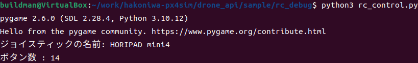
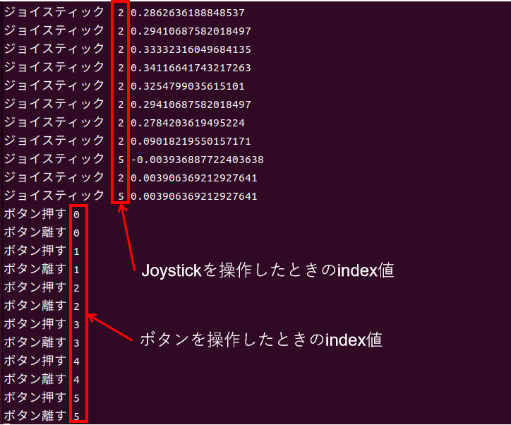

<div class="box-title">
    <p>
    <div style="font-size:18pt;font-weight:bold;text-align:center;margin-top:150px"><span class="title">箱庭ドローンシミュレータ コントローラ設定</span></div>
    </p>
    <p>
    <div style="font-size:14pt;font-weight:bold;text-align:center;margin-top:20px"><span class="sub-title">コントローラ設定とデバッグ編</span></div>
    </p>
    <p>
    <div style="font-size:12pt;font-weight:bold;text-align:center;margin-top:500px"><span class="author">ドローンWG</span></div>
    </p>
    <p>
    <div style="font-size:12pt;font-weight:bold;text-align:center;margin-top:10px"><span class="date">2024年08月16日</span></div>
    </p>
</div>

<!-- 改ページ -->
<div style="page-break-before:always"></div>

<div style="font-size:18pt;font-weight:bold;text-align:left;"><span class="contents">目次</span></div>
<!-- TOC -->

- [1. 本ドキュメントについて](#1-本ドキュメントについて)
  - [1.1. 対象環境](#11-対象環境)
- [2. 箱庭ドローンシミュレータでのコントローラ設定](#2-箱庭ドローンシミュレータでのコントローラ設定)
  - [2.1. JSON形式の設定ファイルの場所](#21-json形式の設定ファイルの場所)
  - [2.2. JSON形式の設定ファイルの内容](#22-json形式の設定ファイルの内容)
    - [2.2.1. 設定ファイルの内容](#221-設定ファイルの内容)
      - [2.2.1.1. modeインデックスの設定内容](#2211-modeインデックスの設定内容)
      - [2.2.1.2. stickインデックスの設定内容](#2212-stickインデックスの設定内容)
      - [2.2.1.3. Eventインデックスの設定内容](#2213-eventインデックスの設定内容)
- [3. 箱庭ドローンシミュレータのコントローラ設定方法](#3-箱庭ドローンシミュレータのコントローラ設定方法)
  - [3.1. コントローラ操作のデバッグ方法](#31-コントローラ操作のデバッグ方法)

<!-- /TOC -->
<!-- 改ページ -->
<div style="page-break-before:always"></div>


<div style="font-size:18pt;font-weight:bold;text-align:left;"><span class="contents">用語集・改版履歴</span></div>


|略語|用語|意味|
|:---|:---|:---|
||||


|No|日付|版数|変更種別|変更内容|
|:---|:---|:---|:---|:---|
|1|2024/08/16|0.1|新規|新規作成|
||||||
|||

<!-- 改ページ -->
<div style="page-break-before:always"></div>

# 1. 本ドキュメントについて

本ドキュメントは、箱庭ドローンシミュレータで利用するドローン操作用のコントローラの設定に関しての設定方法、デバッグ方法に関するドキュメントとなります。


## 1.1. 対象環境

本ドキュメントでは、以下の環境を対象としています。

本ドキュメントでは、以下のOSバージョンとPC環境を想定としています。

|No|対象|内容|
|:---|:---|:---|
|1|OS|Ubuntu 22.04 LTS/Windows10/11|
|2|PC|64bit環境|
|3|PC|Corei7 9th以降|
|4|PC|32Gbyteのメモリ推奨|
|5|PC|SSD 512Gbyte以上|
|6|PC|Graphicsアクセラレータ推奨|

# 2. 箱庭ドローンシミュレータでのコントローラ設定

箱庭ドローンシミュレータでは、多種多様なコントローラを利用できるように設定をJSON形式のファイルとして提供しています。
以降の解説では、ubuntu環境のホームディレクトリ配下のworkディレクトリに箱庭ドローンシミュレータ環境を構築していることを前提として解説をします。

## 2.1. JSON形式の設定ファイルの場所

以下のディレクトリにJSONファイル形式の設定ファイルがあります。

```bash
$ ls work/hakoniwa-px4sim/drone_api/sample/rc_config/
FS-i6S.json  hori4mini-control-lnx.json  ps4-control-lnx.json  ps4-control.json
```

## 2.2. JSON形式の設定ファイルの内容

JSONファイルで設定できる内容を解説します。例として、PS4互換のHORI PAD4 miniのコントローラを例に解説します。

### 2.2.1. 設定ファイルの内容

設定ファイル内容を見ていきましょう。設定ファイルではコントローラのボタンやJOYスティックなどのボタンの割り当てを設定することができます。

- hori4mini-control-lnx.jsonファイルの中身

```JSON
{
    "Os": [ "Darwin" ],
    "mode": 2,
    "stick": {
        "Left": {
            "UD": {
                "index": 1,
                "average": true,
                "valueInverse": false,
                "conversion": {
                    "paramA": 0.9,
                    "paramB": 0.1,
                    "paramC": 0.0
                }
            },
            "LR": {
                "index": 0,
                "average": true,
                "valueInverse": false,
                "conversion": {
                    "paramA": 0.9,
                    "paramB": 0.1,
                    "paramC": 0.0
                }
            }
        },
        "Right": {
            "UD": {
                "index": 5,
                "average": true,
                "valueInverse": false,
                "conversion": {
                    "paramA": 0.9,
                    "paramB": 0.1,
                    "paramC": 0.0
                }
            },
            "LR": {
                "index": 2,
                "average": true,
                "valueInverse": false,
                "conversion": {
                    "paramA": 0.9,
                    "paramB": 0.1,
                    "paramC": 0.0
                }
            }
        }
    },
    "Event": {
        "RadioControlEnable": {
            "index": 1,
            "type": "switch",
            "off": "up",
            "on": "down"
        },
        "Camera": {
            "index": 0,
            "type": "push",
            "off": "up",
            "on": "down"
        },
        "GrabBaggage": {
            "index": 2,
            "type": "toggle",
            "off": "up",
            "on": "down"
        },
        "CameraMoveUp": {
            "index": 5,
            "type": "switch",
            "off": "up",
            "on": "down"
        },
        "CameraMoveDown": {
            "index": 4,
            "type": "switch",
            "off": "up",
            "on": "down"
        }

    }
}
```

まずは、インデックス名から見ていきましょう。インデックスは3種類あります。mode,stick,Eventの3種類になります。

|No|インデックス名|内容|
|:---|:---|:---|
|1|mode|コントローラや送信機(プロポ)のMODE設定内容|
|2|stick|コントローラのJoystickの設定内容|
|3|Event|コントローラの各種ボタン設定内容|

#### 2.2.1.1. modeインデックスの設定内容

modeタグは、コントローラや送信機(プロポ)のMODE設定になります。モードの設定イメージは、下記の画像のイメージになります。


設定値は以下のようになります。

|No|設定値|内容|
|:---|:---|:---|
|1|1|モード1の設定|
|2|2|モード2の設定|

#### 2.2.1.2. stickインデックスの設定内容

stickインデックスは、コントローラのJoystick部分の上下左右の設定になります。


stickのインデックスは、Left(左),Right(右)があり、Left(左),Right(右)それぞれにUD(上下),LR(左右)のインデックスが設定内容としてあります。


Left(左),Right(右)のUD(上下),LR(左右)のそれぞれに以下の設定値があります。

|No|設定項目|設定値|内容|
|:---|:---|:---|:---|
|1|index|0～5の間の値|Joystickを動かしたときのコントローラから送られるインデックス番号|
|2|average|true/false|Joystickを動かしたときの平均値を計算することの設定|
|3|valueInverse|true/false|Joystickを動かしたときの値の反転をする設定|
|4|conversion|0.0～0.9の間の値|ParamA～ParamCがある。Joystickを動かしたときの調整パラメータ設定|

#### 2.2.1.3. Eventインデックスの設定内容

Eventインデックスは、コントローラの各種ボタンを箱庭ドローンシミュレータが機能として利用するための設定になります。


Eventインデックスは、箱庭ドローンシミュレータが用意しているPython操作用のAPI定義に従った項目が設定できるようになっています。


設定値には、RadioControlEnable,Camera,GrabBaggage,CameraMoveUp,CameraMoveDownの5種類の設定があります。

|No|設定項目|内容|
|:---|:---|:---|
|1|RadioControlEnable|0～12の間の値|ドローンの離陸(アーム)/着陸(ディスアーム)ボタン操作設定|
|2|Camera|ドローンカメラ撮影ボタン操作設定|
|3|GrabBaggage|ドローンの荷物操作用のマグネット操作設定|
|4|CameraMoveUp|ドローンカメラの上操作設定|
|5|CameraMoveDown|ドローンカメラの下操作設定|

RadioControlEnable,Camera,GrabBaggage,CameraMoveUp,CameraMoveDownの5種類には、それぞれに以下の設定があります。設定値のindexの値はコントローラによって取れる値が異なるので、現状で把握できている値を記載しています。

|No|設定項目|設定値|内容|
|:---|:---|:---|:---|
|1|index|0～13の間の値|コントローラのボタンを押したときのコントローラから送られるインデックス番号|
|2|type|push/toggle/switch|ボタンを押したときの操作設定。push:押したときに操作が有効,toggle:押した回数によって操作内容変更,switch:押したときの操作内容変更|
|3|off|up/down|ボタンが押されてないときの操作を指定|
|4|on|up/down|ボタンが押されたときの操作を指定|

# 3. 箱庭ドローンシミュレータのコントローラ設定方法

Linuxなど各種OSでの操作や、コントローラ種類によって、コントローラのjoystickの操作やボタン操作によって、コントローラから取れる値が異なることがあります。特に各インデックスの設定項目にあるindex部分に設定する値は異なることが多いです。

現状提供しているJSONファイルでは、利用するコントローラの操作と合わない場合が想定されるため、ここでは、実際にコントローラから取れる値のデバッグ方法を解説します。

## 3.1. コントローラ操作のデバッグ方法

コントローラのデバッグ用のpythonコードを利用して、コントローラから取れる値を確認することができます。

```bash
$ cd ~/work/hakoniwa-px4sim/drone_api/sample/rc_debug
$ python3 rc_control.py
```

起動すると以下のようにコントローラを認識してくれます。コントローラの名前、コントローラ上のボタン数が確認できます。



起動ができたら、実際にコントローラを操作してみましょう。ボタンのインデックス値、Joystickのインデックス値などを確認して、箱庭ドローンシミュレータ用の設定ファイルに反映することで、コントローラを反映することができます。


