<div class="box-title">
    <p>
    <div style="font-size:18pt;font-weight:bold;text-align:center;margin-top:150px"><span class="title">箱庭ドローンシミュレータ PX4利用編</span></div>
    </p>
    <p>
    <div style="font-size:14pt;font-weight:bold;text-align:center;margin-top:20px"><span class="sub-title">Ubuntu22.04環境の利用セットアップと動作検証</span></div>
    </p>
    <p>
    <div style="font-size:12pt;font-weight:bold;text-align:center;margin-top:500px"><span class="author">ドローンWG</span></div>
    </p>
    <p>
    <div style="font-size:12pt;font-weight:bold;text-align:center;margin-top:10px"><span class="date">2024年08月27日</span></div>
    </p>
</div>

<!-- 改ページ -->
<div style="page-break-before:always"></div>

<div style="font-size:18pt;font-weight:bold;text-align:left;"><span class="contents">目次</span></div>
<!-- TOC -->

- [1. 本ドキュメントについて](#1-本ドキュメントについて)
  - [1.1. Unbunt環境上での箱庭ドローンシミュレータ環境構築の事前知識](#11-unbunt環境上での箱庭ドローンシミュレータ環境構築の事前知識)
  - [1.2. Ubuntu環境のセットアップ](#12-ubuntu環境のセットアップ)
    - [1.2.1. dash→bashへの切り替え](#121-dashbashへの切り替え)
    - [1.2.2. Ubuntu環境の事前セットアップ](#122-ubuntu環境の事前セットアップ)
    - [1.2.3. gitの設定](#123-gitの設定)
  - [1.3. 箱庭ドローンシミュレータのセットアップ](#13-箱庭ドローンシミュレータのセットアップ)
    - [1.3.1. 箱庭コア機能用のコマンドインストール](#131-箱庭コア機能用のコマンドインストール)
    - [1.3.2. 箱庭コア機能のビルド](#132-箱庭コア機能のビルド)
      - [1.3.2.1. 箱庭コア機能のビルド確認](#1321-箱庭コア機能のビルド確認)
    - [1.3.3. 箱庭コア機能のインストール](#133-箱庭コア機能のインストール)
    - [1.3.4. 環境変数の設定](#134-環境変数の設定)
    - [1.3.5. 箱庭ドローン Unityアプリのセットアップ](#135-箱庭ドローン-unityアプリのセットアップ)
    - [1.3.6. フライトコントローラ PX4のビルド](#136-フライトコントローラ-px4のビルド)
      - [1.3.6.1. 機体情報の書き換え](#1361-機体情報の書き換え)
    - [1.3.7. PX4のビルド](#137-px4のビルド)
    - [1.3.8. QGC(QGroundContorl)ソフトウェアのインストール](#138-qgcqgroundcontorlソフトウェアのインストール)
  - [1.4. 箱庭ドローンシミュレータの動作確認](#14-箱庭ドローンシミュレータの動作確認)
    - [1.4.1. PX4の起動](#141-px4の起動)
    - [1.4.2. 箱庭コア機能の起動](#142-箱庭コア機能の起動)
    - [1.4.3. Unityアプリの起動](#143-unityアプリの起動)
    - [1.4.4. PX4 ドローン操作](#144-px4-ドローン操作)
  - [1.5. QGCとPX4の接続と動作確認](#15-qgcとpx4の接続と動作確認)
    - [1.5.1. IPアドレスの確認](#151-ipアドレスの確認)
    - [1.5.2. QGCの事前設定](#152-qgcの事前設定)
    - [1.5.3. QGCとPX4の動作確認](#153-qgcとpx4の動作確認)

<!-- /TOC -->

<!-- 改ページ -->
<div style="page-break-before:always"></div>


<div style="font-size:18pt;font-weight:bold;text-align:left;"><span class="contents">用語集・改版履歴</span></div>


|略語|用語|意味|
|:---|:---|:---|
||||


|No|日付|版数|変更種別|変更内容|
|:---|:---|:---|:---|:---|
|1|2024/08/09|0.1|新規|新規作成|
|2|2024/08/14|0.2|追加|ログリプレイ機能の操作方法を追加|
|3|2024/08/16|0.3|追加|PC環境の推奨環境を追加|
|4|2024/08/25|0.4|変更|箱庭コア機能のインストール手順見直し|
|5|2024/08/27|0.5|変更|インストール手順追加、誤記修正|
||||||

<!-- 改ページ -->
<div style="page-break-before:always"></div>

# 1. 本ドキュメントについて

本ドキュメントは、箱庭ドローンシミュレータ上で、実空間でのドローン飛行に近づけるように、ドローンの飛行に必要になる要素を、事前準備編でインストールした各要素を使って、箱庭シミュレータハブエンジン上で表現し、ドローン飛行にあたっての安全性の検証、ドローンと他の機器との連携によるサービス検証をするために、箱庭ドローンシミュレータのインストールと実際の箱庭ドローンシミュレータでのドローン飛行の利用方法に関してのドキュメントとなります。

本ドキュメントでは、以下のOSバージョンとPC環境を想定としています。

|No|対象|内容|
|:---|:---|:---|
|1|OS|Ubuntu 22.04 LTS|
|2|PC|64bit環境|
|3|PC|Corei7 9th以降|
|4|PC|32Gbyteのメモリ推奨|
|5|PC|SSD 512Gbyte以上|
|6|PC|Graphicsアクセラレータ推奨|

## 1.1. Unbunt環境上での箱庭ドローンシミュレータ環境構築の事前知識

Ubuntu上でのインストールと操作にあたっては、コマンドラインが前提となります。前提知識として、Linux OSのコマンド操作のオペレーションができることや、gitコマンドを利用したダウンロード、ソフトウェアのコンパイルなどソフトウェア開発に関する知識が必要になります。

## 1.2. Ubuntu環境のセットアップ

箱庭ドローンシミュレータを動作させるために必要なソフトウェアをTOPPERS 箱庭WGのGithubから入手して、コンパイルやインストールやUbuntu側のシステム設定などを実施します。

### 1.2.1. dash→bashへの切り替え

Ubuntuは、デフォルトシェルがdashになっているので、bashをデフォルトシェルとして利用できるようにしておきます。

``` bash
sudo dpkg-reconfigure dash
```

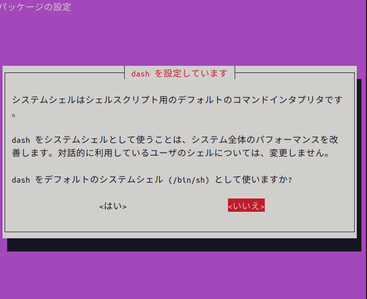

コマンドを実行すると上記のような画面がでますので、<いいえ>を選択して終了させます。


### 1.2.2. Ubuntu環境の事前セットアップ

箱庭ドローンシミュレータ環境を構築するために必要となるパッケージを事前に導入しておきます。

``` bash
$ sudo apt update
$ sudo apt upgrade
```

- 必要なパッケージの導入

``` bash
$ sudo apt install gcc g++ make cmake
$ sudo apt install git jq libgtest-dev net-tools python3-dev
```

### 1.2.3. gitの設定

箱庭ドローンシミュレータは、githubからソフトウェアを入手します。入手にあたってはgitコマンドを利用しますので、gitコマンドの初期化をしておきます。

``` bash
$ git config --global user.name ”ユーザ名”
$ git config --global user.email ”emailアドレス”
```

## 1.3. 箱庭ドローンシミュレータのセットアップ

gitコマンドを使って箱庭ドローンシミュレータのソフトウェアを入手します。

``` bash
$ mkdir work
$ cd work
$ git clone --recursive https://github.com/toppers/hakoniwa-px4sim.git
$ git clone --recursive https://github.com/toppers/hakoniwa-unity-drone-model.git
```

### 1.3.1. 箱庭コア機能用のコマンドインストール

最初に箱庭ドローンシミュレータ環境を利用できるようにするために、箱庭用のコマンドセットをインストールします。

- 該当ディレクトリに移動

```bash
$ cd ~/work/hakoniwa-px4sim
$ cd hakoniwa/third-party/hakoniwa-core-cpp-client
```

- ビルド手順

```bash
$ bash build.bash
```

- インストール手順

```bash
$ bash install.bash
```

### 1.3.2. 箱庭コア機能のビルド

ビルド方法には２種類あります。MATLABで生成したコードを利用しない場合と利用する場合で箱庭コア機能のビルドがことなります。MATLABを利用しない場合が多いと思いますので、通常はMATLABなしのパターンでビルドを実行してください。

- MATLAB生成コードを利用しない場合 ← 通常はこちら

``` bash
$ cd ~/work/hakoniwa-px4sim/hakoniwa
$ bash build.bash
```

- MATLAB生成コードを利用する場合

``` bash
$ cd ~/work/hakoniwa-px4sim/hakoniwa
$ bash build.bash HAKONIWA_MATLAB_BUILD=true
```

#### 1.3.2.1. 箱庭コア機能のビルド確認

ビルドが完了して成功すると、以下のディレクトリが作成されますので、確認します。

``` bash
$ ls cmake-build/src/hako-px4sim 
cmake-build/src/hako-px4sim
```

### 1.3.3. 箱庭コア機能のインストール

最初に箱庭コア機能のインストールを実行します。

``` bash
$ cd ~/work/hakoniwa-px4sim/hakoniwa
$ bash install.bash
```

インストール結果の確認をします。すべてがOKとなっていることを確認してください。

``` bash
$ bash third-party/hakoniwa-core-cpp-client/hako-setup-check.bash
```

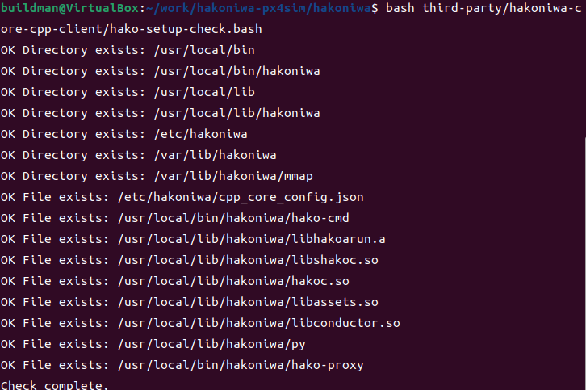

### 1.3.4. 環境変数の設定

各インストールした結果を反映させるため、環境変数の設定を実施します。

``` bash
$ vi ~/.bashrc
```

- 環境変数の設定内容

``` txt
export LD_LIBRARY_PATH=/usr/local/lib/hakoniwa:$LD_LIBRARY_PATH
export PATH=/usr/local/bin/hakoniwa:$PATH
export PYTHONPATH=/usr/local/lib/hakoniwa/py:${PYTHONPATH}
```

設定後、設定内容を反映させるため、シェルを再起動してください。

### 1.3.5. 箱庭ドローン Unityアプリのセットアップ

箱庭ドローンシミュレータでのビジュアライズするためのUnityアプリをセットアップします。箱庭ドローンシミュレータ用の各OS対応のUnityアプリを入手します。

[箱庭ドローンシミュレータ Unityアプリリリースページ](https://github.com/toppers/hakoniwa-unity-drone-model/releases)

上記のページにアクセスして、該当のOS用のUnityアプリを入手します。

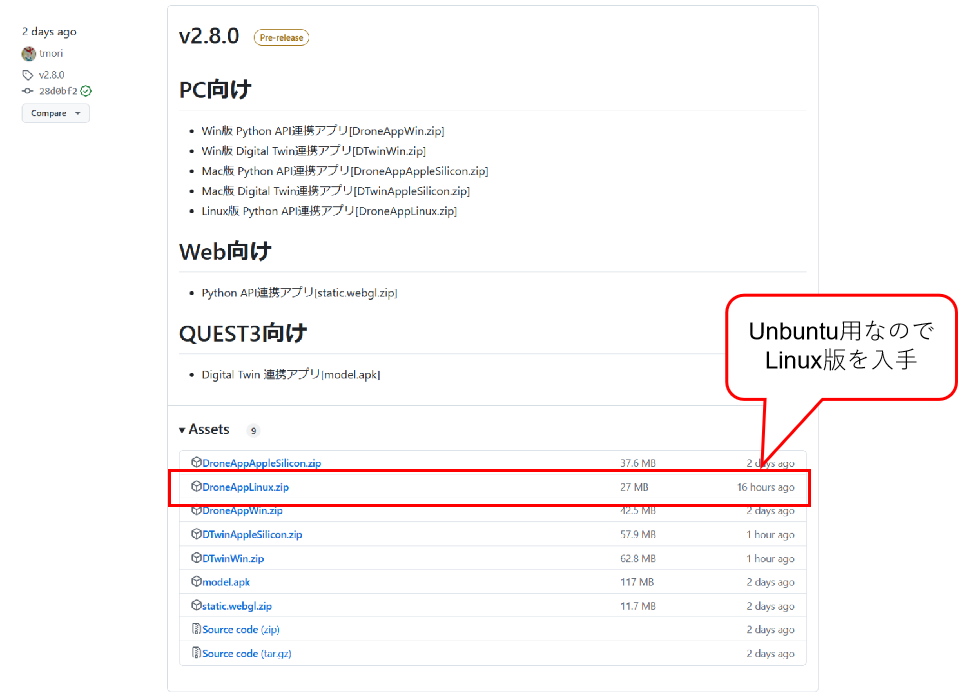

DroneAppLinux.zipを入手します。入手後、解凍します。解凍は、`hakoniwa-unity-drone-model`のディレクトリ配下に解凍してください。

``` bash
$ cd ~/work/hakoniwa-unity-drone-model
$ unzip ~/Downlods/DroneAppLinux.zip
```

### 1.3.6. フライトコントローラ PX4のビルド

ドローンのフライトコントローラ PX4ファームウェアのビルドを実行します。

#### 1.3.6.1. 機体情報の書き換え

箱庭ドローンシミュレータ用の機体に合わせた設定に変更します。以下の手順にて機体情報を書き換えてください。

```bash
$ cd ~/work/hakoniwa-px4sim/px4
$ cp hakoniwa-apps/10016_none_iris PX4-Autopilot/ROMFS/px4fmu_common/init.d-posix/airframes/10016_none_iris 
$ cp hakoniwa-apps/rcS PX4-Autopilot/ROMFS/px4fmu_common/init.d-posix/rcS
```

### 1.3.7. PX4のビルド

以下の手順でビルドを実行します。

```bash
$ cd PX4-Autopilot
$ bash Tools/setup/ubuntu.sh --no-nuttx --no-sim-tools
$ make px4_sitl_default
```

### 1.3.8. QGC(QGroundContorl)ソフトウェアのインストール

QGC(QGroundControl)は、地上からドローンを操作するための運行管理用のソフトウェアになります。箱庭ドローンシミュレータでは、PX4とQGCを連携させて、QGCから箱庭上のドローンを操作することをできるようにします。

QGCの公式ページアクセスして、`DOWNLOAD`をクリックします。

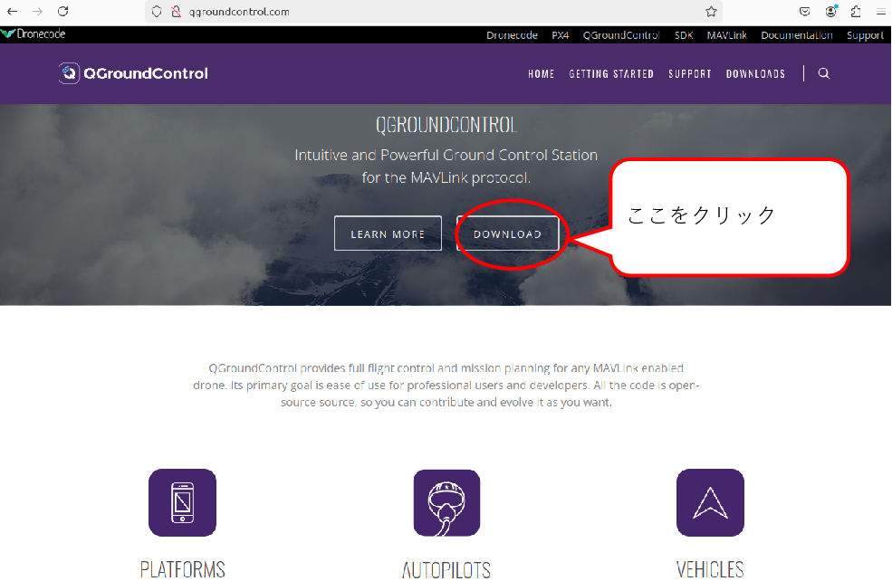

`DOWNLOAD`をクリックしたら、DOWNLOADページの`Ubuntu Linux`の場所に移動して、手順に従ってインストールを実施します。

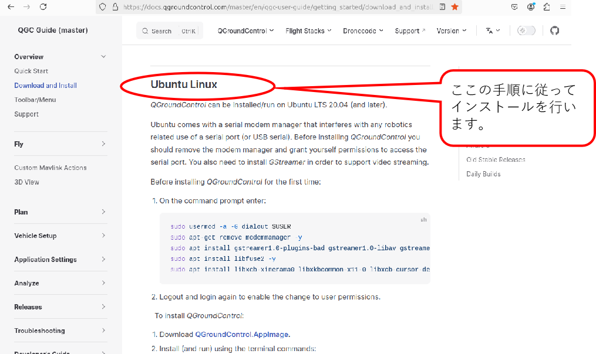

以下は、`Ubuntu Linux`の箇所の事前設定の手順になります。

```bash
$ sudo usermod -a -G dialout $USER
$ sudo apt-get remove modemmanager -y
$ sudo apt install gstreamer1.0-plugins-bad gstreamer1.0-libav gstreamer1.0-gl -y
$ sudo apt install libfuse2 -y
$ sudo apt install libxcb-xinerama0 libxkbcommon-x11-0 libxcb-cursor-dev -y
```

上記の手順が完了したら、QGCのアプリケーションをDownloadします。

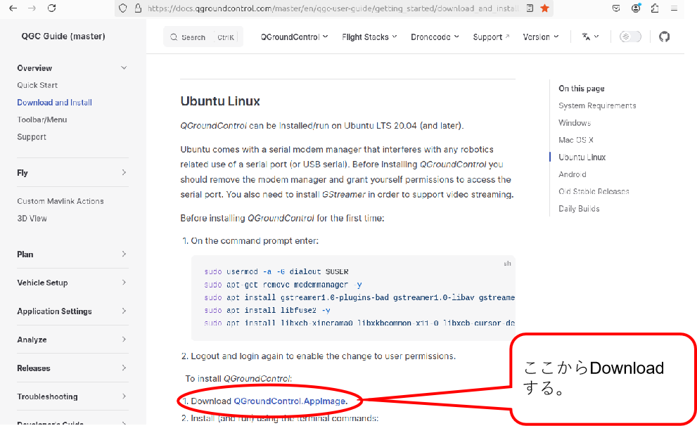

Downloadが完了したら、適当なディレクトリに移動します。

```bash
$ cd ~/work
$ mkdir qgc
$ cd qgc
$ mv ~/Downloads/QGroundControl.AppImage .
```

QGCのアプリケーションに実行権を追加して、起動します。無事に起動できたら本手順はOKです。

```bash
$ chmod +x ./QGroundControl.AppImage
$ ./QGroundControl.AppImage
```

以下のような画面が表示できれば問題ありません。

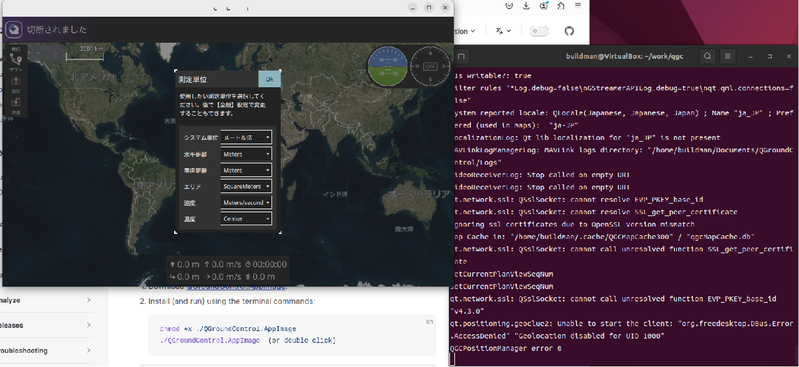


## 1.4. 箱庭ドローンシミュレータの動作確認

ここからは、Unbuntu上での箱庭ドローンシミュレータのPX4とQGCを連携させた動作確認をしていきます。

### 1.4.1. PX4の起動

ドローンフライトコントローラのPX4ファームウェアを起動します。

```bash
$ cd ~/work/hakoniwa-px4sim/px4/PX4-Autopilot
$ bash ../sim/simstart.bash
```

以下のような画面が起動されます。

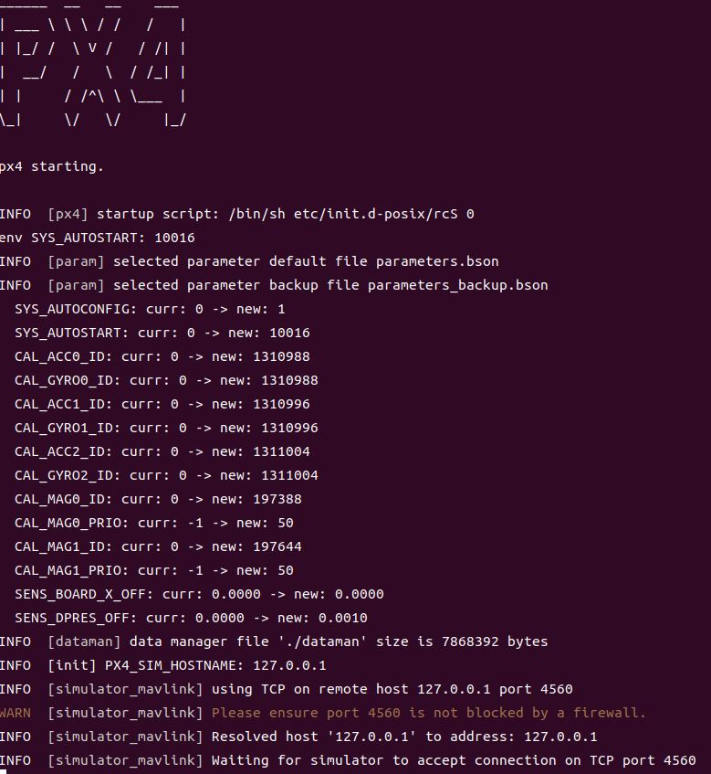


### 1.4.2. 箱庭コア機能の起動

最初に箱庭コア機能を起動します。

``` bash
$ cd ~/work/hakoniwa-px4sim/hakoniwa
$ bash run.bash
```

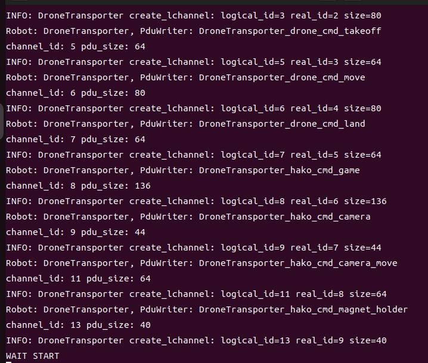

PX4の起動画面に”ERROR [simulator_mavlink] poll timeout 0, 22”が表示されますが、現時点では気にしなくて大丈夫です。次のUnityアプリ手順を実施すればERRORは解消されます。

### 1.4.3. Unityアプリの起動

箱庭ドローンシミュレータのビジュアライズするUnityアプリを起動します。

``` bash
$ cd ~/work/hakoniwa-unity-drone-model
$ bash ./plugin/activate_app.bash DroneAppLinux
```

Unityアプリが起動したら、STARTボタンを押して、待機します。


### 1.4.4. PX4 ドローン操作

PX4の起動画面に戻って、以下のコマンドを入力します。

```px4
pxh> commander takeoff
```

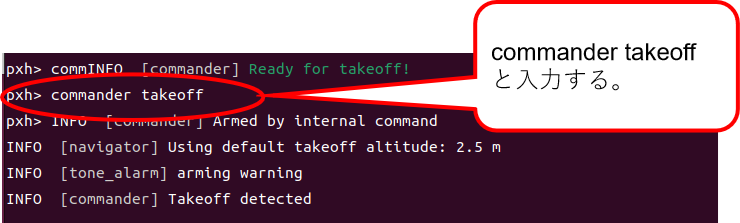

コマンドが成功すると、Unity上のドローンがテイクオフします。

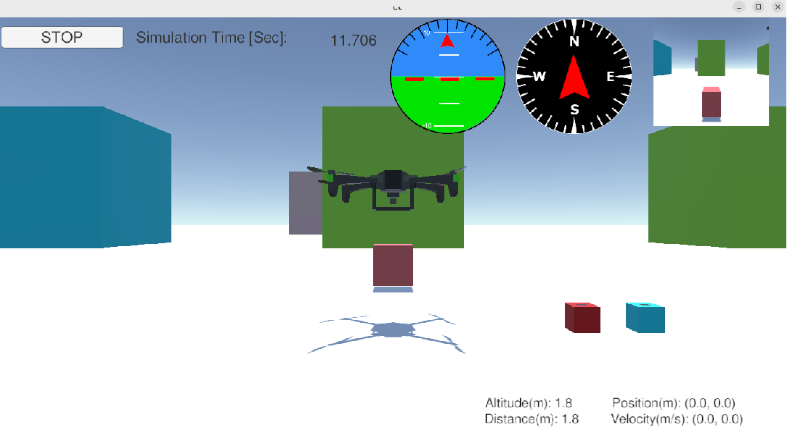

## 1.5. QGCとPX4の接続と動作確認

QGCからPX4に指示を出して、箱庭ドローンシミュレータ上のドローンの飛行をさせることができます。

### 1.5.1. IPアドレスの確認

QGCとPX4は、UDPを使って通信をします。通信にはIPアドレスが必要のため、環境上のIPアドレスを確認します。


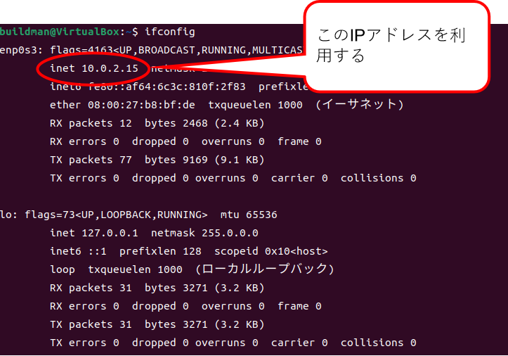

### 1.5.2. QGCの事前設定

以下のコマンドを使って、QGCを立ち上げます。

```bash
$ cd ~/work/qgc
$ ./QGroundControl.AppImage
```

QGCが立ち上がったら、画面向かって左側のアイコンをクリックします。クリックするとメニューが表示されるので、アプリケーション設定をクリックします。

アプリケーション設定の通信リンクをクリックして、以下の設定内容を設定します。新規に設定する場合は、下の追加ボタンを押して設定をします。設定が完了したら一旦、QGCを終了させておきます。

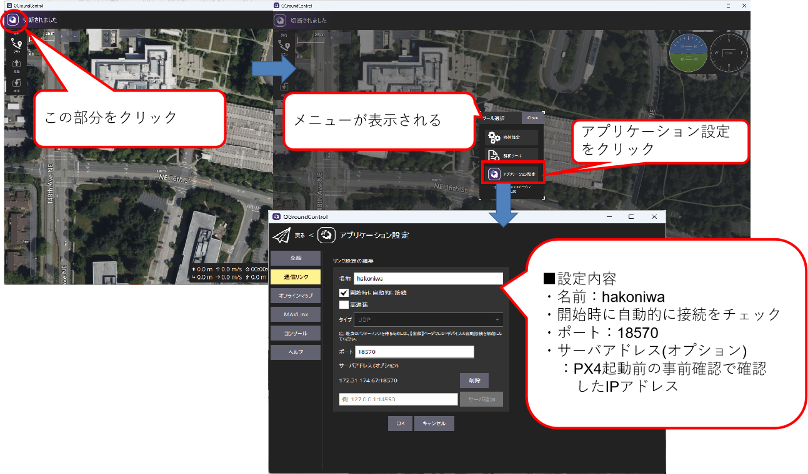

- 通信リンクの設定内容

|No|設定名|設定値|
|:---|:---|:---|
|1|名前|hakoniwa|
|2|開始時に自動的に接続|チェックボックスにチェック|
|3|ポート|18570|
|4|サーバアドレス(オプション)|IPアドレス確認手順で確認したIPアドレス|

### 1.5.3. QGCとPX4の動作確認

PX4起動→箱庭コア機能起動→Unityアプリ起動の各手順に従って、各機能を起動します。起動後に、QGCを起動します。
立ち上げていたPX4/箱庭コア/Unityを終了せずにQGCのみを起動し直すとtakeoffした状態でQGCにUnityが接続されて、QGC画面左のメニューではLandを実行できるはずです。

```bash
$ cd ~/work/qgc
$ ./QGroundControl.AppImage
```

QGCが起動したら、PX4との通信ができている状態になっていることを確認します。QGCの上部のが黄色くなっており、”飛行準備ができました”となっていれば問題ありません。なってない場合は、IPアドレスの設定 or ポート番号の指定が間違っている可能性がありますのでｋ確認してください。

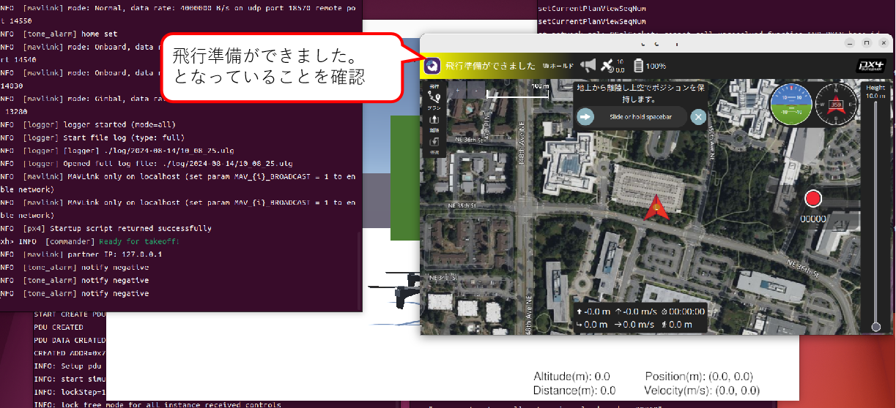


飛行準備ができた状態で、画面向かって左側の離陸ボタンをクリックします。クリック後、スライドバーが表示されるので、スライドを右側に移動させます。

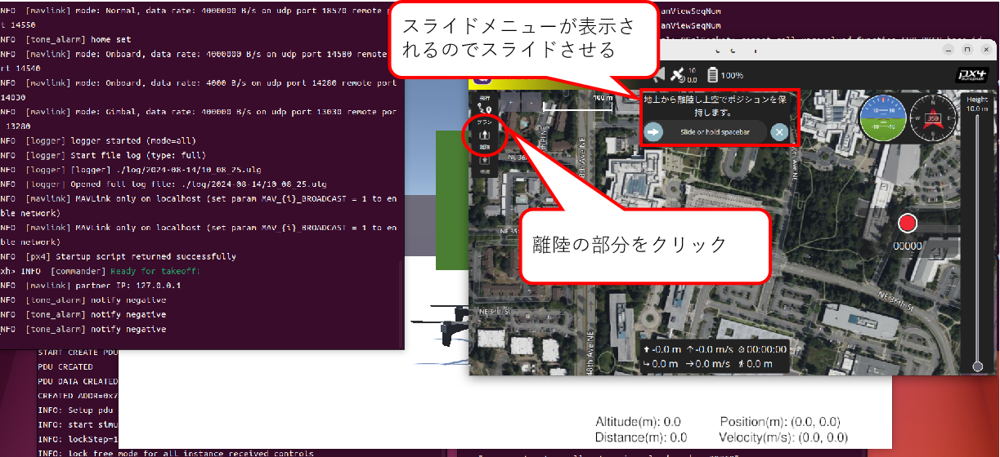


スライド操作が完了すれば、Unity上のドローンがホバリングをして、Takeoffします。

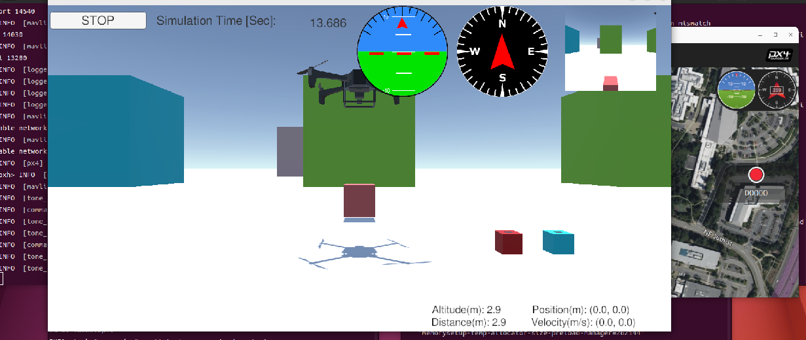
