<div class="box-title">
    <p>
    <div style="font-size:18pt;font-weight:bold;text-align:center;margin-top:150px"><span class="title">箱庭ドローンシミュレータ pythonAPI利用編</span></div>
    </p>
    <p>
    <div style="font-size:14pt;font-weight:bold;text-align:center;margin-top:20px"><span class="sub-title">Ubuntu22.04環境の利用セットアップと動作検証</span></div>
    </p>
    <p>
    <div style="font-size:12pt;font-weight:bold;text-align:center;margin-top:500px"><span class="author">ドローンWG</span></div>
    </p>
    <p>
    <div style="font-size:12pt;font-weight:bold;text-align:center;margin-top:10px"><span class="date">2024年08月27日</span></div>
    </p>
</div>

<!-- 改ページ -->
<div style="page-break-before:always"></div>

<div style="font-size:18pt;font-weight:bold;text-align:left;"><span class="contents">目次</span></div>

<!-- TOC -->

- [1. 本ドキュメントについて](#1-本ドキュメントについて)
  - [1.1. Unbunt環境上での箱庭ドローンシミュレータ環境構築の事前知識](#11-unbunt環境上での箱庭ドローンシミュレータ環境構築の事前知識)
  - [1.2. Ubuntu環境のセットアップ](#12-ubuntu環境のセットアップ)
    - [1.2.1. dash→bashへの切り替え](#121-dashbashへの切り替え)
    - [1.2.2. Ubuntu環境の事前セットアップ](#122-ubuntu環境の事前セットアップ)
    - [1.2.3. gitの設定](#123-gitの設定)
  - [1.3. 箱庭ドローンシミュレータのセットアップ](#13-箱庭ドローンシミュレータのセットアップ)
    - [1.3.1. 箱庭コア機能用のコマンドインストール](#131-箱庭コア機能用のコマンドインストール)
    - [1.3.2. 箱庭コア機能のビルド](#132-箱庭コア機能のビルド)
      - [1.3.2.1. 箱庭コア機能のビルド確認](#1321-箱庭コア機能のビルド確認)
    - [1.3.3. 箱庭コア機能のインストール](#133-箱庭コア機能のインストール)
    - [1.3.4. Python用のAPIインストール](#134-python用のapiインストール)
    - [1.3.5. 環境変数の設定](#135-環境変数の設定)
    - [1.3.6. 箱庭ドローン Unityアプリのセットアップ](#136-箱庭ドローン-unityアプリのセットアップ)
  - [1.4. 箱庭ドローンシミュレータでの動作確認](#14-箱庭ドローンシミュレータでの動作確認)
    - [1.4.1. 箱庭コア機能の起動](#141-箱庭コア機能の起動)
    - [1.4.2. Unityアプリの起動](#142-unityアプリの起動)
    - [1.4.3. sampleアプリの起動](#143-sampleアプリの起動)
    - [1.4.4. PS4のコントローラでのドローン操作](#144-ps4のコントローラでのドローン操作)
  - [1.5. 箱庭ドローンシミュレータのログリプレイ機能](#15-箱庭ドローンシミュレータのログリプレイ機能)
    - [1.5.1. ログリプレイの動作確認確認](#151-ログリプレイの動作確認確認)
    - [1.5.2. ログの記録場所](#152-ログの記録場所)

<!-- /TOC -->

<!-- 改ページ -->
<div style="page-break-before:always"></div>


<div style="font-size:18pt;font-weight:bold;text-align:left;"><span class="contents">用語集・改版履歴</span></div>


|略語|用語|意味|
|:---|:---|:---|
||||


|No|日付|版数|変更種別|変更内容|
|:---|:---|:---|:---|:---|
|1|2024/08/09|0.1|新規|新規作成|
|2|2024/08/14|0.2|追加|ログリプレイ機能の操作方法を追加|
|3|2024/08/16|0.3|追加|PC環境の推奨環境を追加|
|4|2024/08/25|0.4|変更|箱庭コア機能のインストール手順見直し|
|5|2024/08/27|0.5|変更|インストール手順追加、誤記修正|
||||||

<!-- 改ページ -->
<div style="page-break-before:always"></div>

# 1. 本ドキュメントについて

本ドキュメントは、箱庭ドローンシミュレータ上で、実空間でのドローン飛行に近づけるように、ドローンの飛行に必要になる要素を、事前準備編でインストールした各要素を使って、箱庭シミュレータハブエンジン上で表現し、ドローン飛行にあたっての安全性の検証、ドローンと他の機器との連携によるサービス検証をするために、箱庭ドローンシミュレータのインストールと実際の箱庭ドローンシミュレータでのドローン飛行の利用方法に関してのドキュメントとなります。

本ドキュメントでは、以下のOSバージョンとPC環境を想定としています。

|No|対象|内容|
|:---|:---|:---|
|1|OS|Ubuntu 22.04 LTS|
|2|PC|64bit環境|
|3|PC|Corei7 9th以降|
|4|PC|32Gbyteのメモリ推奨|
|5|PC|SSD 512Gbyte以上|
|6|PC|Graphicsアクセラレータ推奨|


## 1.1. Unbunt環境上での箱庭ドローンシミュレータ環境構築の事前知識

Ubuntu上でのインストールと操作にあたっては、コマンドラインが前提となります。前提知識として、Linux OSのコマンド操作のオペレーションができることや、gitコマンドを利用したダウンロード、ソフトウェアのコンパイルなどソフトウェア開発に関する知識が必要になります。

## 1.2. Ubuntu環境のセットアップ

箱庭ドローンシミュレータを動作させるために必要なソフトウェアをTOPPERS 箱庭WGのGithubから入手して、コンパイルやインストールやUbuntu側のシステム設定などを実施します。

### 1.2.1. dash→bashへの切り替え

Ubuntuは、デフォルトシェルがdashになっているので、bashをデフォルトシェルとして利用できるようにしておきます。

``` bash
sudo dpkg-reconfigure dash
```

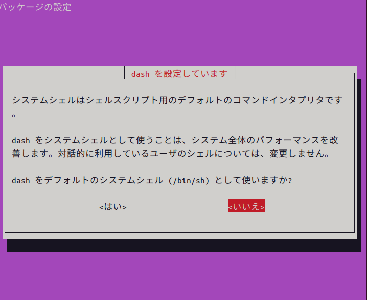

コマンドを実行すると上記のような画面がでますので、<いいえ>を選択して終了させます。


### 1.2.2. Ubuntu環境の事前セットアップ

箱庭ドローンシミュレータ環境を構築するために必要となるパッケージを事前に導入しておきます。

``` bash
$ sudo apt update
$ sudo apt upgrade
```

- 必要なパッケージの導入

``` bash
$ sudo apt install gcc g++ make cmake
$ sudo apt install git jq libgtest-dev net-tools
```

### 1.2.3. gitの設定

箱庭ドローンシミュレータは、githubからソフトウェアを入手します。入手にあたってはgitコマンドを利用しますので、gitコマンドの初期化をしておきます。

``` bash
$ git config --global user.name ”ユーザ名”
$ git config --global user.email ”emailアドレス”
```

## 1.3. 箱庭ドローンシミュレータのセットアップ

gitコマンドを使って箱庭ドローンシミュレータのソフトウェアを入手します。

``` bash
$ mkdir work
$ cd work
$ git clone --recursive https://github.com/toppers/hakoniwa-px4sim.git
$ git clone --recursive https://github.com/toppers/hakoniwa-unity-drone-model.git
```

### 1.3.1. 箱庭コア機能用のコマンドインストール

最初に箱庭ドローンシミュレータ環境を利用できるようにするために、箱庭用のコマンドセットをインストールします。

- 該当ディレクトリに移動

```bash
$ cd ~/work/hakoniwa-px4sim/hakoniwa
$ cd hakoniwa/third-party/hakoniwa-core-cpp-client
```

- ビルド手順

```bash
$ bash build.bash
```

- インストール手順

```bash
$ bash install.bash
```

### 1.3.2. 箱庭コア機能のビルド

ビルド方法には２種類あります。MATLABで生成したコードを利用しない場合と利用する場合で箱庭コア機能のビルドがことなります。MATLABを利用しない場合が多いと思いますので、通常はMATLABなしのパターンでビルドを実行してください。

- MATLAB生成コードを利用しない場合 ← 通常はこちら

``` bash
$ cd ~/work/hakoniwa-px4sim/hakoniwa
$ bash build.bash
```

- MATLAB生成コードを利用する場合

``` bash
$ cd ~/work/hakoniwa-px4sim/hakoniwa
$ bash build.bash HAKONIWA_MATLAB_BUILD=true
```

#### 1.3.2.1. 箱庭コア機能のビルド確認

ビルドが完了して成功すると、以下のディレクトリが作成されますので、確認します。

``` bash
$ ls cmake-build/src/hako-px4sim 
cmake-build/src/hako-px4sim
```

### 1.3.3. 箱庭コア機能のインストール

最初に箱庭コア機能のインストールを実行します。

``` bash
$ cd ~/work/hakoniwa-px4sim/hakoniwa
$ bash install.bash
```

インストール結果の確認をします。すべてがOKとなっていることを確認してください。

``` bash
$ bash third-party/hakoniwa-core-cpp-client/hako-setup-check.bash
```

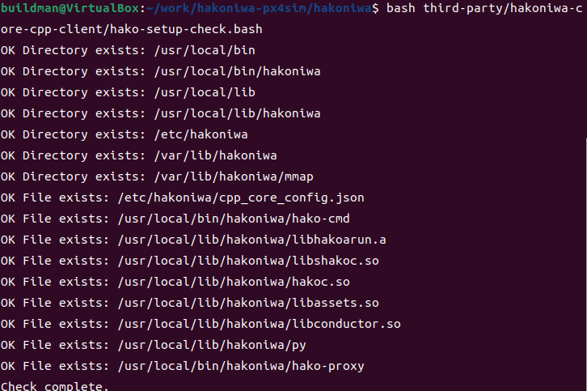

### 1.3.4. Python用のAPIインストール

箱庭ドローンシミュレータの動作確認のためにPython用のAPIライブラリをインストールします。

```bash
$ cd ~/work/hakoniwa-px4sim
$ cd drone_control
$ bash build.bash
$ cd
```

```bash
$ cd ~/work/hakoniwa-px4sim
$ bash drone_api/install.bash
```

### 1.3.5. 環境変数の設定

各インストールした結果を反映させるため、環境変数の設定を実施します。

``` bash
$ vi ~/.bashrc
```

- 環境変数の設定内容

``` txt
export LD_LIBRARY_PATH=/usr/local/lib/hakoniwa:${LD_LIBRARY_PATH}
export PATH=/usr/local/bin/hakoniwa:$PATH
export PYTHONPATH=/usr/local/lib/hakoniwa/py:${PYTHONPATH}
```

設定後、設定内容を反映させるため、シェル画面を再起動してください。

### 1.3.6. 箱庭ドローン Unityアプリのセットアップ

箱庭ドローンシミュレータでのビジュアライズするためのUnityアプリをセットアップします。箱庭ドローンシミュレータ用の各OS対応のUnityアプリを入手します。

[箱庭ドローンシミュレータ Unityアプリリリースページ](https://github.com/toppers/hakoniwa-unity-drone-model/releases)

上記のページにアクセスして、該当のOS用のUnityアプリを入手します。

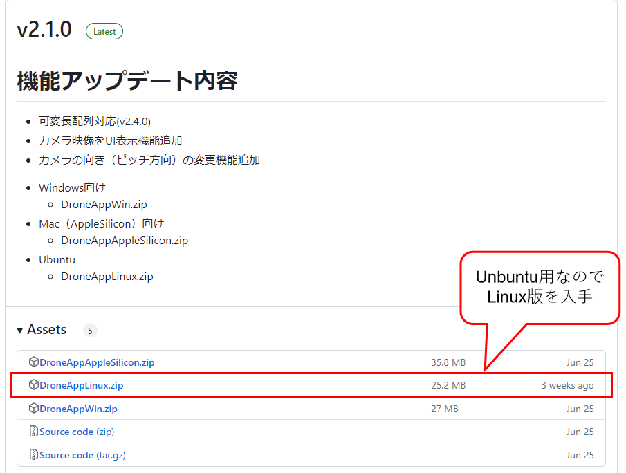

DroneAppLinux.zipを入手します。入手後、解凍します。解凍は、`hakoniwa-unity-drone-model`のディレクトリ配下に解凍してください。

``` bash
$ ~/work/hakoniwa-unity-drone-model
$ unzip ~/Downlods/DroneAppLinux.zip
```

## 1.4. 箱庭ドローンシミュレータでの動作確認

ここからは、Unbuntu上での箱庭ドローンシミュレータのPython APIを使った動作確認をしていきます。

### 1.4.1. 箱庭コア機能の起動

最初に箱庭コア機能を起動します。

``` bash
$ cd ~/work/hakoniwa-px4sim/hakoniwa
$ bash drone-app.bash ../../hakoniwa-unity-drone-model/DroneAppLinux ./config/api_sample
```

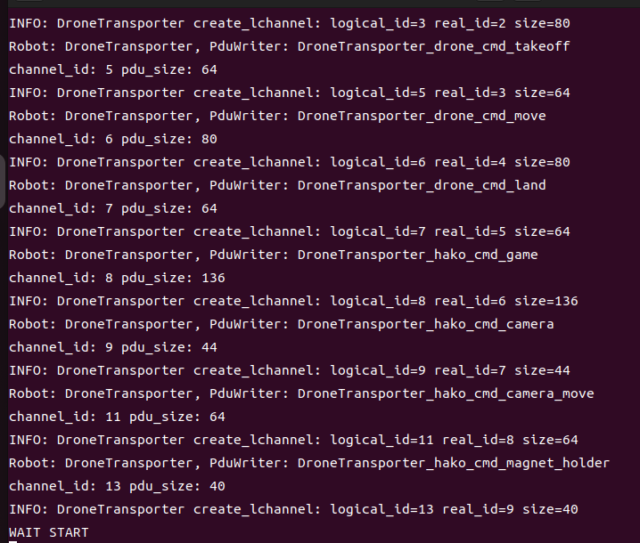


### 1.4.2. Unityアプリの起動

箱庭ドローンシミュレータのビジュアライズするUnityアプリを起動します。

``` bash
$ ~/work/hakoniwa-unity-drone-model
$ bash ./plugin/activate_app.bash DroneAppLinux
```

Unityアプリが起動したら、STARTボタンを押して、待機します。

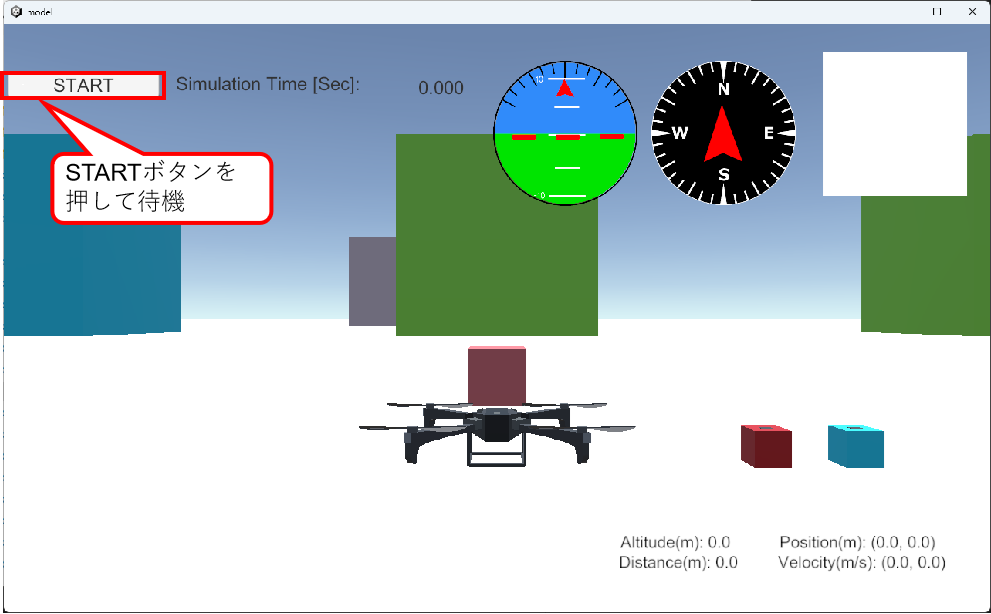

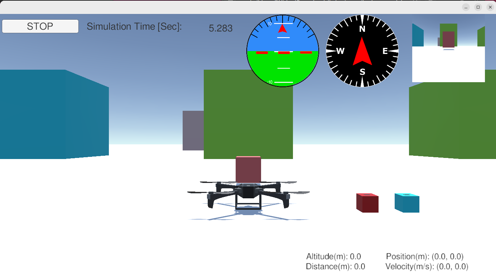


### 1.4.3. sampleアプリの起動

環境の動作を確認するため、ドローンが飛行して荷物を運ぶsampleアプリを起動します。

```bash
$ cd ~/work/hakoniwa-px4sim
$ cd drone_api/sample
$ python3 sample.py ../../../hakoniwa-unity-drone-model/DroneAppLinux/custom.json
```

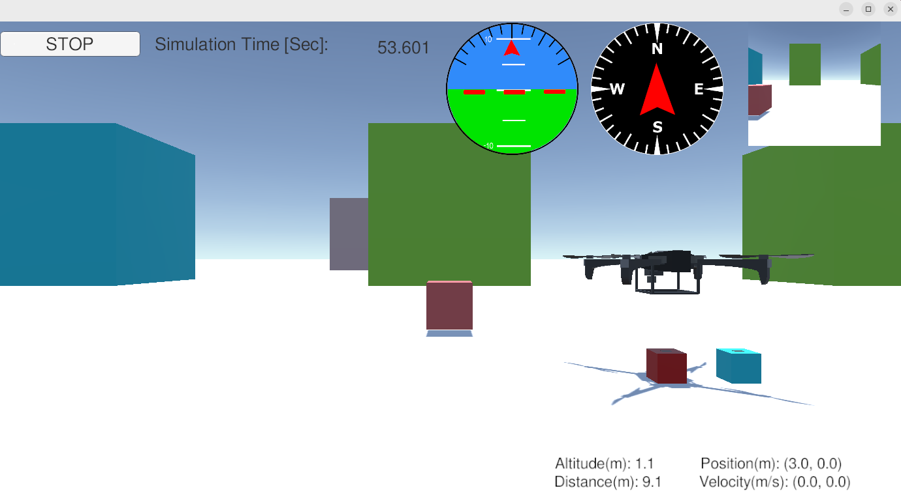


### 1.4.4. PS4のコントローラでのドローン操作

Unityアプリ上のドローンをPS4のコントローラで操作させるためのプロポ用のアプリを起動します。PC本体にPS4のコントローラをUSBに接続します。

1.4.1 箱庭コア機能の起動、1.4.2 Unityアプリの起動手順を実施後に、以下のプロポ用のアプリを起動します。


```bash
$ cd ~/work/hakoniwa-px4sim/hakoniwa
$ cd drone_api/sample
$ python3 rc-custom.py ../../../hakoniwa-unity-drone-model/DroneAppLinux/custom.json rc_config/ps4-control-lnx.json
```

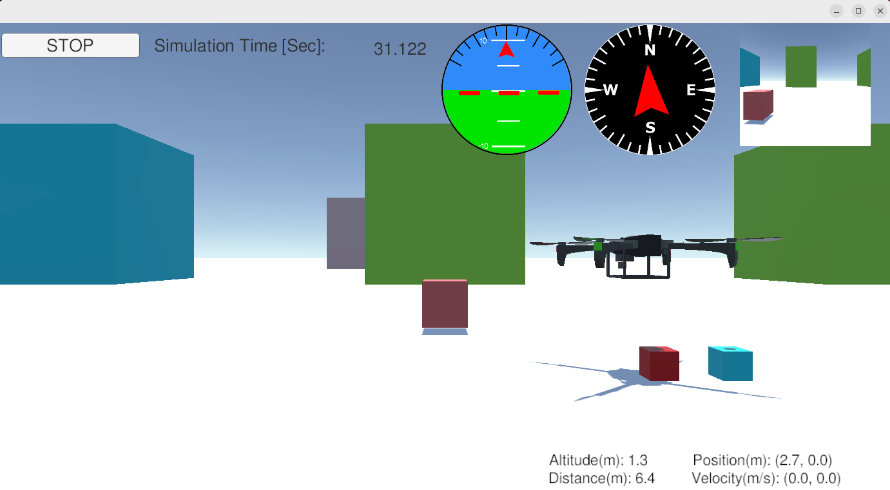

機体の操作は、以下のようになります。

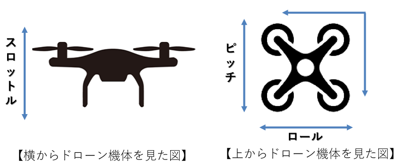

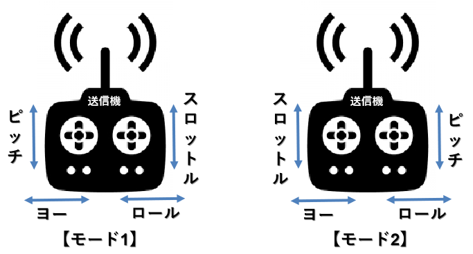

PS4コントローラでの操作は、以下のようになります。

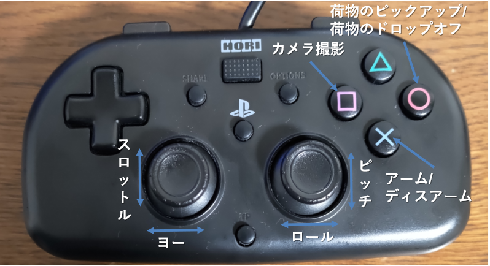


Ubuntuなど、Linux系のOSでは、ゲームパッド毎に設定が違うため、利用するゲームパッドの設定を調査する必要があります。ゲームパッドの操作の調査については、USB接続でゲームパッドを接続したの後に以下のpythonスクリプトを利用することで対応ができます。

```bash
$ cd  ~/work/hakoniwa-px4sim/drone_api/sample/rc_debug
$ python3 rc_control.py
```
[ゲームパッドのデバッグ方法](https://github.com/toppers/hakoniwa-px4sim/blob/main/docs/manual/rcdebug.md)


上記の調査した結果は、以下のフォルダのjsonファイルに設定することで対応が可能となります。以下のサンプルのjsonファイルをコピーして、利用するゲームパッドに合わせた設定をして、コントローラの起動をするようにしてください。

```bash
$ ~/work/hakoniwa-px4sim/drone_api/sample/rc_config
$ ls
FS-i6S.json  hori4mini-control-lnx.json  ps4-control-lnx.json  ps4-control.json
```

- 現在対応できているコントローラのコンフィグファイル(json形式)

|No|名前|内容|
|:---|:---|:---|
|1|ps4-control.json|PS4用のゲームコントローラ(Windows/Mac OS)|
|2|ps4-control-lnx.json|PS4用のゲームコントローラ(Linux OS)|
|3|hori4mini-control-lnx.json|PS4互換HORI4 miniゲームコントローラ(Linux OS)|
|4|FS-i6S.json|FLY SKY社製 FS-i6Sプロポ(送信機)|


## 1.5. 箱庭ドローンシミュレータのログリプレイ機能

V2.6.0以降より、箱庭ドローンシミュレータで動かした結果がログとして残るようになってます。このログを使って、リプレイすることが可能となっています。

### 1.5.1. ログリプレイの動作確認確認

以下の手順にて、ログリプレイ機能用のスクリプトを編集します。

```bash
$ vi ~/work/hakoniwa-px4sim/hakoniwa/replay.bash
```

replay.bashの以下の部分を+になっているような内容に変更します。

```diff
-export HAKO_CUSTOM_JSON_PATH=../../hakoniwa-unity-drone-model/custom.json
+export HAKO_CUSTOM_JSON_PATH=../../hakoniwa-unity-drone-model/DroneAppLinux/custom.json
```

編集後、以下の手順にてを実行します。

```bash
$ cd ~/work/hakoniwa-px4sim/hakoniwa
$ bash replay.bash
```

上記の手順を実施後に、1.4.2 Unityアプリの起動手順を実行します。ログに記録されたドローンの飛行結果を確認することができます。

### 1.5.2. ログの記録場所

箱庭ドローンシミュレータでシミュレータとした結果は、以下の場所にcsv形式でドローンをシミュレートした結果が保管されています。ログとして保管されています。ログを残したい場合は、以下のディレクトリをコピーして保管しておいてください。

```bash
$ cd ~/work/hakoniwa-px4sim/hakoniwa
$ ls drone_log0/
drone_dynamics.csv  log_gps.csv   log_rotor_0.csv  log_rotor_3.csv
log_acc.csv         log_gyro.csv  log_rotor_1.csv  log_thrust.csv
log_baro.csv        log_mag.csv   log_rotor_2.csv 
```