<div class="box-title">
    <p>
    <div style="font-size:18pt;font-weight:bold;text-align:center;margin-top:150px"><span class="title">箱庭ドローンシミュレータ Windows版インストーラ利用方法
    利用</span></div>
    </p>
    <p>
    <div style="font-size:14pt;font-weight:bold;text-align:center;margin-top:20px"><span class="sub-title">インストーラ利用とサンプルアプリ動作確認</span></div>
    </p>
    <p>
    <div style="font-size:12pt;font-weight:bold;text-align:center;margin-top:500px"><span class="author">ドローンWG</span></div>
    </p>
    <p>
    <div style="font-size:12pt;font-weight:bold;text-align:center;margin-top:10px"><span class="date">2024年10月06日</span></div>
    </p>
</div>

<!-- 改ページ -->
<div style="page-break-before:always"></div>

<div style="font-size:18pt;font-weight:bold;text-align:left;"><span class="contents">目次</span></div>
<!-- TOC -->

- [1. 本ドキュメントについて](#1-本ドキュメントについて)
  - [1.1. 対象環境](#11-対象環境)
  - [1.2. 前提条件](#12-前提条件)
- [2. 箱庭ドローンシミュレータ Windows用のインストーラについて](#2-箱庭ドローンシミュレータ-windows用のインストーラについて)
- [3. 箱庭ドローンシミュレータ Windows用のインストール手順](#3-箱庭ドローンシミュレータ-windows用のインストール手順)
  - [3.1. 箱庭ドローンシミュレータ Windows用のインストーラ実行](#31-箱庭ドローンシミュレータ-windows用のインストーラ実行)
- [4. Pythonシミュレーション動作用の事前準備](#4-pythonシミュレーション動作用の事前準備)
  - [4.1. Pythonシミュレーション用のライブラリ導入](#41-pythonシミュレーション用のライブラリ導入)
- [5. Python API用のサンプルアプリ実行](#5-python-api用のサンプルアプリ実行)
  - [5.1. hakowinフォルダの内容](#51-hakowinフォルダの内容)
  - [5.2. サンプリアプリの動作確認](#52-サンプリアプリの動作確認)
    - [5.2.1. 箱庭コア機能の起動](#521-箱庭コア機能の起動)
    - [5.2.2. 箱庭ドローンシミュレータ用のUnityアプリ起動](#522-箱庭ドローンシミュレータ用のunityアプリ起動)
    - [5.2.3. Python API サンプルアプリの起動](#523-python-api-サンプルアプリの起動)
  - [5.3. ドローンの機体操作アプリの動作確認](#53-ドローンの機体操作アプリの動作確認)
    - [5.3.1. 送信機(PS4コントローラ)の接続](#531-送信機ps4コントローラの接続)
      - [5.3.1.1. PS4コントローラの操作定義](#5311-ps4コントローラの操作定義)
    - [5.3.2. 箱庭コア機能の起動](#532-箱庭コア機能の起動)
    - [5.3.3. 箱庭ドローンシミュレータ用のUnityアプリ起動](#533-箱庭ドローンシミュレータ用のunityアプリ起動)
    - [5.3.4. ドローン機体操作アプリの起動](#534-ドローン機体操作アプリの起動)
      - [5.3.4.1. 実際の操作](#5341-実際の操作)
- [6. トラブルシューティング](#6-トラブルシューティング)
  - [6.1. 環境変数が設定できていない場合](#61-環境変数が設定できていない場合)
  - [6.2. Ramdiskが設定できてない場合](#62-ramdiskが設定できてない場合)

<!-- /TOC -->
<!-- 改ページ -->
<div style="page-break-before:always"></div>


<div style="font-size:18pt;font-weight:bold;text-align:left;"><span class="contents">用語集・改版履歴</span></div>


|略語|用語|意味|
|:---|:---|:---|
||||


|No|日付|版数|変更種別|変更内容|
|:---|:---|:---|:---|:---|
|1|2024/08/24|0.1|新規|新規作成|
|2|2024/10/06|0.2|追加|機体操作のアプリ説明を追加|
||||||

<!-- 改ページ -->
<div style="page-break-before:always"></div>

# 1. 本ドキュメントについて

本ドキュメントは、箱庭ドローンシミュレータ用のWindows用のインストーラの利用方法とPython APIを使ったサンプルアプリ動作の確認をする解説をします。

## 1.1. 対象環境

本ドキュメントでは、以下のOSバージョンとPC環境(推奨)を想定としています。

|No|対象|内容|
|:---|:---|:---|
|1|OS|Windows10/11|
|2|PC|64bit環境|
|3|PC|Corei7 9th以降|
|4|PC|32Gbyteのメモリ推奨|
|5|PC|SSD 512Gbyte以上|
|6|PC|Graphicsアクセラレータ推奨|

## 1.2. 前提条件

Ramdiskのインストールが完了していることが必要です。Ramdiskのインストールについては、windows_preinstall手順を確認して、インストールを完了してください。
Python環境のインストールが完了していることが必要です。Python環境のインストールについては、windows_preinstall手順を確認して、インストールを完了してください。

# 2. 箱庭ドローンシミュレータ Windows用のインストーラについて

箱庭ドローンシミュレータ Windows用のインストーラは、Microsoft社のVisual Studio 2022 Community版の統合開発環境を利用して開発されています。
利用用途は、オープンソース且つ、個人的な利用に限られます。詳細なライセンス条項等は、Microsoft社のライセンスに則るものとします。

[Visual Studio 2022 Community版ライセンス条項](https://visualstudio.microsoft.com/ja/license-terms/vs2022-ga-community/)

[Visual Studio 2022 Community版再配布条項](https://learn.microsoft.com/ja-jp/visualstudio/releases/2022/redistribution)


# 3. 箱庭ドローンシミュレータ Windows用のインストール手順

Releasページにあるzipファイルを入手します。入手後、適当なフォルダに展開してください。

## 3.1. 箱庭ドローンシミュレータ Windows用のインストーラ実行

zipファイルを展開したフォルダに移動します。setup.exe, hakowin.msiが展開されています。各ファイルの内容は、以下の通りです。

|No|ファイル名|内容|
|:---|:---|:---|
|1|setup.exe|箱庭ドローンシミュレータ動作環境インストール用のセットアップ実行ファイル|
|2|hakowin.msi|箱庭ドローンシミュレータ動作環境パッケージ一式|

上記のファイルが展開されていることが確認できたら、setup.exeを右クリックして、`管理者として実行`をクリックします。

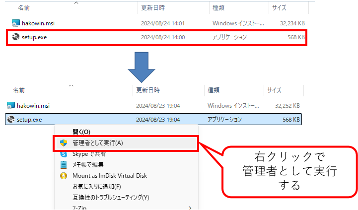

hakowinセットアップウィザードの画面が起動しますので、次をクリックします。

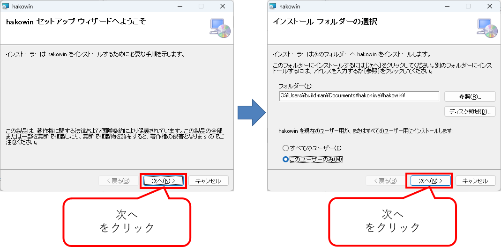

インストールフォルダの選択画面が出てきます。次をクリックします。
- 注意
  インストールフォルダの選択画面ではインストール先のフォルダや、ユーザが選択できますが、インストールフォルダ,ユーザ選択は変更ぜずにインストールをしてください。

hakoniwa drone config fileの画面が出てきますので、コンフィグファイルの指定ラジオボタンは、デフォルトのまま、次をクリックします。

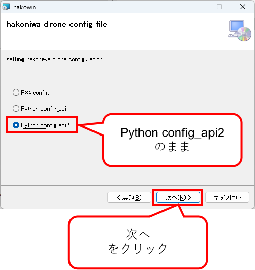

インストールの確認画面が出てきますので、次をクリックします。次の画面でhakowinのインストール画面が出てきますので、プログレスバーが完了するまで待ちます。
プログレスバーが完了したら、次をクリックします。次の画面でインストールの完了画面が出てきますので、閉じるをクリックして終了してください。

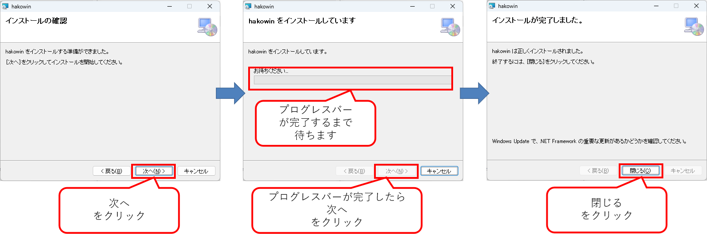

これで箱庭ドローンシミュレータ環境の動作環境がインストールされました。

インストール先は、以下のフォルダにインストールされています。

```txt
C:\Users\”User名”\Documents\hakoniwa\hakowin\hakoniwa-px4-win
```


# 4. Pythonシミュレーション動作用の事前準備

Pythonを使ったシミュレーションを実行するには、Python動作用のライブラリをインストールしておく必要があります。

## 4.1. Pythonシミュレーション用のライブラリ導入

Windowsスタートメニューから、Powershellを管理者モードで起動します。

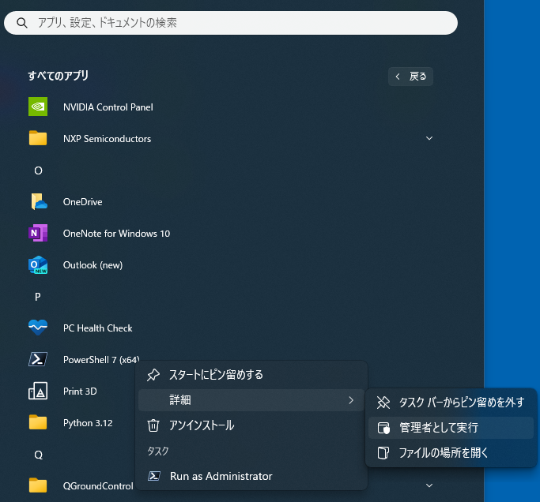

Powershellが起動したら、pipコマンドで以下のライブラリを導入します。

```powershell
PS C:\Windows\System32> pip install pygame
PS C:\Windows\System32> pip install numpy
PS C:\Windows\System32> pip install opencv-python
```

# 5. Python API用のサンプルアプリ実行

インストーラでのインストールが完了すると、ディスクトップ上にhakowinフォルダが作成されます。このフォルダに箱庭ドローンシミュレータ環境やPython API用のサンプルアプリなどのショートカットが配置されています。

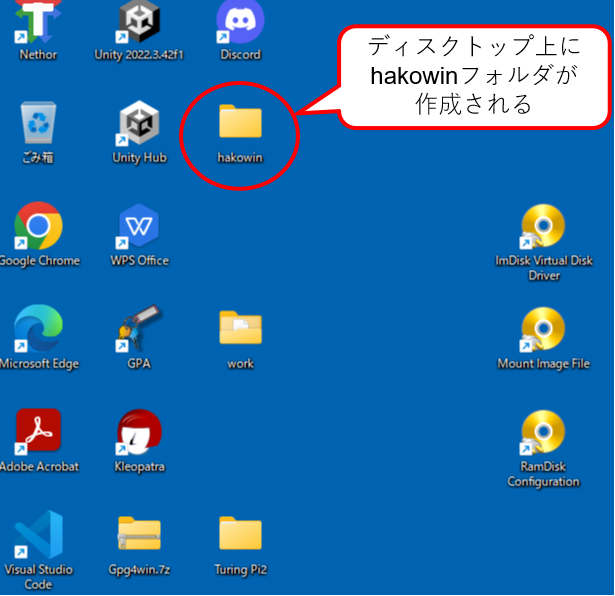

## 5.1. hakowinフォルダの内容

箱庭ドローンシミュレータで利用する箱庭コア機能、Unityのドローンモデル、サンプルアプリなどが配置されています。


|No|ファイル名|種類|用途|
|:---|:---|:---|:---|
|1|create_mmap.batのショートカット|mmap|mmap確認用のツール|
|2|run-win.batのショートカット|箱庭コア機能|PX4用の箱庭コア機能起動用|
|3|run-api.batのショートカット|箱庭コア機能|Python APIを使った箱庭コア機能起動用|
|4|run-api2.batのショートカット|箱庭コア機能|Python APIを使った箱庭コア機能起動用|
|5|run-sample.batのショートカット|Pythonアプリ機能|Python APIを使ったサンプルアプリ起動用|
|6|run-camera.batのショートカット|Pythonアプリ機能|Python APIを使ったカメラアプリ起動用|
|7|run-rc.batのショートカット|Pythonアプリ機能|Python APIを使ったプロポアプリ起動用|
|8|unity_model.exeのショートカット|Unityアプリ機能|箱庭ドローンシミュレータ用のUnityビジュアライズアプリ起動用|

## 5.2. サンプリアプリの動作確認

正しくインストールできていること確認するため、Python APIを使ったサンプルアプリを起動して動作確認をします。

### 5.2.1. 箱庭コア機能の起動

最初に箱庭コア機能を起動します。hakowinフォルダ内の`run-api2.batのショートカット`をダブルクリックして起動します。

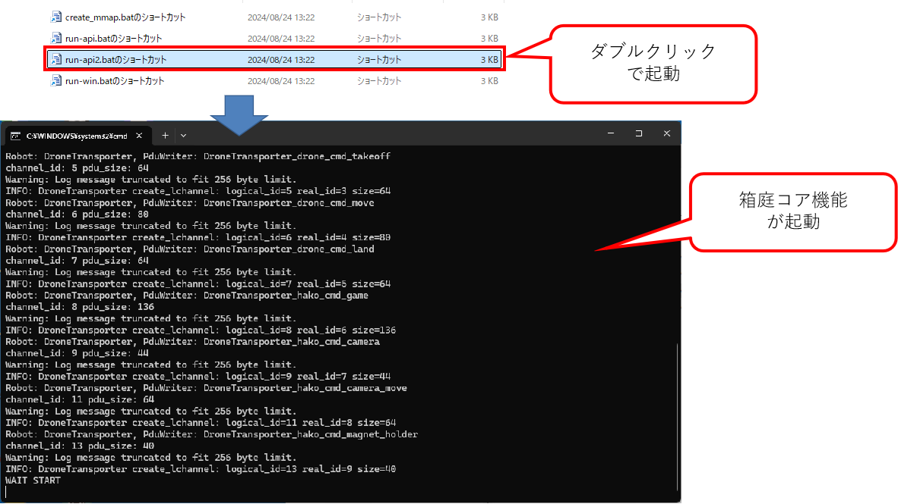

WAIT STARTと表示され、待ち状態になっていることを確認します。

### 5.2.2. 箱庭ドローンシミュレータ用のUnityアプリ起動

次に箱庭ドローンシミュレータでビジュアライズをするためのUnityアプリを起動します。`drone_model.exeのショートカット`をダブルクリックします。

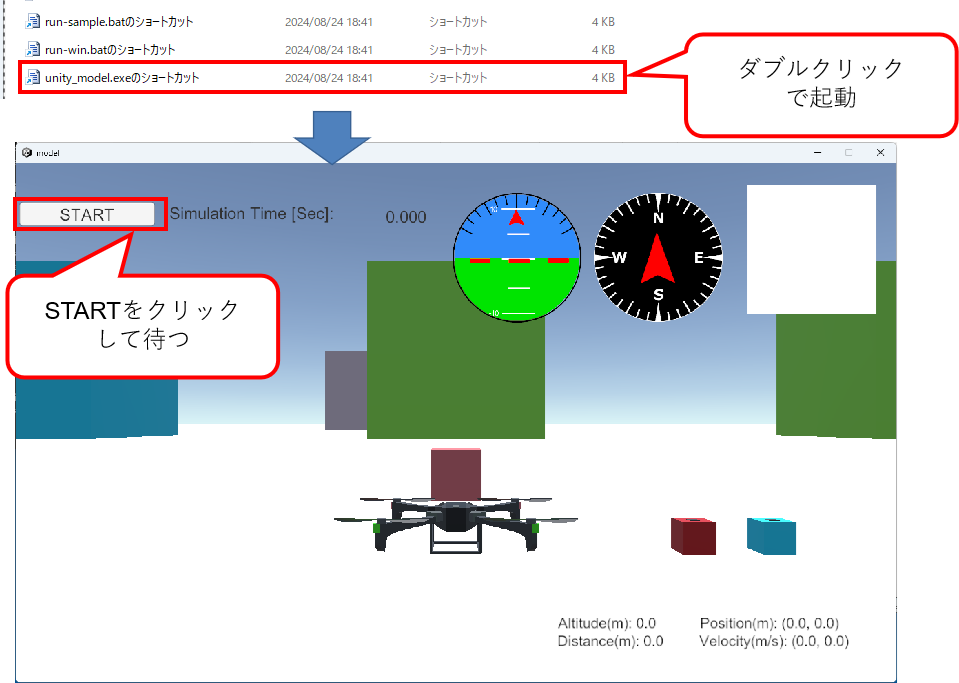

Unityアプリが起動したら、STARTボタンをクリックして待ちます。

### 5.2.3. Python API サンプルアプリの起動

最後にPython APIの動作確認のため、サンプルアプリを起動します。`run-sample.batのショートカット`をダブルクリックして起動します。

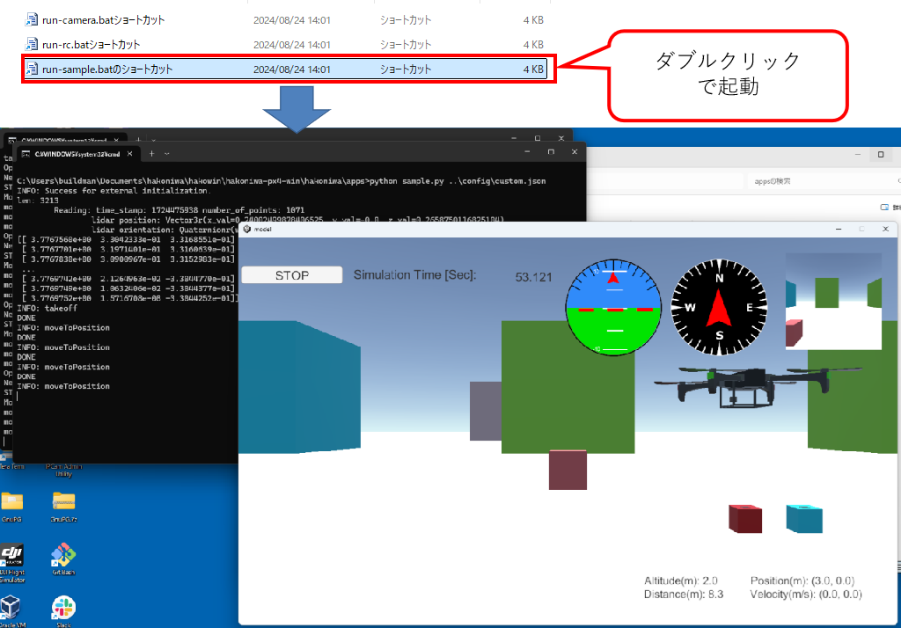

サンプルアプリ起動後にUnityアプリ上でドローンが正しく飛んでいれば、インストールは正常にできています。

## 5.3. ドローンの機体操作アプリの動作確認

実際にコントローラを使って、箱庭ドローンシミュレータ上で、ドローンの機体操作を確認します。

### 5.3.1. 送信機(PS4コントローラ)の接続

PS4用のコントローラをPCにUSB接続します。

#### 5.3.1.1. PS4コントローラの操作定義

Pythonシミュレータでは、ドローンの機体をPS4コントローラで操作します。PS4コントローラの操作方法は、以下のような定義になっています。

|No|PS4コントローラ|内容|備考|
|:---|:---|:---|:---|
|1|左側Joy Stick|スロットルとヨーの操作をします||
|2|右側Joy Stick|ピッチとロールの操作をします||
|3|×ボタン|アーム/ディスアームをします|アームはプロペラ回転開始/ディスアームはプロペラ回転停止のこと|
|4|□ボタン|カメラを使った撮影を操作します||
|5|○ボタン|Pythonシミュレータ上に配置されている荷物のピックアップ/ドロップオフを操作します|

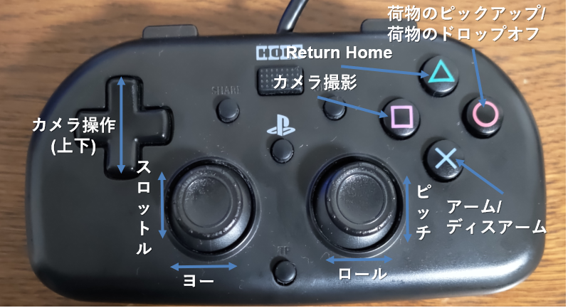


### 5.3.2. 箱庭コア機能の起動

最初に箱庭コア機能を起動します。hakowinフォルダ内の`run-api2.batのショートカット`をダブルクリックして起動します。


WAIT STARTと表示され、待ち状態になっていることを確認します。

### 5.3.3. 箱庭ドローンシミュレータ用のUnityアプリ起動

次に箱庭ドローンシミュレータでビジュアライズをするためのUnityアプリを起動します。`drone_model.exeのショートカット`をダブルクリックします。


Unityアプリが起動したら、STARTボタンをクリックして待ちます。

### 5.3.4. ドローン機体操作アプリの起動

最後にドローン機体操作アプリの動作確認のため、ドローン機体操作アプリを起動します。`run-rc.batのショートカット`をダブルクリックして起動します。

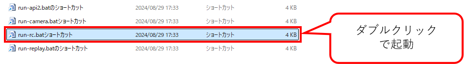

#### 5.3.4.1. 実際の操作

PS4コントローラを使って実際に操作してみましょう。まず、×ボタンを押して、プロペラを回転させて、左側のJoy Stickを上下に操作することで、上昇/下降ができ、左右に操作することで左右旋回を操作できます。右側のJoy Stickを上下に操作することで、前進/後進ができ、左右させることで左右に移動を操作できます。

実際にPythonシミュレータに配置されている荷物の搬送や、カメラを使った撮影などを行ってみましょう。

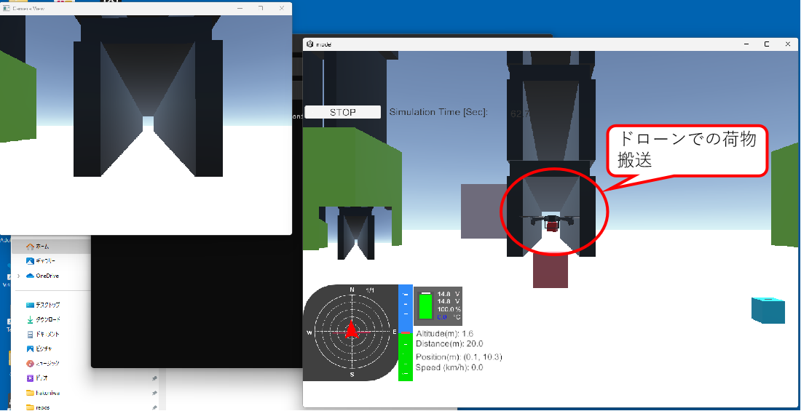


# 6. トラブルシューティング

インストーラを使った箱庭ドローンシミュレータ動作環境では、いくつかのトラブルが発生する可能性があります。以下のようなトラブルになった場合には、環境を見直してください。

## 6.1. 環境変数が設定できていない場合

管理者権限でのインストールをしていない場合には、Windows側のシステム上、環境変数が設定されません。環境変数が設定できていないと、以下のようなエラーが発生する場合があります。

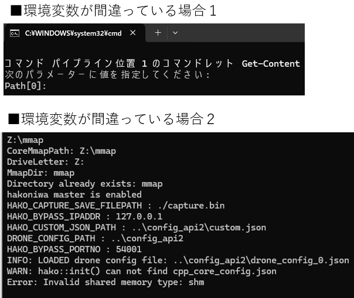

この場合は、箱庭ドローンシミュレータのインストーラが管理者権限で実行されてないために置きますので、一度、アンインストールして、管理者権限で再度インストールし直してください。

## 6.2. Ramdiskが設定できてない場合

Ramdiskが正しく設定できていない場合、以下のようなエラーが発生する場合があります。

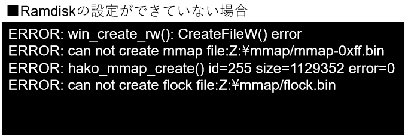

この場合、Ramdiskの設定を見直すため、windows_preinstallの手順を良く見直して、設定を確認してください。
