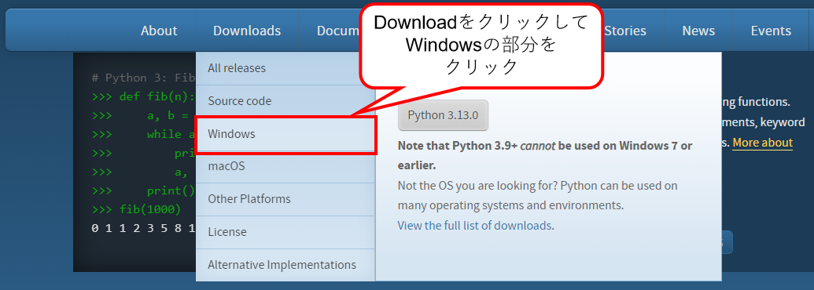
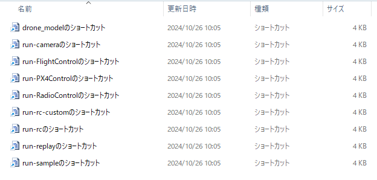
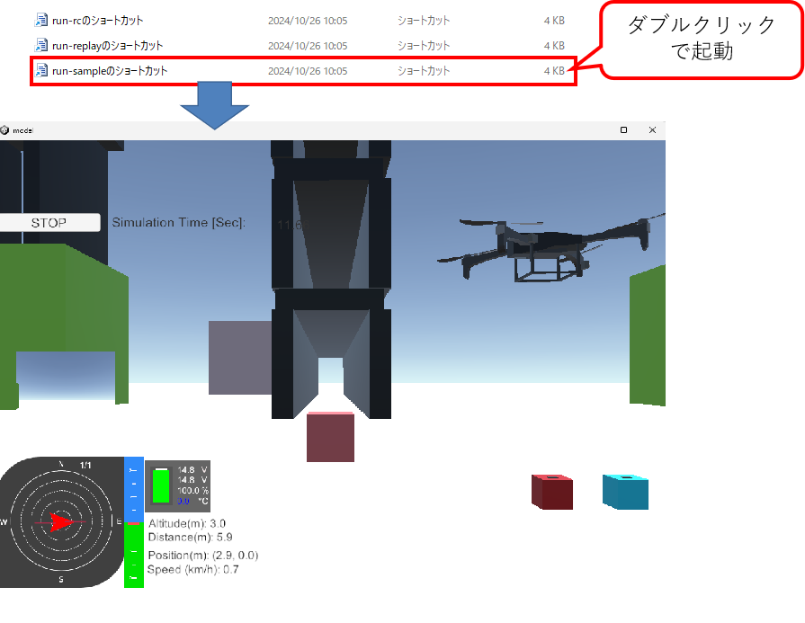
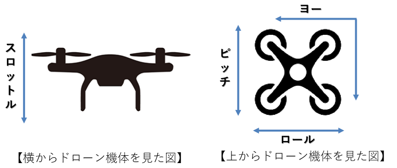

<div class="box-title">
    <p>
    <div style="font-size:18pt;font-weight:bold;text-align:center;margin-top:150px"><span class="title">箱庭ドローンシミュレータ Windows版インストーラ利用方法
    利用</span></div>
    </p>
    <p>
    <div style="font-size:14pt;font-weight:bold;text-align:center;margin-top:20px"><span class="sub-title">インストーラ利用とサンプルアプリ動作確認</span></div>
    </p>
    <p>
    <div style="font-size:12pt;font-weight:bold;text-align:center;margin-top:500px"><span class="author">ドローンWG</span></div>
    </p>
    <p>
    <div style="font-size:12pt;font-weight:bold;text-align:center;margin-top:10px"><span class="date">2024年10月26日</span></div>
    </p>
</div>

<!-- 改ページ -->
<div style="page-break-before:always"></div>

<div style="font-size:18pt;font-weight:bold;text-align:left;"><span class="contents">目次</span></div>
<!-- TOC -->

- [1. 本ドキュメントについて](#1-本ドキュメントについて)
  - [1.1. 対象環境](#11-対象環境)
  - [1.2. 前提条件](#12-前提条件)
    - [1.2.1. RAM Disk環境について](#121-ram-disk環境について)
    - [1.2.2. ImDisk Toolkitのインストール](#122-imdisk-toolkitのインストール)
    - [1.2.3. 箱庭シミュレータ用の設定](#123-箱庭シミュレータ用の設定)
    - [1.2.4. Python環境のインストール](#124-python環境のインストール)
- [2. 箱庭ドローンシミュレータ Windows用のインストーラについて](#2-箱庭ドローンシミュレータ-windows用のインストーラについて)
- [3. 箱庭ドローンシミュレータ Windows用のインストール手順](#3-箱庭ドローンシミュレータ-windows用のインストール手順)
  - [3.1. 箱庭ドローンシミュレータ Windows用のインストーラ実行](#31-箱庭ドローンシミュレータ-windows用のインストーラ実行)
- [4. Pythonシミュレーション動作用の事前準備](#4-pythonシミュレーション動作用の事前準備)
  - [4.1. Pythonシミュレーション用のライブラリ導入](#41-pythonシミュレーション用のライブラリ導入)
- [5. Python API用のサンプルアプリ実行](#5-python-api用のサンプルアプリ実行)
  - [5.1. hakowinフォルダの内容](#51-hakowinフォルダの内容)
    - [5.1.1. 箱庭コア機能の動作について](#511-箱庭コア機能の動作について)
  - [5.2. Flight Control Python API サンプリアプリの動作確認](#52-flight-control-python-api-サンプリアプリの動作確認)
    - [5.2.1. 箱庭コア機能の起動](#521-箱庭コア機能の起動)
    - [5.2.2. 箱庭ドローンシミュレータ用のUnityアプリ起動](#522-箱庭ドローンシミュレータ用のunityアプリ起動)
    - [5.2.3. Flight Control Python API サンプルアプリの起動](#523-flight-control-python-api-サンプルアプリの起動)
  - [5.3. ドローンの機体操作アプリの動作確認](#53-ドローンの機体操作アプリの動作確認)
    - [5.3.1. ドローン操作について](#531-ドローン操作について)
      - [5.3.1.1. ドローン機体の動作](#5311-ドローン機体の動作)
      - [5.3.1.2. 送信機(プロポ)の操作](#5312-送信機プロポの操作)
    - [5.3.2. 送信機(PS4コントローラ)の接続](#532-送信機ps4コントローラの接続)
      - [5.3.2.1. PS4コントローラの操作定義](#5321-ps4コントローラの操作定義)
    - [5.3.3. 箱庭コア機能の起動](#533-箱庭コア機能の起動)
    - [5.3.4. 箱庭ドローンシミュレータ用のUnityアプリ起動](#534-箱庭ドローンシミュレータ用のunityアプリ起動)
    - [5.3.5. ドローン機体操作アプリの起動](#535-ドローン機体操作アプリの起動)
      - [5.3.5.1. 実際の操作](#5351-実際の操作)
    - [5.3.6. コントローラ操作のカスタム操作](#536-コントローラ操作のカスタム操作)
      - [5.3.6.1. コントローラ操作のカスタム定義方法](#5361-コントローラ操作のカスタム定義方法)
      - [5.3.6.2. コントローラ定義の対応方法](#5362-コントローラ定義の対応方法)
  - [5.4. ログリプレイ機能について](#54-ログリプレイ機能について)
    - [5.4.1. 箱庭コア機能の起動](#541-箱庭コア機能の起動)
    - [5.4.2. 箱庭ドローンシミュレータ用のUnityアプリ起動](#542-箱庭ドローンシミュレータ用のunityアプリ起動)
      - [5.4.2.1. ログの格納場所](#5421-ログの格納場所)
- [6. トラブルシューティング](#6-トラブルシューティング)
  - [6.1. 環境変数が設定できていない場合](#61-環境変数が設定できていない場合)
  - [6.2. RAM Diskが設定できてない場合](#62-ram-diskが設定できてない場合)
  - [6.3. PythonのVersionが3.12となってない場合](#63-pythonのversionが312となってない場合)

<!-- /TOC -->
<!-- 改ページ -->
<div style="page-break-before:always"></div>


<div style="font-size:18pt;font-weight:bold;text-align:left;"><span class="contents">用語集・改版履歴</span></div>


|略語|用語|意味|
|:---|:---|:---|
||||


|No|日付|版数|変更種別|変更内容|
|:---|:---|:---|:---|:---|
|1|2024/08/24|0.1|新規|新規作成|
|2|2024/10/06|0.2|追加|機体操作のアプリ説明を追加|
|3|2024/10/26|0.3|追加・変更|v2.7.0のリリースに伴う追加・変更|
||||||

<!-- 改ページ -->
<div style="page-break-before:always"></div>

# 1. 本ドキュメントについて

本ドキュメントは、箱庭ドローンシミュレータ用のWindows用のインストーラの利用方法とPython APIを使ったサンプルアプリ動作の確認をする解説をします。

## 1.1. 対象環境

本ドキュメントでは、以下のOSバージョンとPC環境(推奨)を想定としています。

|No|対象|内容|
|:---|:---|:---|
|1|OS|Windows10/11|
|2|PC|64bit環境|
|3|PC|Corei7 9th以降|
|4|PC|32Gbyteのメモリ推奨|
|5|PC|SSD 512Gbyte以上|
|6|PC|Graphicsアクセラレータ推奨|

## 1.2. 前提条件

Ramdiskのインストールが完了していることが必要です。Ramdiskのインストールについては、以下の手順でインストールを完了してください。
Python環境のインストールが完了していることが必要です。Python環境のインストールについては、以下の手順を確認して、インストールを完了してください。

### 1.2.1. RAM Disk環境について

各要素間で通信でのデータ共有のためにRAM Disk利用しますが、標準のWindows環境ではRAM Diskを作成するためのツールはないため、フリーのツールを導入する必要があります。
Windows用のRAM Disk作成ツールは、さまざまありますが、現状Windows10 or 11で利用制限がないと思われるものを採用することにします。

[Windows用RAM Diskツール比較 参考サイト](https://ik4.es/ja/como-crear-un-disco-ram-en-windows-10-8-y-windows-7/)


ライセンスや使用制限内容などから、今回は「ImDisk」を利用することにします。

### 1.2.2. ImDisk Toolkitのインストール

ImDiskの公式ページにアクセスして、ImDisk環境を入手します。

[ImDisk Toolkit公式ページ(SourceForge)](https://sourceforge.net/projects/imdisk-toolkit/)


ImDisk Toolkitをダウンロードしたら「ImDiskTk-x64.zip」を解凍します。解凍すると「install.bat」があるので、ダブルクリックして、インストーラを起動します。インストーラが起動するとGUIが起動しますので、画面に従って、インストールを行ってください。


インストールが完了すると、ImDisk Toolkit関連のアイコンがディスクトップに出てきますので、「RamDisk Configuration」のアイコンをダブルクリックして、コンフィグレーション画面を起動します。
コンフィグレーション画面が起動したら、以下の設定値を設定して、OKボタンをクリックして終了します。

|No|設定内容|設定値|
|:---|:---|:---|
|1|Size|64MBを指定|
|2|Drive Letter|Z:を指定|
|3|File System|NTFSを指定|


設定が完了すると「Windowsの電源設定」の警告画面が表示されることがあるため以下の電源設定画面にて、高速スタートアップのチェックボックスをOFFにします。完了したら、Windowsを再起動します。


再起動が完了すると以下のようにRamDiskが作成されます。


[ImDiskセットアップ参考サイト：RAM ディスクで超快適環境を構築](https://avalon-studio.work/blog/windows/ram-disk-configration/)

### 1.2.3. 箱庭シミュレータ用の設定

箱庭シミュレータでは、RamDisk上のmmapというフォルダを利用することになります。RamDisk上にmmapフォルダを作成する必要があるのですが、RamDiskの性質上、Windowsを再起動やシャットダウンするとmmapフォルダはなくなってしまいます。
このため、mmapフォルダをWindows起動時にmmapフォルダを作成するようにImDisk Toolkitを設定する必要があります。

「mmap.bat」ファイルを作成します。mmap.batファイルの内容は以下のようになります。

```txt
z:
mkdir mmap
```

mmap.batファイルを作成したら、適当な場所に保存してください。保存ができたら、「RamDisk Configuration」をダブルクリックして起動します。

RamDisk Configurationの画面が起動したら、Advancedのタブをクリックします。Advancedの画面になったら、「Run after mounting」の部分に、先ほど作成したmmap.batを指定します。
完了したらOKボタンをクリックして終了します。


### 1.2.4. Python環境のインストール

Pythonの公式ページにアクセスして、PythonをWindowsで動作させる環境を入手します。

[Python公式ページ](https://www.python.org/)



箱庭ドローンシミュレータで利用するPython環境は、Version 3.12を前提としていますので、リリースページからPython 3.12をダウンロードしてください。


ダウンロードが完了したらインストーラを起動して、画面に従ってインストールをします。


[参考URL：【Windows】Python3.10のインストール(パス通し)](https://qiita.com/youichi_io/items/3111e1cf696a87673b23)

# 2. 箱庭ドローンシミュレータ Windows用のインストーラについて

箱庭ドローンシミュレータ Windows用のインストーラは、Microsoft社のVisual Studio 2022 Community版の統合開発環境を利用して開発されています。
利用用途は、オープンソース且つ、個人的な利用に限られます。詳細なライセンス条項等は、Microsoft社のライセンスに則るものとします。

[Visual Studio 2022 Community版ライセンス条項](https://visualstudio.microsoft.com/ja/license-terms/vs2022-ga-community/)

[Visual Studio 2022 Community版再配布条項](https://learn.microsoft.com/ja-jp/visualstudio/releases/2022/redistribution)

# 3. 箱庭ドローンシミュレータ Windows用のインストール手順

Releasページにあるzipファイルを入手します。入手後、適当なフォルダに展開してください。

## 3.1. 箱庭ドローンシミュレータ Windows用のインストーラ実行

zipファイルを展開したフォルダに移動します。setup.exe, hakowin.msiが展開されています。各ファイルの内容は、以下の通りです。

|No|ファイル名|内容|
|:---|:---|:---|
|1|setup.exe|箱庭ドローンシミュレータ動作環境インストール用のセットアップ実行ファイル|
|2|hakowin.msi|箱庭ドローンシミュレータ動作環境パッケージ一式|

上記のファイルが展開されていることが確認できたら、setup.exeを右クリックして、`管理者として実行`をクリックします。


hakowinセットアップウィザードの画面が起動しますので、次をクリックします。


インストールフォルダの選択画面が出てきます。次をクリックします。

- 注意
  インストールフォルダの選択画面ではインストール先のフォルダや、ユーザが選択できますが、インストールフォルダ,ユーザ選択は変更ぜずにインストールをしてください。

hakoniwa drone config fileの画面が出てきますので、コンフィグファイルの指定ラジオボタンは、デフォルトのまま、次をクリックします。


インストールの確認画面が出てきますので、次をクリックします。次の画面でhakowinのインストール画面が出てきますので、プログレスバーが完了するまで待ちます。
プログレスバーが完了したら、次をクリックします。次の画面でインストールの完了画面が出てきますので、閉じるをクリックして終了してください。


これで箱庭ドローンシミュレータ環境の動作環境がインストールされました。

インストール先は、以下のフォルダにインストールされています。

```txt
C:\Users\”User名”\Documents\hakoniwa\hakowin\hakoniwa-px4-win
```


# 4. Pythonシミュレーション動作用の事前準備

Pythonを使ったシミュレーションを実行するには、Python動作用のライブラリをインストールしておく必要があります。

## 4.1. Pythonシミュレーション用のライブラリ導入

Windowsスタートメニューから、Powershellを管理者モードで起動します。


Powershellが起動したら、pipコマンドで以下のライブラリを導入します。

```powershell
PS C:\Windows\System32> pip install pygame
PS C:\Windows\System32> pip install numpy
PS C:\Windows\System32> pip install opencv-python
```

# 5. Python API用のサンプルアプリ実行

インストーラでのインストールが完了すると、ディスクトップ上にhakowinフォルダが作成されます。このフォルダに箱庭ドローンシミュレータ環境やPython API用のサンプルアプリなどのショートカットが配置されています。


## 5.1. hakowinフォルダの内容

箱庭ドローンシミュレータで利用する箱庭コア機能、Unityのドローンモデル、サンプルアプリなどが配置されています。



|No|ファイル名|種類|用途|
|:---|:---|:---|:---|
|1|drone_modelのショートカット|Unityアプリ機能|箱庭ドローンシミュレータ用のUnityビジュアライズアプリ起動用|
|2|run-cameraのショートカット|Pythonアプリ機能|Python APIを使ったカメラアプリ起動用|
|3|run-FlightControlのショートカット|箱庭コア機能|Flight Controlを使ったPython API制御用の箱庭コア機能起動用|
|4|run-PX4Controlのショートカット|箱庭コア機能|PX4と箱庭コアの連携制御用の起動用|
|5|run-RadioControlのショートカット|箱庭コア機能|Radio Controlを使ったPython API制御用の箱庭コア機能起動用|
|6|run-rc-customのショートカット|Pythonアプリ機能|PS4用のコントローラなどコントローラを使ったプロポアプリ起動用(コントローラの指定が可能)|
|7|run-rcのショートカット|Pythonアプリ機能|PS4用のコントローラなどコントローラを使ったプロポアプリ起動用|
|8|run-replayのショートカット|Pythonアプリ機能|フライトログを使ったPython APIでのシミュレーション結果確認用の起動|
|9|run-sampleのショートカット|Pythonアプリ機能|Python APIを使ったサンプルアプリ起動用|

### 5.1.1. 箱庭コア機能の動作について

箱庭コアは、大きく2つの動作となっています。

|No|動作モード|種類|用途|
|:---|:---|:---|:---|
|1|Flight Controlモード|Python APIからの操作|サンプルアプリのようにPythonを使ってドローンを直接制御する場合に利用するモードとなります|
|2|Radio Controlモード|PS4などコントローラからの操作|PS4などコントローラからドローンを操作する場合に利用するモードとなります|

試したい用途に合わせて利用するモードを選択するようにしてください。

## 5.2. Flight Control Python API サンプリアプリの動作確認

正しくインストールできていること確認するため、Python APIを使ったサンプルアプリを起動して動作確認をします。

### 5.2.1. 箱庭コア機能の起動

最初に箱庭コア機能を起動します。hakowinフォルダ内の`run-FlightControlのショートカット`をダブルクリックして起動します。


`WAIT START`と表示され、待ち状態になっていることを確認します。

### 5.2.2. 箱庭ドローンシミュレータ用のUnityアプリ起動

次に箱庭ドローンシミュレータでビジュアライズをするためのUnityアプリを起動します。`drone_modelショートカット`をダブルクリックします。


Unityアプリが起動したら、STARTボタンをクリックして待ちます。

### 5.2.3. Flight Control Python API サンプルアプリの起動

最後にFlight Control Python APIの動作確認のため、サンプルアプリを起動します。`run-sampleのショートカット`をダブルクリックして起動します。



Flight Controlの動作確認用のPython APIサンプルアプリの起動後に、Unityアプリ上でドローンが飛行できていれば、インストールは正常にできています。

## 5.3. ドローンの機体操作アプリの動作確認

実際にコントローラを使って、箱庭ドローンシミュレータ上で、ドローンの機体操作を確認します。

### 5.3.1. ドローン操作について

ここでは、実際のドローンの機体動作や、送信機の操作方法を解説します。

#### 5.3.1.1. ドローン機体の動作

ドローンの機体の動作は、以下のような定義になっています。

|No|用語|内容|
|:---|:---|:---|
|1|スロットル|ドローン機体の上昇と下降操作|
|2|ロール(エルロン)|ドローン機体の左右移動操作|
|3|ピッチ(エレベータ)|ドローン機体の前進と後進操作|
|4|ヨー(ラダー)|ドローン機体の左右旋回操作|



#### 5.3.1.2. 送信機(プロポ)の操作

ドローンの機体操作は、送信機(プロポ)と言われるラジコンで使われる機器で操作をします。送信機には、モード定義があり、ドローン機体の動作に合わせた操作を送信機上のスティックで操作します。


ドローンの機体操作アプリでは、送信機の操作モードをモード2として取り扱う定義となっています。

### 5.3.2. 送信機(PS4コントローラ)の接続

PS4用のコントローラをPCにUSB接続します。

#### 5.3.2.1. PS4コントローラの操作定義

Pythonシミュレータでは、ドローンの機体をPS4コントローラで操作します。PS4コントローラの操作方法は、以下のような定義になっています。

|No|PS4コントローラ|内容|備考|
|:---|:---|:---|:---|
|1|左側Joy Stick|スロットルとヨーの操作をします||
|2|右側Joy Stick|ピッチとロールの操作をします||
|3|×ボタン|アーム/ディスアームをします|アームはプロペラ回転開始/ディスアームはプロペラ回転停止のこと|
|4|□ボタン|カメラを使った撮影を操作します||
|5|○ボタン|Pythonシミュレータ上に配置されている荷物のピックアップ/ドロップオフを操作します|
|6|十字キー(上下)|ドローンの機体にあるカメラ位置を上下に操作します|


### 5.3.3. 箱庭コア機能の起動

最初に箱庭コア機能を起動します。hakowinフォルダ内の`run-RadioControlのショートカット`をダブルクリックして起動します。


WAIT STARTと表示され、待ち状態になっていることを確認します。

### 5.3.4. 箱庭ドローンシミュレータ用のUnityアプリ起動

次に箱庭ドローンシミュレータでビジュアライズをするためのUnityアプリを起動します。`drone_modelのショートカット`をダブルクリックします。


Unityアプリが起動したら、STARTボタンをクリックして待ちます。

### 5.3.5. ドローン機体操作アプリの起動

最後にドローン機体操作アプリの動作確認のため、ドローン機体操作アプリを起動します。`run-rcのショートカット`をダブルクリックして起動します。


#### 5.3.5.1. 実際の操作

PS4コントローラを使って実際に操作してみましょう。まず、X ボタンを押して、プロペラを回転させて、左側のJoy Stickを上下に操作することで、上昇/下降ができ、左右に操作することで左右旋回を操作できます。右側のJoy Stickを上下に操作することで、前進/後進ができ、左右させることで左右に移動を操作できます。

実際にPythonシミュレータに配置されている荷物の搬送や、カメラを使った撮影などを行ってみましょう。


### 5.3.6. コントローラ操作のカスタム操作

PS4以外のコントローラを使った操作をすることも可能となっています。コントローラのカスタム対応をすることで、定義がないコントローラを利用して、5.3.5項での`run-rcのショートカット`ではなく、`run-rc-customのショートカット`で対応することができるようになります。


#### 5.3.6.1. コントローラ操作のカスタム定義方法

以下のフォルダを開いてください。

```txt
C:\Users\buildman\Documents\hakoniwa\hakowin\hakoniwa-px4-win\hakoniwa\apps\
```

フォルダを開いたら`run-rc-custom.bat`を右クリックして、メモ帳で編集を選択して開きます。


`run-rc-custom.bat`が開いたら、下記の赤枠になっている部分を変更することで、コントローラの操作をカスタムすることができるようになります。


現時点では、以下のコントローラの対応ができています。コンフィグの定義ファイルは、以下のフォルダに入っています。

```txt
C:\Users\buildman\Documents\hakoniwa\hakowin\hakoniwa-px4-win\hakoniwa\apps\rc_config
```

- 現在対応できているWindows用のコントローラのコンフィグファイル(json形式)

|No|名前|内容|
|:---|:---|:---|
|1|ps4-control.json|PS4用のゲームコントローラ(Windows/Mac OS)|
|2|hori4mini-control-win.json|PS4互換HORI4 miniゲームコントローラ(Windows)|
|3|Nintendo-ProControl-win.json|Nintendo SwitchのProコントローラ(Windows)|


定義がなコントローラを利用する場合には、以下の手順にてカスタム対応を実施していください。

#### 5.3.6.2. コントローラ定義の対応方法

コントローラ毎に設定が違うため、利用するコントローラの設定を調査する必要があります。ゲームパッドの操作の調査については、USB接続でコントローラを接続したの後に以下のpythonスクリプトを利用することで対応ができます。

```powershell
PS C:\User\buildman> cd Documents\hakoniwa\hakowin\hakoniwa-px4-win\hakoniwa\apps\rc_debug
PS C:\Users\buildman\Documents\hakoniwa\hakowin\hakoniwa-px4-win\hakoniwa\apps\rc_debug> python.exe .\rc_control.py
```

- コントローラの定義方法の詳細は、以下を参照して対応します。

[コントローラのデバッグ方法](https://github.com/toppers/hakoniwa-px4sim/blob/main/docs/manual/rcdebug.md)


## 5.4. ログリプレイ機能について

Python APIを使った飛行や、PS4コントローラなどで飛行させた結果がログとして残ります。特にPython APIを使った飛行では、飛行が意図通りになってない場合に再現確認ができます。

### 5.4.1. 箱庭コア機能の起動

最初に箱庭コア機能を起動します。hakowinフォルダ内の`run-Replayのショートカット`をダブルクリックして起動します。


`WAIT START`と表示され、待ち状態になっていることを確認します。

### 5.4.2. 箱庭ドローンシミュレータ用のUnityアプリ起動

次に箱庭ドローンシミュレータでビジュアライズをするためのUnityアプリを起動します。`drone_modelショートカット`をダブルクリックします。


Unityアプリが起動したら、STARTボタンをクリックすると、ログに記録されたドローンの飛行結果を確認することができます。

#### 5.4.2.1. ログの格納場所

以下のフォルダにログが保存されています。

```txt
C:\Users\buildman\Documents\hakoniwa\hakowin\hakoniwa-px4-win\hakoniwa\bin\drone_log0
```

# 6. トラブルシューティング

インストーラを使った箱庭ドローンシミュレータ動作環境では、いくつかのトラブルが発生する可能性があります。以下のようなトラブルになった場合には、環境を見直してください。

## 6.1. 環境変数が設定できていない場合

管理者権限でのインストールをしていない場合には、Windows側のシステム上、環境変数が設定されません。環境変数が設定できていないと、以下のようなエラーが発生する場合があります。


この場合は、箱庭ドローンシミュレータのインストーラが管理者権限で実行されてないために置きますので、一度、アンインストールして、管理者権限で再度インストールし直してください。

## 6.2. RAM Diskが設定できてない場合

RAM Diskが正しく設定できていない場合、以下のようなエラーが発生する場合があります。


この場合、RAM Diskの設定を見直すため、 [1.2.1. RAM Disk環境について](#121-RAM-Disk環境について)の手順を良く見直して、設定を確認してください。


## 6.3. PythonのVersionが3.12となってない場合

Python Versionが3.12となっていない場合、以下のようなエラーが発生する場合があります。箱庭ドローンシミュレータでのPython利用は、Version 3.12が前提となっていますので、Version 3.12を利用するようにしてください。


