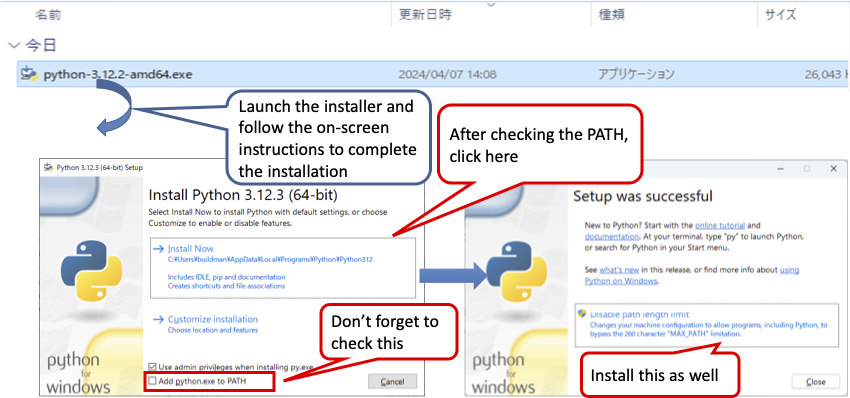

<div class="box-title">
    <p>
    <div style="font-size:18pt;font-weight:bold;text-align:center;margin-top:150px"><span class="title">Hakoniwa Drone Simulator: The Windows Installer Manual</span></div>
    </p>
    <p>
    <div style="font-size:14pt;font-weight:bold;text-align:center;margin-top:20px"><span class="sub-title">Installer use and sample app operation check</span></div>
    </p>
    <p>
    <div style="font-size:12pt;font-weight:bold;text-align:center;margin-top:500px"><span class="author">Drone WG</span></div>
    </p>
    <p>
    <div style="font-size:12pt;font-weight:bold;text-align:center;margin-top:10px"><span class="date">6th May, 2024</span></div>
    </p>
</div>

<!-- 改ページ -->
<div style="page-break-before:always"></div>

<div style="font-size:18pt;font-weight:bold;text-align:left;"><span class="contents">Table of Contents</span></div>
<!-- TOC -->

- [1. About This Document](#1-about-this-document)
  - [1.1. Target Environment](#11-target-environment)
  - [1.2. Prerequisites](#12-prerequisites)
    - [1.2.1. About the RAM Disk Environment](#121-about-the-ram-disk-environment)
    - [1.2.1.1. Installing ImDisk Toolkit](#1211-installing-imdisk-toolkit)
    - [1.2.1.1.1. Setting Up for Hakoniwa Simulator](#12111-setting-up-for-hakoniwa-simulator)
    - [1.2.2 Installing Python Environment](#122-installing-python-environment)
- [2. About the Hakoniwa Drone Simulator Windows Installer](#2-about-the-hakoniwa-drone-simulator-windows-installer)
- [3. Hakoniwa Drone Simulator Windows Installation Procedure](#3-hakoniwa-drone-simulator-windows-installation-procedure)
  - [3.1. Running the Installer](#31-running-the-installer)
- [4. Preparations for Python Simulation](#4-preparations-for-python-simulation)
  - [4.1. Installing Python Libraries](#41-installing-python-libraries)
- [5. Running Sample Apps for Python API](#5-running-sample-apps-for-python-api)
  - [5.1. Contents of the hakowin Folder](#51-contents-of-the-hakowin-folder)
  - [5.2. Running the Sample App](#52-running-the-sample-app)
    - [5.2.1. Starting the Hakoniwa Core Functionality](#521-starting-the-hakoniwa-core-functionality)
    - [5.2.2. Starting the Unity Application for the Hakoniwa Drone Simulator](#522-starting-the-unity-application-for-the-hakoniwa-drone-simulator)
    - [5.2.3. Running the Python API Sample App](#523-running-the-python-api-sample-app)
  - [5.3. Running the Drone Control Application](#53-running-the-drone-control-application)
    - [5.3.1. Connecting the Transmitter (PS4 Controller)](#531-connecting-the-transmitter-ps4-controller)
      - [5.3.1.1. PS4 Controller Operation Definitions](#5311-ps4-controller-operation-definitions)
    - [5.3.2. Starting the Hakoniwa Core Functionality](#532-starting-the-hakoniwa-core-functionality)
    - [5.3.3. Starting the Unity Application for the Hakoniwa Drone Simulator](#533-starting-the-unity-application-for-the-hakoniwa-drone-simulator)
    - [5.3.4. Running the Drone Control App](#534-running-the-drone-control-app)
      - [5.3.4.1. Actual Operations](#5341-actual-operations)
- [6. Troubleshooting](#6-troubleshooting)
  - [6.1. If Environment Variables Are Not Set](#61-if-environment-variables-are-not-set)
  - [6.2. If Ramdisk Is Not Configured Properly](#62-if-ramdisk-is-not-configured-properly)

<!-- /TOC -->
<!-- 改ページ -->
<div style="page-break-before:always"></div>

# 1. About This Document

This document explains how to use the Windows installer for the Hakoniwa Drone Simulator and verify the operation of sample applications using the Python API.

## 1.1. Target Environment

This document assumes the following OS version and PC environment (recommended):

| No  | Target | Details                            |
| --- | ------ | ---------------------------------- |
| 1   | OS     | Windows 10/11                      |
| 2   | PC     | 64-bit environment                 |
| 3   | PC     | Core i7 9th generation or later    |
| 4   | PC     | 32GB memory (recommended)          |
| 5   | PC     | SSD with 512GB or more             |
| 6   | PC     | Graphics accelerator (recommended) |

## 1.2. Prerequisites

A RAM Disk must be installed. Please complete the installation of the RAM Disk following the steps below.
A Python environment must also be installed. Please check the steps below to complete the installation.

### 1.2.1. About the RAM Disk Environment

The RAM Disk is used for data sharing between various components. Since the standard Windows environment does not have tools for creating a RAM Disk, it is necessary to use free tools.
Among the various RAM Disk tools for Windows, we will use "ImDisk" for Windows 10 or 11, as it seems to have no usage restrictions.

[Reference site for comparing RAM Disk tools for Windows](https://ik4.es/en/how-to-create-a-ram-disk-in-windows-10-8-and-windows-7/)

We will use "ImDisk" due to licensing and usage restrictions.

### 1.2.1.1. Installing ImDisk Toolkit

Access the official ImDisk page to obtain the ImDisk environment.

[Official ImDisk Toolkit page (SourceForge)](https://sourceforge.net/projects/imdisk-toolkit/)


Download the ImDisk Toolkit, extract the "ImDiskTk-x64.zip" file, and double-click "install.bat" to start the installer. Follow the GUI instructions to complete the installation.


Once the installation is complete, icons related to ImDisk Toolkit will appear on the desktop. Double-click the "RamDisk Configuration" icon to open the configuration screen. Set the following values and click the OK button to complete.

| No  | Setting      | Value        |
| --- | ------------ | ------------ |
| 1   | Size         | Specify 64MB |
| 2   | Drive Letter | Specify Z:   |
| 3   | File System  | Specify NTFS |


After the configuration is complete, a warning regarding Windows power settings may appear. In this case, uncheck the "Fast startup" checkbox in the power settings and restart Windows.


After the restart, a RAM Disk will be created.


[Reference site for ImDisk setup: Building an ultra-comfortable environment with RAM Disk](https://avalon-studio.work/blog/windows/ram-disk-configration/)

### 1.2.1.1.1. Setting Up for Hakoniwa Simulator

Hakoniwa Simulator uses a folder called "mmap" on the RAM Disk. Since the "mmap" folder disappears after a Windows restart or shutdown, it is necessary to set up ImDisk Toolkit to create the folder during startup.

Create an "mmap.bat" file with the following contents:

```txt
z:
mkdir mmap
```

Save the "mmap.bat" file in an appropriate location. Then double-click "RamDisk Configuration" to start it.

When the RamDisk Configuration screen appears, click the "Advanced" tab. In the "Run after mounting" section, specify the previously created "mmap.bat" file. Click the OK button to complete.


### 1.2.2 Installing Python Environment

Access the official Python page to obtain the Python environment for Windows.

[Official Python page](https://www.python.org/)


Click to start the download automatically. After downloading, run the installer and follow the on-screen instructions to complete the installation.



[Reference URL: Installing Python 3.10 on Windows (Path Setup)](https://qiita.com/youichi_io/items/3111e1cf696a87673b23)

# 2. About the Hakoniwa Drone Simulator Windows Installer

The Hakoniwa Drone Simulator Windows installer was developed using Microsoft's Visual Studio 2022 Community Edition IDE. It is intended for open source and personal use only. Licensing terms and conditions follow Microsoft's license.

[Visual Studio 2022 Community Edition License Terms](https://visualstudio.microsoft.com/en/license-terms/vs2022-ga-community/)

[Visual Studio 2022 Community Edition Redistribution Terms](https://learn.microsoft.com/en-us/visualstudio/releases/2022/redistribution)

# 3. Hakoniwa Drone Simulator Windows Installation Procedure

Download the zip file from the Releases page and extract it to an appropriate folder.

## 3.1. Running the Installer

Move to the folder where the zip file was extracted. The files "setup.exe" and "hakowin.msi" should be extracted. The contents of these files are as follows:

| No  | File Name   | Description                                              |
| --- | ----------- | -------------------------------------------------------- |
| 1   | setup.exe   | Setup executable for installing Hakoniwa Drone Simulator |
| 2   | hakowin.msi | Complete package for installing Hakoniwa Drone Simulator |

Once these files are extracted, right-click on "setup.exe" and click "Run as administrator."


The Hakowin Setup Wizard will start. Click "Next."


In the installation folder selection screen, click "Next."

**Note:** Although you can select the installation folder and user, please proceed without changing these settings.

In the hakoniwa drone config file screen, leave the radio button for the config file at the default setting, then click "Next."


Click "Next" in the installation confirmation screen, and wait for the progress bar to complete. Once completed, click "Next" and then click "Finish" to close.


The Hakoniwa Drone Simulator environment is now installed.

The installation destination is as follows:

```txt
C:\Users\"Username"\Documents\hakoniwa\hakowin\hakoniwa-px4-win
```

# 4. Preparations for Python Simulation

To run simulations using Python, it is necessary to install the required libraries for Python.

## 4.1. Installing Python Libraries

Start PowerShell in administrator mode from the Windows Start menu.


Use the pip command to install the following libraries:

```powershell
PS C:\Windows\System32> pip install pygame
PS C:\Windows\System32> pip install numpy
PS C:\Windows\System32> pip install opencv-python
```

# 5. Running Sample Apps for Python API

Once installation is complete, a "hakowin" folder will be created on the desktop. This folder contains shortcuts for the Hakoniwa Drone Simulator environment and sample apps for Python API.


## 5.1. Contents of the hakowin Folder

The "hakowin" folder contains core functions, Unity drone models, and sample applications for Hakoniwa Drone Simulator.


| No  | File Name                   | Type          | Purpose                                                    |
| --- | --------------------------- | ------------- | ---------------------------------------------------------- |
| 1   | Shortcut to create_mmap.bat | mmap          | Tool for confirming mmap                                   |
| 2   | Shortcut to run-win.bat     | Hakoniwa Core | Start core function for PX4                                |
| 3   | Shortcut to run-api.bat     | Hakoniwa Core | Start core function using Python API                       |
| 4   | Shortcut to run-api2.bat    | Hakoniwa Core | Start core function using Python API                       |
| 5   | Shortcut to run-sample.bat  | Python App    | Start sample application using Python API                  |
| 6   | Shortcut to run-camera.bat  | Python App    | Start camera application using Python API                  |
| 7   | Shortcut to run-rc.bat      | Python App    | Start remote control app using Python API                  |
| 8   | Shortcut to unity_model.exe | Unity App     | Start Unity visualization app for Hakoniwa Drone Simulator |

## 5.2. Running the Sample App

To confirm that the installation is successful, run the sample app using the Python API.

### 5.2.1. Starting the Hakoniwa Core Functionality

First, start the core function of Hakoniwa. Double-click the shortcut to "run-api2.bat" in the hakowin folder.


Verify that it is in the "WAIT START" state.

### 5.2.2. Starting the Unity Application for the Hakoniwa Drone Simulator

Next, start the Unity application for visualization in the Hakoniwa Drone Simulator. Double-click the "drone_model.exe" shortcut.


Once the Unity application starts, click the "START" button and wait.

### 5.2.3. Running the Python API Sample App

Finally, to verify the Python API functionality, run the sample app by double-clicking the "run-sample.bat" shortcut.


If the drone flies correctly in the Unity application after launching the sample app, the installation was successful.

## 5.3. Running the Drone Control Application

To confirm the control of the drone using a controller, proceed as follows:

### 5.3.1. Connecting the Transmitter (PS4 Controller)

Connect a PS4 controller to the PC via USB.

#### 5.3.1.1. PS4 Controller Operation Definitions

The PS4 controller is used to control the drone in the Python simulator. The control definitions are as follows:

| No  | PS4 Controller  | Description                               | Notes                                              |
| --- | --------------- | ----------------------------------------- | -------------------------------------------------- |
| 1   | Left Joy Stick  | Controls throttle and yaw                 |                                                    |
| 2   | Right Joy Stick | Controls pitch and roll                   |                                                    |
| 3   | × Button        | Arms/disarms the drone                    | "Arm" starts propeller rotation, "Disarm" stops it |
| 4   | □ Button        | Operates camera for taking photos         |                                                    |
| 5   | ○ Button        | Picks up/drops off cargo in the simulator |                                                    |


### 5.3.2. Starting the Hakoniwa Core Functionality

First, start the core function of Hakoniwa by double-clicking the shortcut to "run-api2.bat" in the hakowin folder.


Verify that it is in the "WAIT START" state.

### 5.3.3. Starting the Unity Application for the Hakoniwa Drone Simulator

Next, start the Unity application for visualization in the Hakoniwa Drone Simulator by double-clicking the "drone_model.exe" shortcut.


Once the Unity application starts, click the "START" button and wait.

### 5.3.4. Running the Drone Control App

Finally, run the drone control app by double-clicking the "run-rc.bat" shortcut.


#### 5.3.4.1. Actual Operations

Use the PS4 controller to operate the drone. First, press the × button to start the propellers. Use the left Joy Stick to move up and down or rotate left and right. Use the right Joy Stick to move forward and backward or slide left and right.

Try transporting cargo or taking photos using the Python simulator.


# 6. Troubleshooting

The Hakoniwa Drone Simulator environment installed by the installer may encounter some issues. Please review your environment settings if you encounter the following problems.

## 6.1. If Environment Variables Are Not Set

If the installation is not performed with administrative privileges, environment variables may not be set. This can cause errors as shown below.


In this case, uninstall the Hakoniwa Drone Simulator and reinstall it with administrative privileges.

## 6.2. If Ramdisk Is Not Configured Properly

If the RAM Disk is not configured correctly, errors as shown below may occur.


In this case, review the pre-installation steps carefully and verify the RAM Disk settings.

