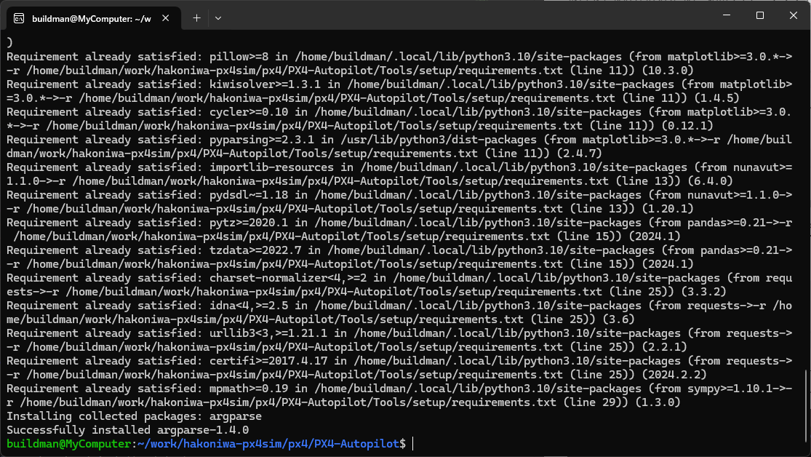
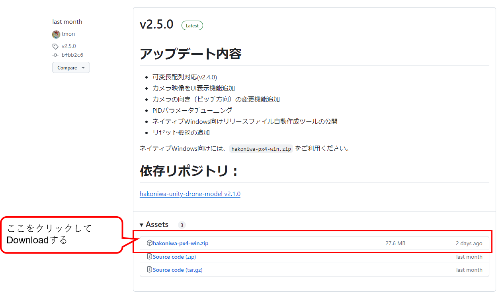
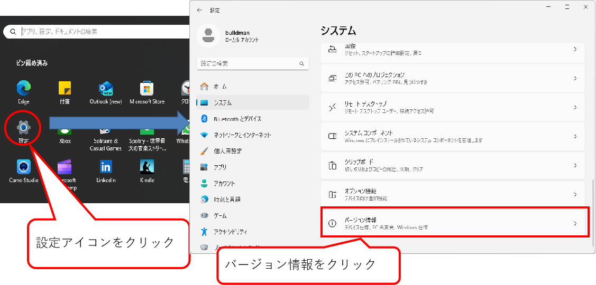
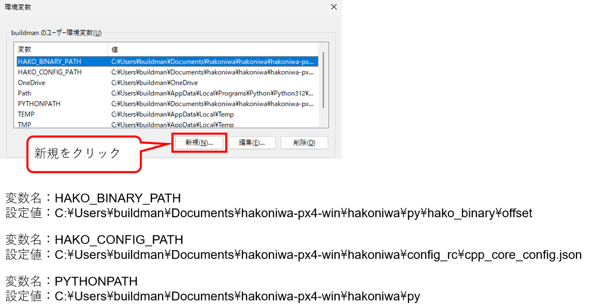
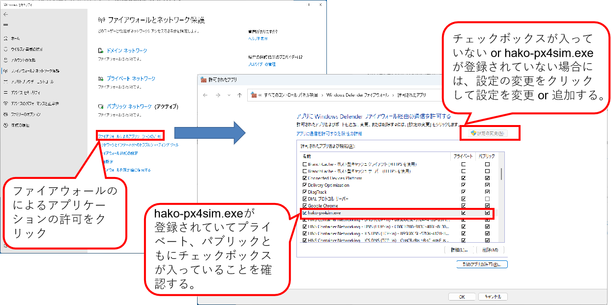
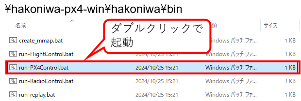

<div class="box-title">
    <p>
    <div style="font-size:18pt;font-weight:bold;text-align:center;margin-top:150px"><span class="title">箱庭ドローンシミュレータ 利用編</span></div>
    </p>
    <p>
    <div style="font-size:14pt;font-weight:bold;text-align:center;margin-top:20px"><span class="sub-title">Windows環境の利用セットアップと動作検証</span></div>
    </p>
    <p>
    <div style="font-size:12pt;font-weight:bold;text-align:center;margin-top:500px"><span class="author">組込みシステム技術協会 ドローンWG</span></div>
    </p>
    <p>
    <div style="font-size:12pt;font-weight:bold;text-align:center;margin-top:10px"><span class="date">2024年08月14日</span></div>
    </p>
</div>

<!-- 改ページ -->
<div style="page-break-before:always"></div>

<div style="font-size:18pt;font-weight:bold;text-align:left;"><span class="contents">目次</span></div>
<!-- TOC -->

- [1. 本ドキュメントについて](#1-本ドキュメントについて)
  - [1.1. Windows環境上での箱庭ドローンシミュレータ環境の準備について](#11-windows環境上での箱庭ドローンシミュレータ環境の準備について)
  - [1.2. Windows環境へのセットアップ](#12-windows環境へのセットアップ)
    - [1.2.1. ドローンフライトコントローラのソフトウェア](#121-ドローンフライトコントローラのソフトウェア)
    - [1.2.2. ドローンフライトコントローラのソフトウェア導入](#122-ドローンフライトコントローラのソフトウェア導入)
      - [1.2.2.1. 箱庭ドローンシミュレータ用のPX4事前準備](#1221-箱庭ドローンシミュレータ用のpx4事前準備)
      - [1.2.2.2. 箱庭ドローンシミュレータ用のPX4ビルド](#1222-箱庭ドローンシミュレータ用のpx4ビルド)
    - [1.2.3. 箱庭ドローンシミュレータの導入](#123-箱庭ドローンシミュレータの導入)
    - [1.2.4. 箱庭ドローンシミュレータの環境設定](#124-箱庭ドローンシミュレータの環境設定)
      - [1.2.4.1. 箱庭ドローンシミュレータ用のコンフィグパスの設定](#1241-箱庭ドローンシミュレータ用のコンフィグパスの設定)
      - [1.2.4.2. Windows ファイアウォールの回避](#1242-windows-ファイアウォールの回避)
  - [1.3. 箱庭ドローンシミュレータを使った動作確認](#13-箱庭ドローンシミュレータを使った動作確認)
    - [1.3.1. 箱庭のおさらい](#131-箱庭のおさらい)
  - [1.4. PX4シミュレーション](#14-px4シミュレーション)
    - [1.4.1. PX4の起動手順](#141-px4の起動手順)
      - [1.4.1.1. PX4起動前の事前確認](#1411-px4起動前の事前確認)
      - [1.4.1.2. PX4フライトコントローラのソフトウェア起動](#1412-px4フライトコントローラのソフトウェア起動)
    - [1.4.2. 箱庭ドローンシミュレータの起動](#142-箱庭ドローンシミュレータの起動)
      - [1.4.2.1. 箱庭ドローンシミュレータ起動時のトラブル1](#1421-箱庭ドローンシミュレータ起動時のトラブル1)
      - [1.4.2.2. 箱庭ドローンシミュレータ起動時のトラブル2](#1422-箱庭ドローンシミュレータ起動時のトラブル2)
    - [1.4.3. QGCの起動](#143-qgcの起動)
    - [1.4.4. Unityのドローン機体モデルの起動](#144-unityのドローン機体モデルの起動)
    - [1.4.5. ドローン飛行の確認](#145-ドローン飛行の確認)
- [2. 最後に](#2-最後に)

<!-- /TOC -->
<!-- 改ページ -->
<div style="page-break-before:always"></div>


<div style="font-size:18pt;font-weight:bold;text-align:left;"><span class="contents">用語集・改版履歴</span></div>


|略語|用語|意味|
|:---|:---|:---|
||||


|No|日付|版数|変更種別|変更内容|
|:---|:---|:---|:---|:---|
|1|2024/05/02|0.1|新規|新規作成|
|2|2024/05/05|0.2|追加|Pythonシミュレータ部分の追加|
|3|2024/08/14|0.3|削除|Pythonシミュレータ部分の分離|
||||||

<!-- 改ページ -->
<div style="page-break-before:always"></div>

# 1. 本ドキュメントについて

本ドキュメントは、箱庭ドローンシミュレータ上で、実空間でのドローン飛行に近づけるように、ドローンの飛行に必要になる要素を、事前準備編でインストールした各要素を使って、箱庭シミュレータハブエンジン上で表現し、ドローン飛行にあたっての安全性の検証、ドローンと他の機器との連携によるサービス検証をするために、箱庭ドローンシミュレータのインストールと実際の箱庭ドローンシミュレータでのドローン飛行の利用方法に関してのドキュメントとなります。

## 1.1. Windows環境上での箱庭ドローンシミュレータ環境の準備について

[事前準備編](https://github.com/toppers/hakoniwa-px4sim/blob/main/docs/manual/windows_preinstall.md)でインストールした各要素にドローン飛行のシミュレーションに必要な機能をインストールする必要があります。インストールにあたっては、前提知識として、Linux OSのオペレーションができることや、gitコマンドを利用したダウンロード、ソフトウェアのコンパイルなどソフトウェア開発に関する知識が必要になります。

## 1.2. Windows環境へのセットアップ

箱庭ドローンシミュレータを動作させるために必要なソフトウェアをToppers 箱庭WGのGithubから入手して、コンパイルやインストールやWindows側のシステム設定などを実施します。

### 1.2.1. ドローンフライトコントローラのソフトウェア

事前準備編で準備したWSL2(Windows Subsystem for Linux)上に、箱庭ドローンシミュレータと連携する機能として、実際にドローンの機体で利用されているフライトコントローラのソフトウェアであるPX4を導入して、箱庭ドローンシミュレータと連携させます。

PX4は、オープンソースで開発されたドローン(UAV：無人航空機)向けのフライト制御を行うためのソフトウェアです。

[PX4:Open Source Autopilot](https://px4.io/)

[PX4 Github](https://github.com/PX4/PX4-Autopilot)

### 1.2.2. ドローンフライトコントローラのソフトウェア導入

以下の箱庭ドローンシミュレータのドキュメントに従って、ソフトウェアの導入をします。

[箱庭ドローンシミュレータPX4導入手順](https://github.com/toppers/hakoniwa-px4sim/blob/main/px4/README-ja.md)

#### 1.2.2.1. 箱庭ドローンシミュレータ用のPX4事前準備

WSL2のUbuntuを起動します。Ubuntuが起動したら、作業用のディレクトリを作成して、箱庭ドローンシミュレータ用のPX4をgithubから入手します。

```bash
$ mkdir work
$ cd work
$ git clone --recursive https://github.com/toppers/hakoniwa-px4sim.git
```


githubからの入手が完了したら、コンパイルの事前準備をします。PX4自体は、実機のドローンで飛ばすためのもののため、箱庭ドローンシミュレータ用に設定を変更する必要があります。

```bash
$ cd ~/work/hakoniwa-px4sim/px4/
$ ls
PX4-Autopilot  README-ja.md  README.md  auto-test  docker  hakoniwa-apps  sim
```

ディレクトリの移動ができたら、以下のコマンドを実行して、箱庭ドローンシミュレータ用の設定ファイルをコピーします。

```bash
$ cp hakoniwa-apps/10016_none_iris PX4-Autopilot/ROMFS/px4fmu_common/init.d-posix/airframes/10016_none_iris 
$ cp hakoniwa-apps/rcS PX4-Autopilot/ROMFS/px4fmu_common/init.d-posix/rcS
```

#### 1.2.2.2. 箱庭ドローンシミュレータ用のPX4ビルド

以下の手順を実行し、PX4をビルドします。

```bash
$ cd ~/work/hakoniwa-px4sim/px4/
$ cd PX4-Autopilot
$ bash Tools/setup/ubuntu.sh --no-nuttx --no-sim-tools
```

bash Tools/setup/ubuntu.sh --no-nuttx --no-sim-toolsを実行すると、root権限が必要になるため、パスワードが聞かれますので、アカウントのパスワードを入力してください。


パスワードを入力すると、PX4のビルドに必要なパッケージがUnbutuに導入されます。




パッケージ導入が完了したら、makeコマンドにてビルドを実行します。

```bash
$ make px4_sitl_default
```


### 1.2.3. 箱庭ドローンシミュレータの導入

箱庭ドローンシミュレータ公式のgithubからWindows環境の箱庭ドローンシミュレータを入手します。

[箱庭ドローンシミュレータ公式githubリリースページ](https://github.com/toppers/hakoniwa-px4sim/releases)

現状の最新版は、V2.3.0になっています。最新版がリリースされていれば最新版を利用してください。



ダウンロードが完了したら、zipファイルを解凍します。


### 1.2.4. 箱庭ドローンシミュレータの環境設定

箱庭ドローンシミュレータをWindowsで利用する場合には、環境変数の設定や動作環境のパス設定などが必要になります。

#### 1.2.4.1. 箱庭ドローンシミュレータ用のコンフィグパスの設定

Windowsのスタートメニューを開いて、設定アイコンをクリックして、システムを開きます。システムの画面の一番下にあるバージョン情報をクリックします。



バージョン情報が開いたら、システムの詳細をクリックして、システムプロパティを開きます。システムプロパティが開いたら、一番下の環境変数(N)を開きます。


環境変数の画面が開いたら、以下の環境変数を設定します。パスの設定は、絶対パスでの設定が必要ですので、hakoniwa-px4-winを解凍したフォルダの絶対パスで設定してください。
今回の例は、buildmanというユーザのDocumentsフォルダに解凍した例を示しています。

|No|環境変数名|設定内容(例)|
|:---|:---|:---|
|1|HAKO_BINARY_PATH|C:\Users\buildman\Documents\hakoniwa-px4-win\hakoniwa\py\hako_binary\offset|
|2|HAKO_CONFIG_PATH|C:\Users\buildman\Documents\hakoniwa-px4-win\hakoniwa\config\cpp_core_config.json|
|3|PYTHONPATH|C:\Users\buildman\Documents\hakoniwa-px4-win\hakoniwa\py



PYTHONPATHは、既に設定されている場合には、箱庭ドローンシミュレータ用のpythonパスを追加するようにしてください。

#### 1.2.4.2. Windows ファイアウォールの回避

箱庭ドローンシミュレータは、各要素間で通信を行います。通信部分がWindowsのファイアウォール機能によって通信できない場合がある場合があるので、事前にファイアウォールの許可設定をしておくようにしましょう。

Windowsセキュリティを開いて、ファイアウォールとネットワーク保護をクリックします。クリックすると許可されたアプリの画面が開くので、hako-px4sim.exeが登録されているかを確認します。登録されていて、プライベート/パブリックのチェックボックスがONになっていれば問題ありません。
hako-px4sim.exeが登録されていない or プライベート/パブリックのチェックボックスがOFFになっている場合には、hako-px4sim.exeを登録してから、プライベート/パブリックのチェックボックスがONにする or プライベート/パブリックのチェックボックスがONにします。



## 1.3. 箱庭ドローンシミュレータを使った動作確認

ここまでの手順で、箱庭ドローンシミュレータを利用した各要素を使ったドローンシミュレータを動作させるための準備が整いました。ここからは、箱庭ドローンシミュレータを使った動作を確認していきたいと思います。

今回の手順では、以下の2つのパターンの動作確認ができます。

|No|シミュレータ名|内容|
|:---|:---|:---|
|1|PX4シミュレーション|実際のフライトコントローラのPX4とQGC(地上での機体制御)を組み合わせたUnity上でのドローン飛行のシミュレーション|
|2|Pythonシミュレーション|Pythonで作成したドローンパーツを組み合わせて、PS4(Play Station4)のコントローラなどでの飛行シミュレーション|

それぞれの動作に関して、実際にやってみることにしましょう。

### 1.3.1. 箱庭のおさらい

ここで箱庭のおさらいをしておきたいと思います。箱庭は、箱庭そのものがシミュレータというより、各要素を連携させながら動作させるためのシミュレータハブエンジンです。イメージとしては、スイッチングハブ(もうちょっと頭が良いですが…)で、PC同士をを通信させることができるように、プロトコル(各要素同士が会話する言葉)が合っていれば、各要素毎を繋ぎ合わせて、連携できる仕組みだと思ってください。


## 1.4. PX4シミュレーション

PX4シミュレーションでは、各要素として以下のような要素を連携させて動作させることで、ドローンの飛行シミュレーションをすることができます。

|No|要素名|内容|
|:---|:---|:---|
|1|PX4|WSL2上でPX4フライトコントローラのソフトウェア部分|
|2|QGC|ドローンの機体を制御する地上側のコントローラ|
|3|RAM Disk|箱庭と各要素間でのデータ連携するためのメモリ|
|4|Unity環境|箱庭と各要素が連携した時のドローンの飛行状態を表示|
|5|箱庭ドローンシミュレータ|各要素間を連携動作させながら、各要素間のスケジューリングを制御|


### 1.4.1. PX4の起動手順

最初にPX4フライトコントローラのソフトウェアを起動します。

#### 1.4.1.1. PX4起動前の事前確認

各要素との連携をするために、PX4フライトコントローラのソフトウェアのIPアドレスを確認しておく必要があります。Unbutuを起動して、以下の手順で確認しておき、IPアドレスを確認しておいてください。

```bash
$ ifconfig
```


図の赤枠になっている部分が、IPアドレスです。どこかにメモをしておいてください。

#### 1.4.1.2. PX4フライトコントローラのソフトウェア起動

箱庭ドローンシミュレータ用のPX4ビルド手順でビルドした場所からPX4フライトコントローラのソフトウェアを起動します。以下の手順は、参考手順ですので、自身の構築環境に合わせて対応をしてください。

```bash
$ cd ~/work/hakoniwa-px4sim/px4/PX4-Autopilot
$ bash ../sim/win-simstart.bash
```

起動が正常にできると、以下のような画面で他の要素からの通信待ち状態になります。


### 1.4.2. 箱庭ドローンシミュレータの起動

箱庭ドローンシミュレータを起動します。箱庭シミュレータは、Windows上で動作させるためのバッチファイルが用意されていますので、バッチファイルで起動します。hakoniwa-px4-win内の以下のパスにエクスプローラで移動して、run-win.batをダブルクリックして起動します。

```txt
箱庭ドローンシミュレータの場所：\hakoniwa-px4-win\hakoniwa\bin
```




起動が正常にできると、以下のような画面で他の要素からのコマンド待ち状態になります。


PX4の起動画面に”ERROR [simulator_mavlink] poll timeout 0, 22”が表示されますが、現時点では気にしなくて大丈夫です。


#### 1.4.2.1. 箱庭ドローンシミュレータ起動時のトラブル1

Windows上で初めて起動すると、以下のようにWindowsで保護される可能性があります。この場合には、左側の詳細情報をクリックして、実行ボタンをクリックして起動してください。


#### 1.4.2.2. 箱庭ドローンシミュレータ起動時のトラブル2

Windows Updateや環境設定などによって、WSL2の表記が違っており、箱庭ドローンシミュレータ起動用のrun-win.batが正常に動作しない場合があります。
この場合、動作させる環境に合わせて、バッチファイルを編集する必要があります。

コマンドプロンプトを開いて、WSL2のイーサーネットデバイス名を確認します。

```cmd
C:\Users\buildman> ipconfig
```

WSL2で使っているイーサネットデバイス名が表示されます。使っている環境に合わせて、run-win.batの内容を変更します。


変更箇所としては、run-win.bat内の:: WSL IPアドレスの取得となっている下の行にある"vEthernet (WSL (Hyper-V firewall))"のダブルクオートで括られているWSL2のイーサネットデバイス名をipconfigで表示された名前に変更します。


### 1.4.3. QGCの起動

QGC(QGroundControl)を起動します。Windowsスタートボタンから、QGroundControlのアプリケーションを起動します。


アプリケーションが起動したら、通信の設定を実施します。左上のQGroundControlアイコンをクリックします。クリックするとアプリケーションの真ん中にメニューが表示されます。メニューの中から、アプリケーション設定を選択します。

アプリケーション設定の通信リンクをクリックして、下にある追加をクリックします。リンク設定の編集画面が表示されるので、以下の設定値を設定して、OKをクリックしてください。

|No|設定名|設定値|
|:---|:---|:---|
|1|名前|hakoniwa|
|2|開始時に自動的に接続|チェックボックスにチェック|
|3|ポート|18570|
|4|サーバアドレス(オプション)|PX4起動前の事前確認で確認したIPアドレス|


### 1.4.4. Unityのドローン機体モデルの起動

Unity上で動作させるドローン機体モデルを起動します。hakoniwa-px4-win内の以下のパスにエクスプローラで移動して、model.exeをダブルクリックして起動します。

```txt
ドローン機体モデルの場所：\hakoniwa-px4-win\hakoniwa\DroneAppWin
```


起動するとUnityのドローン機体モデルが表示されます。


### 1.4.5. ドローン飛行の確認

Unityのドローン機体モデル画面のSTARTボタンをクリックします。STARTボタンをクリックすると各要素同士が、箱庭ドローンシミュレータと連携動作を始めます。PX4を起動している画面に「Ready for takeoff」表示されていれば、各要素の連携は正常にできています。


QGroundControlの画面で、左側にあるメニューから、「離陸」クリックします。クリックすると画面の真ん中上にスライドメニューが表示されるので、スライドさせます。


スライドさせると、Unity画面のドローン機体が、ホバリングを開始して、ドローンが飛行します。ここでは簡単なドローン飛行のみを紹介しています。QGroundControlでのドローンのフライトプランなどを設定すれば、Unity空間上でドローンの飛行体験ができますので、是非試してみてください。


# 2. 最後に

箱庭ドローンシミュレータを使ったPX4シミュレータに関しての解説を行いました。箱庭シミュレータの機能を拡張することで、ドローンを利用したさまざまなユースケースをシミュレータ上で検証することができます。ドローンの産業用途での利活用にあたっては、安全性が重視されます。また、ドローンを使うことで、自動車で実現できなかったサービスも実現可能です。ドローンの利活用のユースケースを想定して、箱庭ドローンシミュレータの利活用を検討してみてください。
