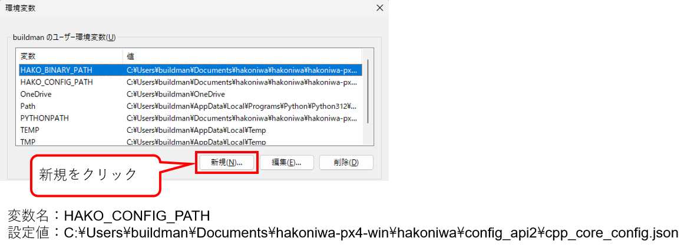
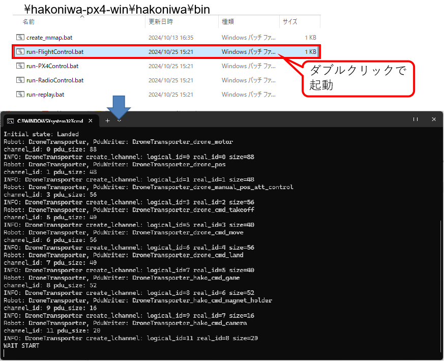
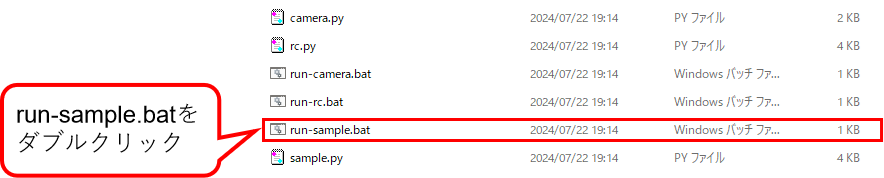
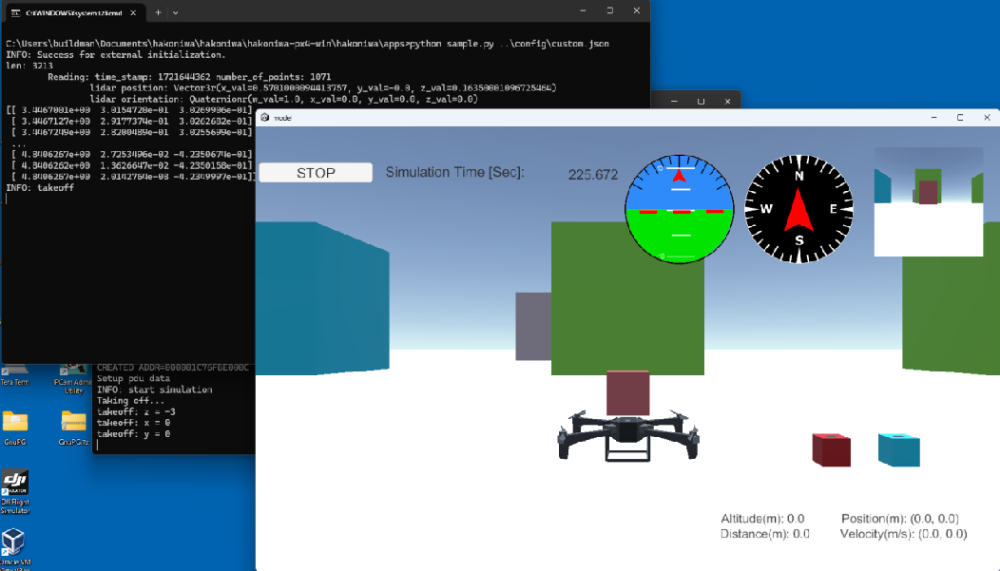
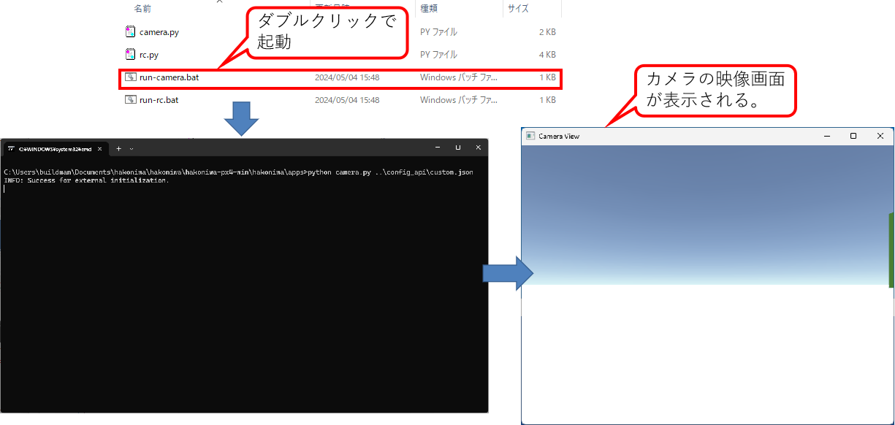
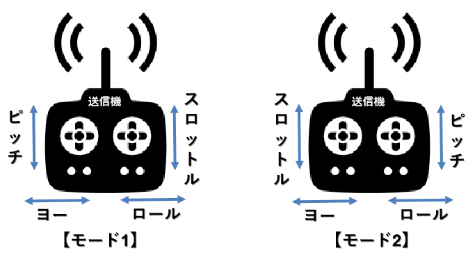

<div class="box-title">
    <p>
    <div style="font-size:18pt;font-weight:bold;text-align:center;margin-top:150px"><span class="title">箱庭ドローンシミュレータ 利用編</span></div>
    </p>
    <p>
    <div style="font-size:14pt;font-weight:bold;text-align:center;margin-top:20px"><span class="sub-title">Windows環境の利用セットアップと動作検証</span></div>
    </p>
    <p>
    <div style="font-size:12pt;font-weight:bold;text-align:center;margin-top:500px"><span class="author">ドローンWG</span></div>
    </p>
    <p>
    <div style="font-size:12pt;font-weight:bold;text-align:center;margin-top:10px"><span class="date">2024年08月18日</span></div>
    </p>
</div>

<!-- 改ページ -->
<div style="page-break-before:always"></div>

<div style="font-size:18pt;font-weight:bold;text-align:left;"><span class="contents">目次</span></div>
<!-- TOC -->

- [1. 本ドキュメントについて](#1-本ドキュメントについて)
  - [1.1. Windows環境上での箱庭ドローンシミュレータ環境の準備について](#11-windows環境上での箱庭ドローンシミュレータ環境の準備について)
  - [1.2. Windows環境へのセットアップ](#12-windows環境へのセットアップ)
    - [1.2.1. 箱庭ドローンシミュレータの導入](#121-箱庭ドローンシミュレータの導入)
    - [1.2.2. 箱庭ドローンシミュレータの環境設定](#122-箱庭ドローンシミュレータの環境設定)
      - [1.2.2.1. 箱庭ドローンシミュレータ用のコンフィグパスの設定](#1221-箱庭ドローンシミュレータ用のコンフィグパスの設定)
      - [1.2.2.2. Windows ファイアウォールの回避](#1222-windows-ファイアウォールの回避)
  - [1.3. 箱庭ドローンシミュレータを使った動作確認](#13-箱庭ドローンシミュレータを使った動作確認)
    - [1.3.1. 箱庭のおさらい](#131-箱庭のおさらい)
  - [1.4. Pythonシミュレーション](#14-pythonシミュレーション)
    - [1.4.1. Pythonシミュレーションの事前設定](#141-pythonシミュレーションの事前設定)
      - [1.4.1.1. 箱庭ドローンシミュレータ用のコンフィグパス変更](#1411-箱庭ドローンシミュレータ用のコンフィグパス変更)
      - [1.4.1.2. Pythonシミュレーション動作用のライブラリ導入](#1412-pythonシミュレーション動作用のライブラリ導入)
  - [1.5. pythonシミュレータ環境の動作確認](#15-pythonシミュレータ環境の動作確認)
    - [1.5.1. Pythonシミュレータの起動](#151-pythonシミュレータの起動)
    - [1.5.2. Unity上のドローン機体ビジュアルモデルの表示起動](#152-unity上のドローン機体ビジュアルモデルの表示起動)
    - [1.5.3. pythonサンプルプログラムの起動](#153-pythonサンプルプログラムの起動)
  - [1.6. ドローンの機体操作](#16-ドローンの機体操作)
    - [1.6.1. 送信機(PS4コントローラ)の起動](#161-送信機ps4コントローラの起動)
    - [1.6.2. カメラモデルの起動](#162-カメラモデルの起動)
    - [1.6.3. ドローン操作について](#163-ドローン操作について)
      - [1.6.3.1. ドローン機体の動作](#1631-ドローン機体の動作)
      - [1.6.3.2. 送信機(プロポ)の操作](#1632-送信機プロポの操作)
    - [1.6.4. Pythonシミュレータでのドローン機体操作](#164-pythonシミュレータでのドローン機体操作)
      - [1.6.4.1. PS4コントローラの操作定義](#1641-ps4コントローラの操作定義)
      - [1.6.4.2. 実際の操作](#1642-実際の操作)
- [2. 最後に](#2-最後に)

<!-- /TOC -->
<!-- 改ページ -->
<div style="page-break-before:always"></div>


<div style="font-size:18pt;font-weight:bold;text-align:left;"><span class="contents">用語集・改版履歴</span></div>


|略語|用語|意味|
|:---|:---|:---|
||||


|No|日付|版数|変更種別|変更内容|
|:---|:---|:---|:---|:---|
|1|2024/05/02|0.1|新規|新規作成|
|2|2024/05/05|0.2|追加|Pythonシミュレータ部分の追加|
|3|2024/07/22|0.3|変更|PX4シミュレータ部分を分離|
|4|2024/07/22|0.4|追加|環境変数の””追加時の注釈を追加|
|5|2024/07/23|0.5|追加|Pythonサンプルプログラム手順の追加|
|6|2024/08/18|0.6|変更|api2用の設定に変更|
||||||

<!-- 改ページ -->
<div style="page-break-before:always"></div>

# 1. 本ドキュメントについて

本ドキュメントは、箱庭ドローンシミュレータ上で、実空間でのドローン飛行に近づけるように、ドローンの飛行に必要になる要素を、事前準備編でインストールした各要素を使って、箱庭シミュレータハブエンジン上で表現し、ドローン飛行にあたっての安全性の検証、ドローンと他の機器との連携によるサービス検証をするために、箱庭ドローンシミュレータのインストールと実際の箱庭ドローンシミュレータでのドローン飛行の利用方法に関してのドキュメントとなります。

## 1.1. Windows環境上での箱庭ドローンシミュレータ環境の準備について

事前準備編でインストールした各要素にドローン飛行のシミュレーションに必要な機能をインストールする必要があります。インストールにあたっては、前提知識として、Linux OSのオペレーションができることや、gitコマンドを利用したダウンロード、ソフトウェアのコンパイルなどソフトウェア開発に関する知識が必要になります。

## 1.2. Windows環境へのセットアップ

箱庭ドローンシミュレータを動作させるために必要なソフトウェアをTOPPERS 箱庭WGのGithubから入手して、コンパイルやインストールやWindows側のシステム設定などを実施します。

### 1.2.1. 箱庭ドローンシミュレータの導入

箱庭ドローンシミュレータ公式のgithubからWindows環境の箱庭ドローンシミュレータを入手します。

[箱庭ドローンシミュレータ公式githubリリースページ](https://github.com/toppers/hakoniwa-px4sim/releases)

現状の最新版は、V2.5.0になっています。最新版がリリースされていれば最新版を利用してください。


ダウンロードが完了したら、zipファイルを解凍します。


### 1.2.2. 箱庭ドローンシミュレータの環境設定

箱庭ドローンシミュレータをWindowsで利用する場合には、環境変数の設定や動作環境のパス設定などが必要になります。

#### 1.2.2.1. 箱庭ドローンシミュレータ用のコンフィグパスの設定

Windowsのスタートメニューを開いて、設定アイコンをクリックして、システムを開きます。システムの画面の一番下にあるバージョン情報をクリックします。


バージョン情報が開いたら、システムの詳細をクリックして、システムプロパティを開きます。システムプロパティが開いたら、一番下の環境変数(N)を開きます。


環境変数の画面が開いたら、以下の環境変数を設定します。パスの設定は、絶対パスでの設定が必要ですので、hakoniwa-px4-winを解凍したフォルダの絶対パスで設定してください。
今回の例は、buildmanというユーザのDocumentsフォルダに解凍した例を示しています。

|No|環境変数名|設定内容(例)|
|:---|:---|:---|
|1|HAKO_BINARY_PATH|C:\Users\buildman\Documents\hakoniwa-px4-win\hakoniwa\py\hako_binary\offset|
|2|HAKO_CONFIG_PATH|C:\Users\buildman\Documents\hakoniwa-px4-win\hakoniwa\config_api2\cpp_core_config.json|
|3|PYTHONPATH|C:\Users\buildman\Documents\hakoniwa-px4-win\hakoniwa\py|


※注：環境変数の設定時に、上記の部分からコピー＆ペーストすると、””が追加される可能性があるので、””は削除して設定してください。


PYTHONPATHは、既に設定されている場合には、箱庭ドローンシミュレータ用のpythonパスを追加するようにしてください。

#### 1.2.2.2. Windows ファイアウォールの回避

箱庭ドローンシミュレータは、各要素間で通信を行います。通信部分がWindowsのファイアウォール機能によって通信できない場合がある場合があるので、事前にファイアウォールの許可設定をしておくようにしましょう。

Windowsセキュリティを開いて、ファイアウォールとネットワーク保護をクリックします。クリックすると許可されたアプリの画面が開くので、hako-px4sim.exeが登録されているかを確認します。登録されていて、プライベート/パブリックのチェックボックスがONになっていれば問題ありません。
hako-px4sim.exeが登録されていない or プライベート/パブリックのチェックボックスがOFFになっている場合には、hako-px4sim.exeを登録してから、プライベート/パブリックのチェックボックスがONにする or プライベート/パブリックのチェックボックスがONにします。


## 1.3. 箱庭ドローンシミュレータを使った動作確認

ここまでの手順で、箱庭ドローンシミュレータを利用した各要素を使ったドローンシミュレータを動作させるための準備が整いました。ここからは、箱庭ドローンシミュレータを使った動作を確認していきたいと思います。

箱庭ドローンシミュレータでは、以下の2つのパターンの動作確認ができます。

|No|シミュレータ名|内容|
|:---|:---|:---|
|1|PX4シミュレーション|実際のフライトコントローラのPX4とQGC(地上での機体制御)を組み合わせたUnity上でのドローン飛行のシミュレーション|
|2|Pythonシミュレーション|Pythonで作成したドローンパーツを組み合わせて、PS4(Play Station4)のコントローラなどでの飛行シミュレーション|

本マニュアルでは、2のPythonシミュレータを確認できる手順を取り扱います。

### 1.3.1. 箱庭のおさらい

ここで箱庭のおさらいをしておきたいと思います。箱庭は、箱庭そのものがシミュレータというより、各要素を連携させながら動作させるためのシミュレータハブエンジンです。イメージとしては、スイッチングハブ(もうちょっと頭が良いですが…)で、PC同士をを通信させることができるように、プロトコル(各要素同士が会話する言葉)が合っていれば、各要素毎を繋ぎ合わせて、連携できる仕組みだと思ってください。


## 1.4. Pythonシミュレーション

ここからは、手軽に箱庭ドローンシミュレータ上でドローンを飛ばすために、Pythonプログラムで作ったドローンパーツを組み合わせたシミュレーション環境を解説します。

|No|要素名|内容|
|:---|:---|:---|
|1|Python環境|Unity上で手軽にドローンパーツを組み合わせて作るドローンモデル環境|
|2|RAM Disk|箱庭と各要素間でのデータ連携するためのメモリ|
|3|Unity環境|箱庭と各要素が連携した時のドローンの飛行状態を表示|
|4|箱庭ドローンシミュレータ|各要素間を連携動作させながら、各要素間のスケジューリングを制御|


### 1.4.1. Pythonシミュレーションの事前設定

PX4シミュレーションでのコンフィグファイルをPythonシミレーション用のコンフィグファイルに変更とPythonシミュレーション動作に必要なライブラリを導入する必要があります。


#### 1.4.1.1. 箱庭ドローンシミュレータ用のコンフィグパス変更

箱庭ドローンシミュレータ用のコンフィグパスの設定の手順に従って、コンフィグファイルのパスを変更します。

|No|環境変数名|設定内容(例)|
|:---|:---|:---|
|1|HAKO_CONFIG_PATH|C:\Users\buildman\Documents\hakoniwa-px4-win\hakoniwa\config_api2\cpp_core_config.json|



※注：環境変数の設定時に、上記の部分からコピー＆ペーストすると、””が追加される可能性があるので、””は削除して設定してください。


#### 1.4.1.2. Pythonシミュレーション動作用のライブラリ導入

Windowsスタートメニューから、Powershellを管理者モードで起動します。


Powershellが起動したら、pipコマンドで以下のライブラリを導入します。

```powershell
PS C:\Windows\System32> pip install pygame
PS C:\Windows\System32> pip install numpy
PS C:\Windows\System32> pip install opencv-python
```


## 1.5. pythonシミュレータ環境の動作確認

### 1.5.1. Pythonシミュレータの起動

Pythonシミュレータを起動します。Pythonシミュレータは、Windows上で動作させるためのバッチファイルが用意されていますので、バッチファイルで起動します。hakoniwa-px4-win内の以下のパスにエクスプローラで移動して、run-api2.batをダブルクリックして起動します。

```txt
Python：\hakoniwa-px4-win\hakoniwa\bin
```



正常に起動できるとコマンドプロンプトが表示されます。

### 1.5.2. Unity上のドローン機体ビジュアルモデルの表示起動

Unity上で動作させるドローン機体モデルを起動します。hakoniwa-px4-win内の以下のパスにエクスプローラで移動して、model.exeをダブルクリックして起動します。

```txt
ドローン機体モデルの場所：\hakoniwa-px4-win\hakoniwa\DroneAppWin
```


起動するとUnityのドローン機体モデルが表示されます。表示されたら、左上のSTARTボタンをクリックして待機させます。


### 1.5.3. pythonサンプルプログラムの起動

Pythonシミュレータ環境の動作確認のため、Pythonシミュレータのサンプルプログラムで動作確認します。run-sample.batをダブルクリックして起動します。

```txt
サンプルプログラムの場所：\hakoniwa-px4-win\hakoniwa\apps
```




正常に起動できるとUnity上のドローン機体がホバリングします。




## 1.6. ドローンの機体操作

ここからは、実際にコントローラを使って、箱庭ドローンシミュレータ上で、ドローンの機体操作をする手順を行います。

1.5.1～1.5.2項の手順を実施したのちに、以下の手順を実施してください。

### 1.6.1. 送信機(PS4コントローラ)の起動

PS4用のコントローラをPCにUSBで接続します。USB接続ができたら、hakoniwa-px4-win内の以下のパスにエクスプローラで移動して、run-rc.batをダブルクリックして起動します。

```txt
コントローラ起動の場所：\hakoniwa-px4-win\hakoniwa\apps
```


正常に起動できるとコマンドプロンプトが表示されます。


### 1.6.2. カメラモデルの起動

Unity上のドローン機体モデルにあるカメラモデルを起動します。hakoniwa-px4-win内の以下のパスにエクスプローラで移動して、run-camera.batをダブルクリックして起動します。

```txt
カメラモデルの場所：\hakoniwa-px4-win\hakoniwa\apps
```



正常に起動できるとコマンドプロンプトが表示されます。

### 1.6.3. ドローン操作について

ここでは、実際のドローンの機体動作や、送信機の操作方法を解説します。

#### 1.6.3.1. ドローン機体の動作

ドローンの機体の動作は、以下のような定義になっています。

|No|用語|内容|
|:---|:---|:---|
|1|スロットル|ドローン機体の上昇と下降操作|
|2|ロール(エルロン)|ドローン機体の左右移動操作|
|3|ピッチ(エレベータ)|ドローン機体の前進と後進操作|
|4|ヨー(ラダー)|ドローン機体の左右旋回操作|


#### 1.6.3.2. 送信機(プロポ)の操作

ドローンの機体操作は、送信機(プロポ)と言われるラジコンで使われる機器で操作をします。送信機には、モード定義があり、ドローン機体の動作に合わせた操作を送信機上のスティックで操作します。



Pythonシミュレータでは、送信機の操作モードをモード2として取り扱う定義となっています。

### 1.6.4. Pythonシミュレータでのドローン機体操作

Pythonシミュレータでは、PS4コントローラを使って、ドローンの飛行を操作することができます。また、Pythonシミュレータに配置されている荷物の搬送や、ドローン搭載されているカメラでの撮影ができるようになっています。


#### 1.6.4.1. PS4コントローラの操作定義

Pythonシミュレータでは、ドローンの機体をPS4コントローラで操作します。PS4コントローラの操作方法は、以下のような定義になっています。

|No|PS4コントローラ|内容|備考|
|:---|:---|:---|:---|
|1|左側Joy Stick|スロットルとヨーの操作をします||
|2|右側Joy Stick|ピッチとロールの操作をします||
|3|×ボタン|アーム/ディスアームをします|アームはプロペラ回転開始/ディスアームはプロペラ回転停止のこと|
|4|□ボタン|カメラを使った撮影を操作します||
|5|○ボタン|Pythonシミュレータ上に配置されている荷物のピックアップ/ドロップオフを操作します|


#### 1.6.4.2. 実際の操作

PS4コントローラを使って実際に操作してみましょう。まず、×ボタンを押して、プロペラを回転させて、左側のJoy Stickを上下に操作することで、上昇/下降ができ、左右に操作することで左右旋回を操作できます。右側のJoy Stickを上下に操作することで、前進/後進ができ、左右させることで左右に移動を操作できます。

実際にPythonシミュレータに配置されている荷物の搬送や、カメラを使った撮影などを行ってみましょう。


# 2. 最後に

箱庭ドローンシミュレータを使ったPythonシミュレータに関しての解説を行いました。箱庭シミュレータの機能を拡張することで、ドローンを利用したさまざまなユースケースをシミュレータ上で検証することができます。ドローンの産業用途での利活用にあたっては、安全性が重視されます。また、ドローンを使うことで、自動車で実現できなかったサービスも実現可能です。ドローンの利活用のユースケースを想定して、箱庭ドローンシミュレータの利活用を検討してみてください。