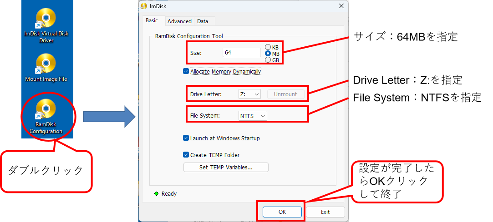
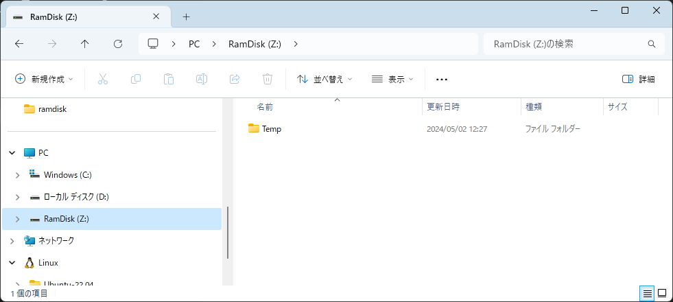

<div class="box-title">
    <p>
    <div style="font-size:18pt;font-weight:bold;text-align:center;margin-top:150px"><span class="title">箱庭ドローンシミュレータ 準備編</span></div>
    </p>
    <p>
    <div style="font-size:14pt;font-weight:bold;text-align:center;margin-top:20px"><span class="sub-title">Windows環境の利用での事前準備</span></div>
    </p>
    <p>
    <div style="font-size:12pt;font-weight:bold;text-align:center;margin-top:500px"><span class="author">ドローンWG</span></div>
    </p>
    <p>
    <div style="font-size:12pt;font-weight:bold;text-align:center;margin-top:10px"><span class="date">2024年08月16日</span></div>
    </p>
</div>

<!-- 改ページ -->
<div style="page-break-before:always"></div>

<div style="font-size:18pt;font-weight:bold;text-align:left;"><span class="contents">目次</span></div>

<!-- TOC -->

- [1. 本ドキュメントについて](#1-本ドキュメントについて)
  - [1.1. 対象環境](#11-対象環境)
  - [1.2. 箱庭とは](#12-箱庭とは)
  - [1.3. Windows上での箱庭ドローンシミュレータ動作の要素](#13-windows上での箱庭ドローンシミュレータ動作の要素)
- [2. 各要素のインストール](#2-各要素のインストール)
  - [2.1. WSLの準備](#21-wslの準備)
    - [2.1.1. BIOSの確認](#211-biosの確認)
    - [2.1.2. Windows OS上の設定](#212-windows-os上の設定)
      - [2.1.2.1. WSL導入用の設定](#2121-wsl導入用の設定)
    - [2.1.3. WSL用のLinuxカーネルのインストール](#213-wsl用のlinuxカーネルのインストール)
      - [2.1.3.1. WSL2を既定設定](#2131-wsl2を既定設定)
        - [2.1.3.1.1. WSLの情報](#21311-wslの情報)
    - [2.1.4. WSLで動作させるディストリビューションのインストール](#214-wslで動作させるディストリビューションのインストール)
      - [2.1.4.1. ディストリビューション導入後のパッケージ追加](#2141-ディストリビューション導入後のパッケージ追加)
  - [2.2. Python環境のインストール](#22-python環境のインストール)
  - [2.3. QGC環境のインストール](#23-qgc環境のインストール)
  - [2.4. RAM Disk環境について](#24-ram-disk環境について)
    - [2.4.1. ImDisk Toolkitのインストール](#241-imdisk-toolkitのインストール)
      - [2.4.1.1. 箱庭シミュレータ用の設定](#2411-箱庭シミュレータ用の設定)
  - [2.5. Unity環境について](#25-unity環境について)
    - [2.5.1. Unity環境のダウンロード](#251-unity環境のダウンロード)
    - [2.5.2. Unity Hub環境のインストール](#252-unity-hub環境のインストール)
    - [2.5.3. Unity環境のインストール](#253-unity環境のインストール)
  - [2.6. 各要素のインストール完了](#26-各要素のインストール完了)

<!-- /TOC -->


<!-- 改ページ -->
<div style="page-break-before:always"></div>


<div style="font-size:18pt;font-weight:bold;text-align:left;"><span class="contents">用語集・改版履歴</span></div>


|略語|用語|意味|
|:---|:---|:---|
||||


|No|日付|版数|変更種別|変更内容|
|:---|:---|:---|:---|:---|
|1|2024/05/01|0.1|新規|新規作成|
|2|2024/07/22|0.2|変更|WSL環境構築の手順に注釈追加|
|3|2024/08/16|0.3|追加|PC環境の推奨環境を追加|
|||

<!-- 改ページ -->
<div style="page-break-before:always"></div>

# 1. 本ドキュメントについて

本ドキュメントは、箱庭ドローンシミュレータが利用する各要素となる機能を事前にインストールする手順となります。本ドキュメントで解説している部分は、事前にセットアップ済やインストール済みであれば読み飛ばして頂いて問題ありません。また、最初に一度やれば良い手順ですので、一度実施済みであれば、本ドキュメントを読み飛ばして、問題ありません。

## 1.1. 対象環境

本ドキュメントでは、以下のOSバージョンとPC環境を想定としています。

|No|対象|内容|
|:---|:---|:---|
|1|OS|Windows10 or Windows11|
|2|PC|64bit環境|
|3|PC|Hyper-vが利用できること(推奨)|
|4|PC|Corei7 9th以降|
|5|PC|32Gbyteのメモリ推奨|
|6|PC|SSD 512Gbyte以上|
|7|PC|Graphicsアクセラレータ推奨|

## 1.2. 箱庭とは

箱庭は、TOPPERSプロジェクトで開発、運営されているPC上で動作する仮想シミュレーションになります。
「箱の中に、さまざまなモノをみんなの好みで配置して、いろいろ試せる！」をコンセプトとして、さまざまな機器やサービスを連携させることでPC上での実証実験に利用できる環境となっています。

[箱庭紹介記事(MONOist)](https://monoist.itmedia.co.jp/mn/articles/2106/28/news012.html)

[箱庭プロジェクト紹介](https://github.com/toppers/hakoniwa)

## 1.3. Windows上での箱庭ドローンシミュレータ動作の要素

Windows環境で、箱庭ドローンシミュレータを利用するにあたっては、以下のドローン飛行に必要な要素をインストールを行った上で、実際の箱庭シミュレータが各要素を連携させた上で、ドローン飛行が実現可能になります。
箱庭とはの部分でも解説した通り、箱庭自体がシミュレータではなく、シミレーションに必要となる各要素となる機能を繋ぎ合わせるたり、組み合わせたりすることで、シミュレーションを実現できるシミュレーションハブエンジンになっています。


表．各要素の説明

|No|要素|概要|
|:---|:---|:---|
|1|WSL2(Windows Subsystem for Linux)|ドローン飛行に必要なフライトコントローラのソフトウェアを動作させる環境になります|
|2|Python環境|箱庭シミュレータでPythonでの制御に必要になります|
|3|箱庭シミュレータ(Windows用)|箱庭シミュレータの本体と各要素をつなぎ合わせるI/F環境となります|
|4|QGC(Ground Control)|フライトコントローラ(WSL2上で動作)と連携し、ドローン飛行の制御やドローンフライトプランなどに利用します|
|5|RAM Disk環境(Imdisk)|各要素間で通信する際に共有メモリとして利用します|
|6|Unity環境|ドローンのモデルや飛行状況を投影するのに利用します(ライセンス注意!)|

# 2. 各要素のインストール

箱庭シミュレータを動作させる前に、各要素を事前に準備する必要があります。各要素ごとにインストール方法が異なるので、適時インターネットで検索しながら進めてください。ここではつまずきそうな部分に関しての解説のみしておきます。

## 2.1. WSLの準備


本手順は、箱庭ドローンシミュレータのPX4シミュレータ環境([windows_install&operation_PX4環境ドキュメント](https://github.com/toppers/hakoniwa-px4sim/blob/main/docs/manual/windows_install%26operation_PX4%E7%92%B0%E5%A2%83_WSL2%E7%89%88.md))利用時に必要になる手順です。
Pythonシミュレータ環境([windows_install&operation_python環境のドキュメント](https://github.com/toppers/hakoniwa-px4sim/blob/main/docs/manual/windows_install%26operation_pythonAPI%E7%B7%A8.md))を利用する場合には不要な手順ですので、読み飛ばしてください。

インターネット上で検索すれば、インストール方法は出てきますが、ここではポイントを絞ってインストール方法を解説します。

以下のサイトを参考にインストールできると思います。また、WSL2自体の説明もありますので参考にしてください。


[参考サイト1：WSL2 のインストール，WSL2 上への Ubuntu のインストールと利用（Windows 11 対応の記事）（Windows 上）](https://www.kkaneko.jp/tools/wsl/wsl2.html)

[参考サイト2：WindowsでWSL2を使って「完全なLinux」環境を作ろう！](https://www.kagoya.jp/howto/it-glossary/develop/wsl2_linux/)

### 2.1.1. BIOSの確認

各PC上のBIOS画面を開いて、Hyper-v機能が利用できる場合は、有効化してください。

### 2.1.2. Windows OS上の設定

Windowsマークのスタートボタン → Windowsシステムツール → コントロールパネルをクリックして開きます。(Windows10)もしくは、Windowsマークをクリックして、検索ウィンドでコントールパネルと入力して開きます。(Windows11)


コントロールパネルが開いたら「プログラムと機能」を開きます。


「プログラムと機能」が開いたら、左側にある「Windowsの機能の有効化または無効化」を開きます。


#### 2.1.2.1. WSL導入用の設定

「Windowsの機能の有効化または無効化」が開いたら、「Linux用Windowsサブシステム」「Windowsハイパーバイザープラットフォーム(もしあれば)」「仮想マシンプラットフォーム」をそれぞれチェックマークを入れます。


チェックマークが入れられたら、一旦、再起動します。再起動時にWSL2の動作に必要なWindowsの機能が導入されます。


### 2.1.3. WSL用のLinuxカーネルのインストール

以下のサイトにアクセスして、WSL2上で動作するLinuxカーネルイメージを更新します。

[WSL用Linuxカーネルイメージ入手先](https://learn.microsoft.com/ja-jp/windows/wsl/install-manual#step-4---download-the-linux-kernel-update-package)

サイトにアクセスすると、WSL2用のLinuxカーネルを入手できるサイトにリンクがあるので、クリックしてダウンロードをします。


ダウンロードが終わったら、インストーラを起動して、画面に従って、インストールを実施します。インストールが終わったら再起動します。


#### 2.1.3.1. WSL2を既定設定

「Windowsキー」＋「R」を押下して、「ファイル名を指定して実行」を開き、「cmd」と入力してコマンドプロンプトを表示させます。

コマンドプロンプトが開いたら、以下のコマンドを入力してWSLの既定値をWSL2に設定します。

```cmd
c:\User\”ユーザ名”> wsl --set-default-version 2
```

コマンド実行後、”この操作は正しく終了しました。”と表示されれば設定完了です。コマンドプロンプトを閉じてください。


##### 2.1.3.1.1. WSLの情報

ここまでの手順でWSLは導入されたことになります。WSLには、Version1とVersion2が存在します。Version1をWSL1、Version2をWSL2と呼んでおり、WSL2の方がよりネイティブのLinux環境に近い環境になっています。

WSLの導入にあたっては、Microsoftが公式にチュートリアルを用意していますので、トラブルや導入方法が分からない場合には、参照してください。

[Windows Subsystem for Linux に関するドキュメント(Microsoft公式)](https://learn.microsoft.com/ja-jp/windows/wsl/)

### 2.1.4. WSLで動作させるディストリビューションのインストール

WSL上で動作させるためのLinuxディストリビューションをインストールします。今回の箱庭シミュレータでは、Ubuntu22.04を導入します。

Windowsスタートボタンをクリックして、「Microsoft Store」を開きます。


開いたら、検索部分にUbuntuと入力して、Enterを入力すると、Ubuntuの入手画面が開きますので、Ubuntu 22.04をクリックして、開くをクリックするとインストールが開始されますので、インストールが完了するまで、しばらく待ってください。


インストールが完了すると、Ubuntuの初期化画面が表示され、「Enter new UNIX username」が聞かれます。その後、usernemaのパスワードが聞かれますので、適時設定してください。


#### 2.1.4.1. ディストリビューション導入後のパッケージ追加

箱庭ドローンシミュレータを動作させる場合に、IPアドレスの確認が必要になります。ディストリビューションのインストール、usernameとpassword設定が完了したら、追加のパッケージをインストールしておきます。ディストリビューションのUbuntuを起動して、以下のコマンドを実行しておいてください。

```bash
$ sudo apt-get install net-tools
```

## 2.2. Python環境のインストール

Pythonの公式ページにアクセスして、PythonをWindowsで動作させる環境を入手します。

[Python公式ページ](https://www.python.org/)


クリックすると自動的にダウンロードが始まります。ダウンロードが完了したらインストーラを起動して、画面に従ってインストールをします。


[参考URL：【Windows】Python3.10のインストール(パス通し)](https://qiita.com/youichi_io/items/3111e1cf696a87673b23)

## 2.3. QGC環境のインストール

QGC(QGroundControl)の公式ページにアクセスして、QGC環境を入手します。

[QGROUNDCONTOL公式ページ](http://qgroundcontrol.com/)

公式ページに行くと、DOWNLOADというボタンがあるのでクリックします。


DOWNLOADボタンをクリックすると、各OSごとのインストーラが配布されています。Windows用を入手します。


インストーラをダウンロードできたら、インストーラを起動して、画面に従ってインストールします。


## 2.4. RAM Disk環境について

各要素間で通信でのデータ共有のためにRAM Disk利用しますが、標準のWindows環境ではRAM Diskを作成するためのツールはないため、フリーのツールを導入する必要があります。
Windows用のRAM Disk作成ツールは、さまざまありますが、現状Windows10 or 11で利用制限がないと思われるものを採用することにします。

[Windows用RAM Diskツール比較 参考サイト](https://ik4.es/ja/como-crear-un-disco-ram-en-windows-10-8-y-windows-7/)


ライセンスや使用制限内容などから、今回は「ImDisk」を利用することにします。

### 2.4.1. ImDisk Toolkitのインストール

ImDiskの公式ページにアクセスして、ImDisk環境を入手します。

[ImDisk Toolkit公式ページ(SourceForge)](https://sourceforge.net/projects/imdisk-toolkit/)


ImDisk Toolkitをダウンロードしたら「ImDiskTk-x64.zip」を解凍します。解凍すると「install.bat」があるので、ダブルクリックして、インストーラを起動します。インストーラが起動するとGUIが起動しますので、画面に従って、インストールを行ってください。


インストールが完了すると、ImDisk Toolkit関連のアイコンがディスクトップに出てきますので、「RamDisk Configuration」のアイコンをダブルクリックして、コンフィグレーション画面を起動します。
コンフィグレーション画面が起動したら、以下の設定値を設定して、OKボタンをクリックして終了します。

|No|設定内容|設定値|
|:---|:---|:---|
|1|Size|64MBを指定|
|2|Drive Letter|Z:を指定|
|3|File System|NTFSを指定|




設定が完了すると「Windowsの電源設定」の警告画面が表示されることがあるため以下の電源設定画面にて、高速スタートアップのチェックボックスをOFFにします。完了したら、Windowsを再起動します。


再起動が完了すると以下のようにRamDiskが作成されます。



[ImDiskセットアップ参考サイト：RAM ディスクで超快適環境を構築](https://avalon-studio.work/blog/windows/ram-disk-configration/)

#### 2.4.1.1. 箱庭シミュレータ用の設定

箱庭シミュレータでは、RamDisk上のmmapというフォルダを利用することになります。RamDisk上にmmapフォルダを作成する必要があるのですが、RamDiskの性質上、Windowsを再起動やシャットダウンするとmmapフォルダはなくなってしまいます。
このため、mmapフォルダをWindows起動時にmmapフォルダを作成するようにImDisk Toolkitを設定する必要があります。

「mmap.bat」ファイルを作成します。mmap.batファイルの内容は以下のようになります。

```txt
z:
mkdir mmap
```

mmap.batファイルを作成したら、適当な場所に保存してください。保存ができたら、「RamDisk Configuration」をダブルクリックして起動します。

RamDisk Configurationの画面が起動したら、Advancedのタブをクリックします。Advancedの画面になったら、「Run after mounting」の部分に、先ほど作成したmmap.batを指定します。
完了したらOKボタンをクリックして終了します。


## 2.5. Unity環境について

Unity環境は、現時点(2024年05月時点)では、個人利用、学生利用では無料で利用が可能です。しかしながら、商用での利用では有償利用となるため、商用で利用する場合には、正規のライセンスを購入する必要があります。今回の箱庭シミュレータでのUnity利用は、あくまでも個人利用且つ、教育用途として利用することを想定していますので、決して商用での利用はしないようにしてください。また、Unity環境の利用規約も変わる可能性がありますので、留意してください。

[Unityのインストール参考サイト：【初心者用】2023年版Unityの始め方！インストールから勉強方法まで解説](https://yuru-uni.com/unity-start2023/)

### 2.5.1. Unity環境のダウンロード

Unityの公式ページにアクセスして、Unity環境を入手します。

[Unity公式ページ](https://unity.com/ja)

Unityの公式ページの右上にある「プランと価格を確認する」となっているボタンをクリックします。クリックすると、Uinity環境の利用プランと価格が表示されます。今回は、「Unity Personal」のプランを利用するので、Unity Personalの「今すぐダウンロード」部分をクリックします。クリックすると「Windows用のダウンロード」のボタンがありますので、クリックしてダウンロードを行ってっください。


### 2.5.2. Unity Hub環境のインストール

ダウンロードができたら、「UnityHubSetup.exe」を右クリックして、管理者として実行をクリックします。Unity Hub セットアップのインストール画面が起動するので、画面に従ってインストールします。インストールが完了すると”Unity Hubセットアップウィザードは完了しました”と表示されます。このとき、Unity Hubを実行(R)のチェックボックスは、そのままにしておき、完了ボタンをクリックします。


### 2.5.3. Unity環境のインストール

Unity Hub環境がインストールされたら、Unity Hubが起動されます。Unity HubにUnityエンジンをインストールする必要がありますが、インストールする際には、Unity公式ページにてUnity IDを作成する必要があります。Unity公式ページで、Unity IDを作成したのち、Unity Hubの左上のアイコンをクリックして、Unity IDでサインインしておきます。


サインインができたら、左下のDownloadをクリックして、利用可能なUnityエンジンをDownloadします。ダウンロードが完了したら、設定アイコンをクリックしてLincenseをクリックします。「Add new license」が表示されるので、Get a free personal licenseをクリックして、Personalライセンスを取得します。取得後、Personal Lincenseが取得されたことが確認できます。


Unityでは、日本語の利用が可能です。設定アイコンをクリックして、Appearanceをクリックし、Languageの部分を日本語に選択します。


## 2.6. 各要素のインストール完了

ここまでで、各要素を使った箱庭シミュレータの事前セットアップが完了しました。本編では実際に各要素を箱庭シミュレータがつなぎ合わせて、連携動作させるための環境のセットアップとなります。
