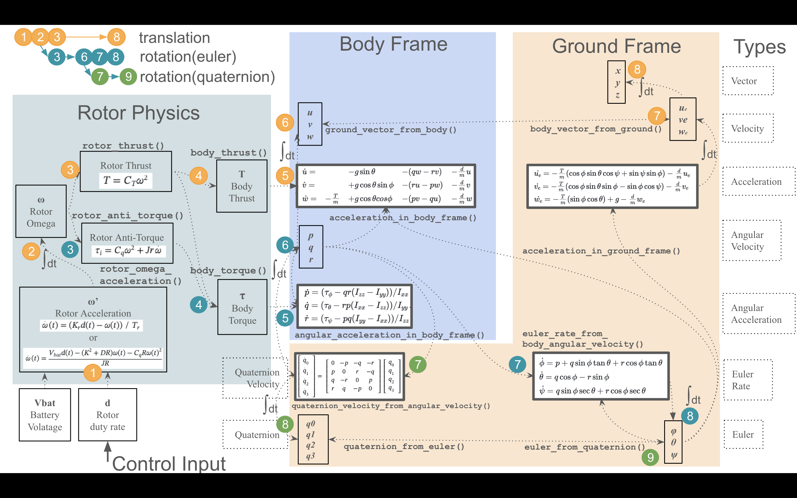

English ｜ [日本語](README-ja.md)

# Hakoniwa Drone Physics Library(math, physics and dynamics)

## What is this ?
This is a math, physics, and dynamics library for the drone plant model in the Hakoniwa project(Open Source Runtime Environment for Simulating Cyber-Physical Systems).

You can transform vectors between the ground and the body frame coordinate system, and also calculate the drone's speed, acceleration from the rotors' thrust and gravity.

It is first designed for Hakoniwa px4sim project, but I found it was more general, so
made it a separate library with more user-friendly interface, and also added the reference to the equations in the book below.

Most of the functions are implemented based on the equations in the following book:

- ["Introduction to Drone Engineering" by Dr. Kenzo Nonami(Japanese)](https://www.coronasha.co.jp/np/isbn/9784339032307/)


All the functions are implemented in C++, with the equation numbers in the book as comments in the sourde code. The coverage is not enough but the drone in the project started flying with this library, 
although not all the equations in the book are not implemented yet.

I hope this can be a reference implmentation for the basic drone dynamics.

## Hello World

### In C++
```cpp
#include <iostream>

// include the library header
#include "drone_physics.hpp"

int main() {
    // the namespace of the library
    using namespace hako::drone_physics;

    // create a body frame from Euler angles.
    VectorType frame = {0, 0, M_PI/2};
    VelocityType body_velocity = {100, 200, 300};
    
    // Convert the body velocity to the ground frame.
    VelocityType ground_velocity = ground_vector_from_body(body_velocity, frame);

    // get the x,y,z components of the velocity.
    auto [u, v, w] = ground_velocity;

    std::cout << "u = " << u << ", v = " << v << ", w = " << w << std::endl;
    // output: u = 200, v = -100, w = 300

    // reverse the conversion to the body frame.
    VelocityType body_velocity2 = body_vector_from_ground(
        {u, v, w},
        {0, 0, M_PI/2}
    );

    auto [u2, v2, w2] = body_velocity2;
    std::cout << "u2 = " << u2 << ", v2 = " << v2 << ", w2 = " << w2 << std::endl;
    // output: u2 = 100, v2 = 200, w2 = 300, back again.
}
```
### In C
```C
#include <stdio.h>

// include the library header
#include "drone_physics_c.h"

int main() {
    // create a body frame from Euler angles. dp_ is the prefix for this lib.
    dp_euler_t frame = {0, 0, M_PI/2};
    dp_velocity_t body_velocity = {100, 200, 300};
    
    // Convert the body velocity to the ground frame.
    dp_velocity_t g = dp_ground_vector_from_body(&body_velocity, &frame);

    // get the x,y,z components of the velocity.
    printf("x=%g, y=%g, z=%g\n", g.x, g.y, g.z);
    // output: x = 200, y = -100, z = 300

    // you can also use explicit initialization.
    // reverse the conversion to the body frame.
    dp_velocity_t b = dp_body_vector_from_ground(
        &g, &(dp_euler_t){0, 0, M_PI/2}
    );

    // get the x,y,z components of the velocity.
    printf("x=%g, y=%g, z=%g\n", b.x, b.y, b.z);
    // output: x = 100, y = 200, z = 300, back again.
}
```

## Installation
Copy this whole directory to your project.
There is `CMkakeLists.txt`, use CMake to build.

```bash
$ cmake .
$ make
```

- The C++ library is built as `libdrone_physics.a`.
- The C library is built as `libdrone_physics_c.a`.
- Test programs `utest` `ctest` `examples` `cexamples` are also built as unit tests and examples.

I your programs,

- In C++, include `drone_physics.hpp` into your C++ code and link with `libdrone_physics.a`.
- In C, include `drone_physics_c.h` into your C code and link with `libdrone_physics_c.a`.

See `examples.cpp`, `utest.cpp` for more examples in C++,
and `cexamples.c`, `ctest.c` for more examples in C.

## Type list

### Vectors
`VectorType` is a 3-dimensional vector, used in both the ground frame and the body frame. The following subtypes are available.

- `VelocityType` - Velocity
- `AccelerationType` - Acceleration
- `ForceType` - Force
- `TorqueType` - Torque

### Angular velocities
- `AngularVelocityType` - Angular velocity
- `AngularAccelerationType` - Angular acceleration

### Euler angles
`EulerType` is a 3-dimensional vector, used in transformation between the ground frame and the body frame. The following subtypes are available.
Note that the euleer angles are not vectors, and cannot be added, scaled, or multiplied by matrices. The following subtypes are available.

- `EulerType` - Euler angles
- `EulerRateType` - Change rate of the Euler angles
- `EulerAccelerationType` - Acceleration of the Euler angles(2nd order differential)

## List of functions
Functions(C++) are implemented in the following categories, with the referece to the book.

### Frame conversion:
| Function | equation | note |
|----------|-----------|------|
|`ground_vector_from_body`  | (1.71), (1.124) | Body velocity to ground velocity |
|`body_vector_from_ground`  | (1.69), inverse of (1.124) | Ground velocity to body velocity |
|`euler_rate_from_body_angular_velocity` | (1.109) | Body angular velocity to euler rate |
|`body_angular_velocity_from_euler_rate` | (1.106) | Euler rate to body angular velocity |

### Body dynamics(Acceleration):
| Function | equations in the book | note |
|----------|-----------|------|
|`acceleration_in_body_frame` | (1.136),(2.31) | Acceleration in body frame by force |
|`angular_acceleration_in_body_frame` | (1.137),(2.31) | Angular acceleration in body frame by force |
|`acceleration_in_ground_frame` | (2.46), (2.47) | Acceleration in ground frame by torque |
|`euler_acceleration_in_ground_frame` | differential of (1.109) | Euler acceleration by torque |


### Rotor dynamics(for one rotor, rotation speed and thrust):
| Function | equations in the book | note |
|----------|-----------|------|
|`rotor_omega_acceleration` | (2.48) | Rotor angular rate acceleration from dury rate |
|`rotor_thrust` | (2.50) | Rotor thrust from rotor angular rate($-z$ direction) |
|`rotor_anti_torque` | (2.56) | Rotor anti-torque from rotor thrust($z$ -axis rotation) |

### Body dynamics(n rotors, thrust and torque to the body):
| Function | equations in the book | note |
|----------|-----------|------|
|`body_thrust` | (2.61) | Sum of the $n$ trust from the rotors |
|`body_torque` | (2.60)-(2.62) | Sum of the torques from the $n$ rotors based on the positionings of them |

There are C language interfaces for all the functions above, with the prefix `dp_` for "drone physics".

## Equations
The ground frame coordinate system fixed to the ground is defined by right hand rule,
in which $z$-axis is downward.

The body frame coordinate system is defined by right hand rule, in which $x$-axis is the front of the drone, $y$-axis is the right side of the drone, and $z$-axis is the bottom of the drone.

The origin of the body frame is the center of gravity of the drone. The body frame is attached to the drone, and the body frame moves with the drone.

The rotation order from ground to body is $z$-axis($\psi$), $y$-axis($\theta$) and $x$-axis($\phi$),
so that the ground frame axies are rotated to be aligned with the body frame.

Note $\phi, \theta, \psi$ are the bridge across the two frames and the same values are used in both frames.
In other words, the angles are the same values in the equations of the ground frame and the body frame(not to be converted between one another).

The basic dynamics equations in the body frame are as follows eq.(2.31).

$$
\begin{array}{l}
m \dot{v} + \omega \times m v = F \\
I \dot{\omega} + \omega \times I \omega = \tau
\end{array}
$$

where;

- $m$ - mass of the drone
- $I$ - inertia matrix of the drone 
- $v$ - linear velocity of the drone $v=(u, v, w)$
- $\omega$ - angular rate of the drone $\omega = (p, q, r)$
- $F$ - force vector including gravity($mg$), drag($-dv)$, and thrust $(T)$
- $\tau$ - torque vector from the rotors

The body frame dynamics above are expanded based on the body angles $\phi, \theta, \psi$ as follows.

### Body frame dynamics
Here is the body frame dynamics equations used in this library.
All the state variables and its time-derivatives from force and torque
$(u,v,w,\dot{u},\dot{v},\dot{w},p,q,r,\dot{p},\dot{q},\dot{r})$ can be calculated
by using these equations and the frame transformations below.

Finally the body velocity $(u, v, w)^T$ transformed to the ground frame $(u_e, v_e, w_e)^T$
is time-integrated to get the body position $(x, y, z)^T$.

And the body angular velocity $(p,q,r)^T$ transformed to the euler
rate $(\dot{\phi}, \dot{\theta}, \dot{\psi})^T$ is time-integrated to get
the euler angles $(\phi, \theta, \psi)^T$ which is the body attitude.

####　Velocity and Acceleration(linear translation)
$$
\begin{array}{l}
\dot{u} = -g \sin{\theta} -(qw -rv) -\frac{d}{m}u \\
\dot{v} = g \cos{\theta}\sin{\phi} -(ru -pw) -\frac{d}{m}v \\
\dot{w} = -\frac{T}{m} + g \cos{\theta}cos{\phi} -(pv-qu) -\frac{d}{m}w
\end{array}
$$

The function name: `acceleration_in_body_frame`.

#### Angular velocity and Angular Acceleration(rotation)
$$
\begin{array}{l}
\dot{p} = (\tau_{\phi} -qr(I_{zz}-I_{yy}))/I_{xx} \\
\dot{q} = (\tau_{\theta}-rp(I_{xx}-I_{zz}))/I_{yy} \\
\dot{r} = (\tau_{\psi}-pq(I_{yy}-I_{xx}))/I_{zz} 
\end{array}
$$

The function name: `angular_acceleration_in_body_frame`.

#### Body angular velocity and Euler rate
The body angular velocity $(p, q, r)^T$ is transformed to the euler rate $(\dot{\phi}, \dot{\theta}, \dot{\psi})^T$ by the following matrix.

$$
\begin{array}{l}
\dot{\phi} = p + q \sin{\phi} \tan{\theta} + r \cos{\phi} \tan{\theta} \\
\dot{\theta} = q \cos{\phi} - r \sin{\phi} \\
\dot{\psi} = q \sin{\phi} \sec{\theta} + r \cos{\phi} \sec{\theta}
\end{array}
$$

The function name: `euler_rate_from_body_angular_velocity`.

where;

- $m$ - mass of the drone($m>0$).
- $g$ - acceleration due to gravity($g>0$).
- $(u, v, w)^T$ - velocity of the drone in the body frame.
- $(p, q, r)^T$ - angular velocity of the drone in the body frame.
- $d$ - air friction coefficient "drag", affecting the velocity terms(d>0).
- $(\phi, \theta, \psi)^T$ - roll($x$-axis), pitch($y$-axis) and yaw($z$-axis) euler angles.
- $I_{xx}​,I_{yy}, I_{zz}$ are inertia moments around the body-frame axes $x, y, z$ respectively. ($x, y, z$) should be aligned with the drone's principal axes, from the gravity-center(other slant inertia $I_{xy}, I_{yz}, I_{zx}$ are assumed to be zero).

## Ground frame dynamics
The ground frame dynamics of the translational motion is as follows.
The rotational motion in the ground frame are not calculated in this library
because time-varying inertia is too complex(to me) in the ground frame.

$$
\begin{array}{l}
\dot{u_e} = -\frac{T}{m}(\cos{\phi}\sin{\theta}\cos{\psi} + \sin{\psi}\sin{\phi}) - \frac{d}{m}u_e \\
\dot{v_e} = -\frac{T}{m}(\cos{\phi}\sin{\theta}\sin{\phi} - \sin{\phi}\cos{\psi}) -\frac{d}{m}v_e \\
\dot{w_e} = -\frac{T}{m}(\sin{\phi}\cos{\theta})                  +g              -\frac{d}{m}w_e 
\end{array}
$$

The function name is `acceleration_in_ground_frame`.

The transformations from/to the body frame and the ground frame are as follows.

### Frame transformation
The dynamics above are calculated using the transformations between the ground frame and the body frame.

#### Velocity, Acceleration
The body velocity $v = (u, v, w)^T$ is transformed to ground $v_e = (u_e, v_e, w_e)^T$ by the following matrix. The acceleration is transformed in the same way.

$$
\left[
  \begin{array}{c}
   u_e \\
  v_e \\
  w_e \end{array}
\right] =
  \begin{bmatrix}
    \cos\theta\cos\psi & \sin\phi\sin\theta\cos\psi - \cos\phi\sin\psi & \cos\phi\sin\theta\cos\psi + \sin\phi\sin\psi \\
    \cos\theta\sin\psi & \sin\phi\sin\theta\sin\psi + \cos\phi\cos\psi & \cos\phi\sin\theta\sin\psi -\sin\phi\cos\psi \\
    -\sin\theta & \sin\phi\cos\theta & \cos\phi\cos\theta
  \end{bmatrix}
\left[
  \begin{array}{c} u \\
  v \\
  w \end{array}
\right]
$$


#### Angular velocity
The body angular rate $\omega = (p, q, r)$ 
is transformed to ground($\omega_e = (p_e, q_e, r_e$).
From the body to the ground, the transformation matrix is;

$$
\begin{bmatrix}
   p_e \\ 
   q_e \\ 
   r_e
\end{bmatrix} =
  \begin{bmatrix}
1 & \sin \phi \tan \theta & \cos \phi \tan \theta \\ 
0 & \cos \phi & -\sin \phi \\
0 & \sin \phi \sec \theta & \cos \phi \sec \theta
\end{bmatrix}
\begin{bmatrix}
    p \\ 
    q \\ 
    r
\end{bmatrix}
$$

### One Rotor dynamics
Each rotor can be modeled as a first-order lag system, in which the rotor angular rate
$\Omega(t)$ is controlled by the duty rate $d(t)$, described as transfer function G(s)
eq.(2.48) in the book,

$G(s)/D(s) = K_r/(T_r s + 1)$

and the time domain differential equation is as follows.

$\dot{\Omega}(t) = K_r ( d(t) - \frac{\Omega(t)}{ T_r})$

where;

- $K_r$ - rotor gain constant.
- $T_r$ - rotor time constant.
- $d(t)$ - duty rate of the rotor. ($0.0 \le d(t) \le 1.0$)

The thrust $T$ of the rotor is proportional to the square of the rotor angular velocity
$\Omega$ eq.(2.50). $A$ is a parameter related to the rotor size and the air density.

$T = A \Omega^2 $

The anti-torque $\tau_i$ of the rotor (2.56).
 
$\tau_i = B \Omega^2 + Jr \dot{\Omega}$

where $B$, $Jr$ is parameters related to the rotor properties. This makes the drone rotate around the $z$-axis.

## Overview of variables and functionson
The body location $(x, y, z)^T$ and the euler angles $(\phi, \theta, \psi)^T$ are placed in the
ground frame in the figure so to understand easily(which are the bridge between the two frames).



## Experiments
We connected Hakoniwa to PX4 SITL simulator and tested the library with the following experiments.
The architecture of the simulation is described here.


Mission:
- Lift off and hover at height 10m.
- Move to the right 10m.


## Tests
`utest.cpp` has unit tests for all the functions. It is not easy to read, but you can use it as a reference.
`ctest.c` has C interface tests.

## Implementation Policy
- All the functions are implemented in standard C++17.
- No external libraries are used other than ones in the std:: namespace.
- Implemented as functions, not classes. Meaning stateless.

## Acknowledgement
I thank Dr. Nonami for writing the detailed description of the math around the drone development.
And also I thank （[@tmori](https://github.com/tmori)）for connecting Hakoniwa to
PX4, QGroundControl, and Unity, and spending a long time testing the drone flight virtually, and also 
for leading this whole Hakoniwa project.
