<div class="box-title">
    <p>
    <div style="font-size:18pt;font-weight:bold;text-align:center;margin-top:150px"><span class="title">箱庭ドローンシミュレータ Windows版インストーラ開発方法</span></div>
    </p>
    <p>
    <div style="font-size:14pt;font-weight:bold;text-align:center;margin-top:20px"><span class="sub-title">Visual Studio 2022 Community版を利用したインストーラ開発編</span></div>
    </p>
    <p>
    <div style="font-size:12pt;font-weight:bold;text-align:center;margin-top:500px"><span class="author">ドローンWG</span></div>
    </p>
    <p>
    <div style="font-size:12pt;font-weight:bold;text-align:center;margin-top:10px"><span class="date">2024年08月29日</span></div>
    </p>
</div>

<!-- 改ページ -->
<div style="page-break-before:always"></div>

<div style="font-size:18pt;font-weight:bold;text-align:left;"><span class="contents">目次</span></div>
<!-- TOC -->

- [1. 本ドキュメントについて](#1-本ドキュメントについて)
  - [1.1. 対象環境](#11-対象環境)
  - [1.2. 前提条件](#12-前提条件)
- [2. 箱庭ドローンシミュレータ Windows用のインストーラ開発について](#2-箱庭ドローンシミュレータ-windows用のインストーラ開発について)
- [3. 箱庭ドローンシミュレータ用のWindowsインストーラについて](#3-箱庭ドローンシミュレータ用のwindowsインストーラについて)
  - [3.1. 箱庭ドローンシミュレータの仕組みについて](#31-箱庭ドローンシミュレータの仕組みについて)
  - [3.2. Microsoft Visual Studio Installer Project 2022の導入](#32-microsoft-visual-studio-installer-project-2022の導入)
  - [3.3. Setup Projectの作成](#33-setup-projectの作成)
  - [3.4. インストーラのカスタム動作ついて](#34-インストーラのカスタム動作ついて)
    - [3.4.1. カスタム動作のプロジェクト作成](#341-カスタム動作のプロジェクト作成)
    - [3.4.2. カスタム動作のプログラムコードの追加](#342-カスタム動作のプログラムコードの追加)
    - [3.4.3. カスタム動作の登録](#343-カスタム動作の登録)
    - [3.4.4. Setup Projectへのカスタム動作登録](#344-setup-projectへのカスタム動作登録)
  - [3.5. カスタム動作用のプログラムについて](#35-カスタム動作用のプログラムについて)
    - [3.5.1. カスタム動作のサンプルコード](#351-カスタム動作のサンプルコード)
    - [3.5.2. カスタム動作のデバッグ](#352-カスタム動作のデバッグ)
  - [3.6. 箱庭ドローンシミュレータ用のインストーラプログラムについて](#36-箱庭ドローンシミュレータ用のインストーラプログラムについて)
  - [3.7. 箱庭ドローンシミュレータ用の各プロジェクトのカスタマイズ箇所について](#37-箱庭ドローンシミュレータ用の各プロジェクトのカスタマイズ箇所について)
    - [3.7.1. 箱庭ドローンシミュレータのパッケージ追加](#371-箱庭ドローンシミュレータのパッケージ追加)
    - [3.7.2. Setup Projectのプロパティ情報](#372-setup-projectのプロパティ情報)
    - [3.7.3. 箱庭ドローンシミュレータ用のコンフィグ指定](#373-箱庭ドローンシミュレータ用のコンフィグ指定)
    - [3.7.4. プライマリ出力 from CustomActionのプロパティ](#374-プライマリ出力-from-customactionのプロパティ)

<!-- /TOC -->


<!-- 改ページ -->
<div style="page-break-before:always"></div>


<div style="font-size:18pt;font-weight:bold;text-align:left;"><span class="contents">用語集・改版履歴</span></div>


|略語|用語|意味|
|:---|:---|:---|
|DLL/dll|Dynamic Link Library|動的リンクするライブラリ|
||||

|No|日付|版数|変更種別|変更内容|
|:---|:---|:---|:---|:---|
|1|2024/08/27|0.1|新規|新規作成|
||||||
||||||

<!-- 改ページ -->
<div style="page-break-before:always"></div>

# 1. 本ドキュメントについて

本ドキュメントは、箱庭ドローンシミュレータ for Windows用のインストーラを開発するためのマニュアルとなっています。

## 1.1. 対象環境

本ドキュメントでは、以下の環境を対象としています。

本ドキュメントでは、以下のOSバージョンとPC環境を想定としています。

|No|対象|内容|
|:---|:---|:---|
|1|OS|Windows10/11|
|2|PC|64bit環境|
|3|PC|Corei7 9th以降|
|4|PC|32Gbyteのメモリ推奨|
|5|PC|SSD 512Gbyte以上|
|6|PC|Visual Studio 2022 Community版インストール済み|

## 1.2. 前提条件

Windows 10/11にVisual Studio 2022 Community版がインストールされていることが前提となります。

# 2. 箱庭ドローンシミュレータ Windows用のインストーラ開発について

箱庭ドローンシミュレータ Windows用のインストーラ開発では、Microsoft社のVisual Studio 2022 Community版の統合開発環境を利用して開発します。
利用用途は、オープンソース且つ、個人的な利用に限られます。詳細なライセンス条項等は、Microsoft社のライセンスに則るものとします。

[Visual Studio 2022 Community版ライセンス条項](https://visualstudio.microsoft.com/ja/license-terms/vs2022-ga-community/)

[Visual Studio 2022 Community版再配布条項](https://learn.microsoft.com/ja-jp/visualstudio/releases/2022/redistribution)


# 3. 箱庭ドローンシミュレータ用のWindowsインストーラについて

箱庭ドローンシミュレータ用のWindowsインストーラは、Microsoft社が提供するVisual Studio用のInstaller Projectを利用して開発をします。

## 3.1. 箱庭ドローンシミュレータの仕組みについて

Microsoft社が提供しているsetup.exeを作り出すプロジェクトを利用して、カスタム動作を行わせるためのDLLを作成して、箱庭ドローンシミュレータ用のWindowsインストーラを作成することになります。

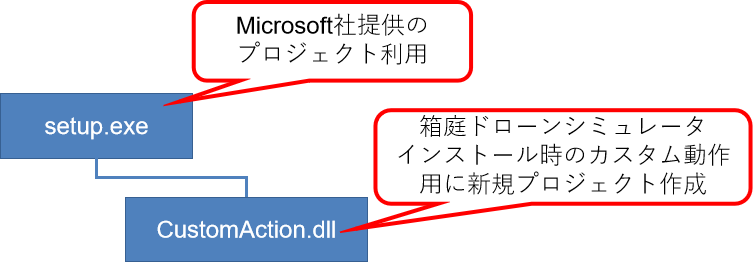

## 3.2. Microsoft Visual Studio Installer Project 2022の導入 

Visual Studio 2022 Community版を起動します。コードなしで続行をクリックして、Visual Studioを起動します。

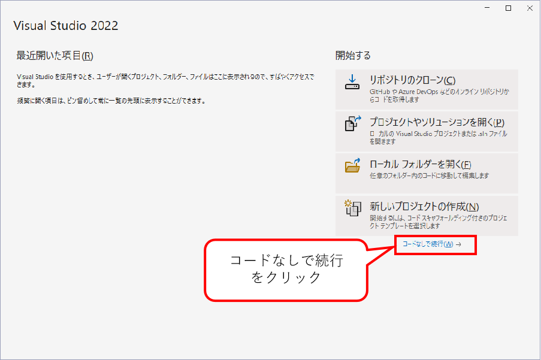

Visual Studioが起動したら、拡張メニュー→拡張機能の管理をクリックします。

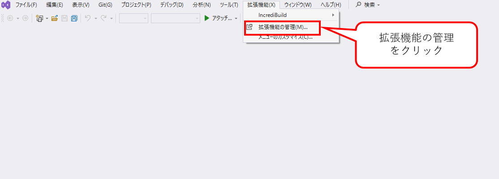

拡張機能の管理画面が起動したら、左上のボックスに`install`と入力して、Microsoft Visual Studio Installer Projectを検索します。
画面にMicrosoft Visual Studio Installer Projectが出てきたら、インストールをクリックして、インストールを行います。

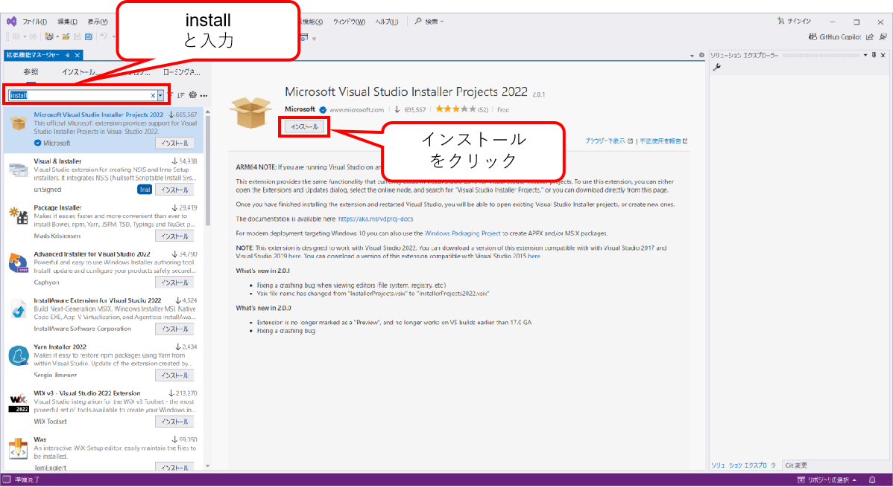

Microsoft Visual Studio Installer Projectのインストール画面が出てくるので、`Modify`をクリックして、インストールを開始します。インストールが完了するまで待ちます。

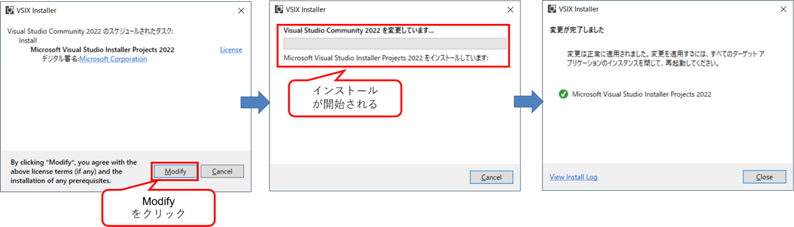

インストールが完了したら、一度、Visual Studioを終了します。

## 3.3. Setup Projectの作成

Visual Studioを起動し、新しいプロジェクトを作成をクリックします。

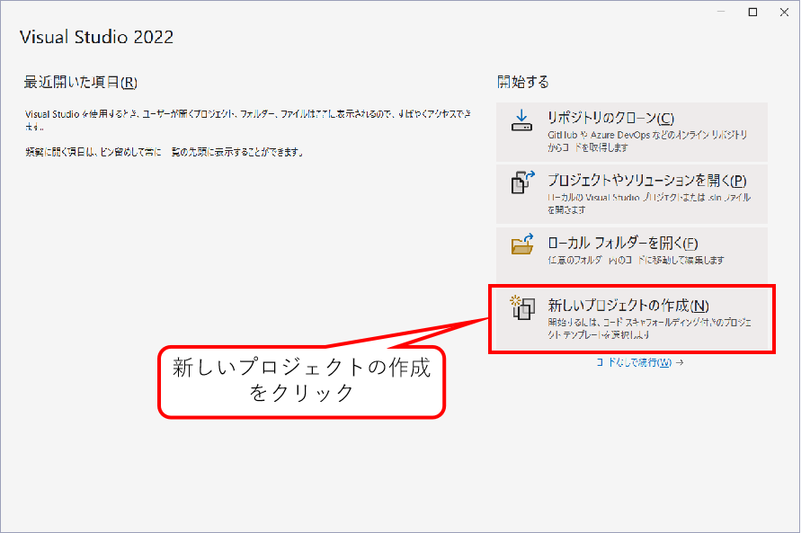


プロジェクト作成画面が起動したら、プロジェクト作成画面でSetup Projectを検索して選択します。

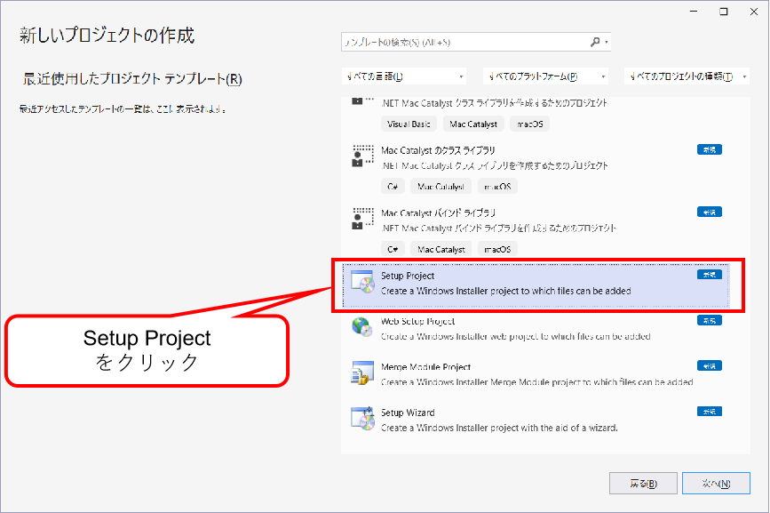


Setup Projectを選択するとプロジェクト名を入力して、Visual Studioを起動します。ここでは、プロジェクト名は、`hakowin`としています。

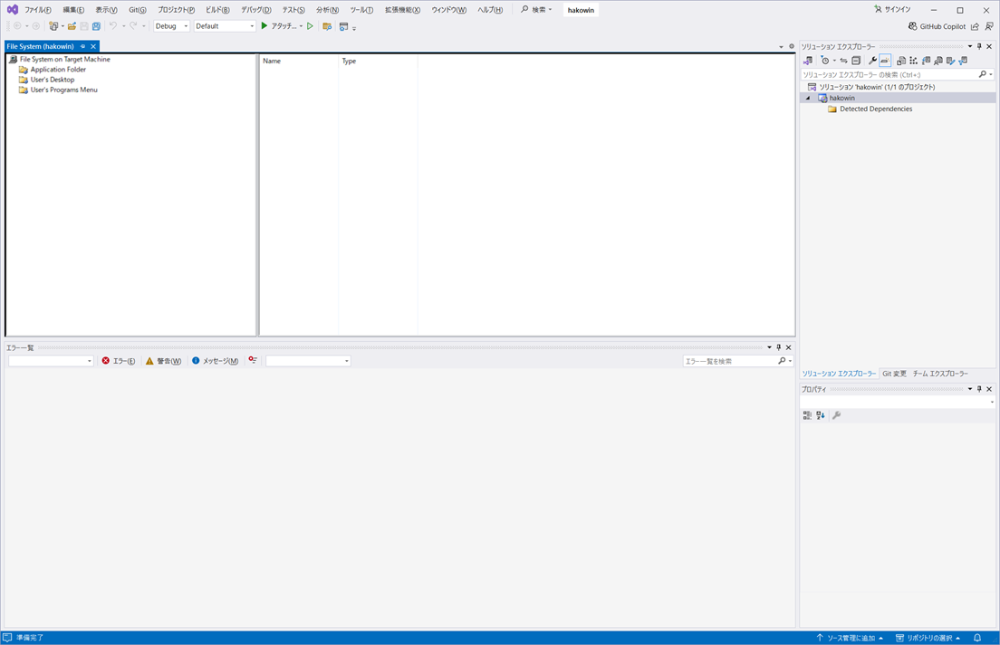


## 3.4. インストーラのカスタム動作ついて

Setup Projectは、単純にパッケージ化したソフトウェアをインストールする機能のみで、環境変数の設定や、コンフィグ選択などのカスタム動作ができないため、カスタム動作ができるように機能を追加する必要があります。

### 3.4.1. カスタム動作のプロジェクト作成

ソリューションメニューの一番上のソリューション名を右クリックします。右クリックして、追加→新規プロジェクトをクリックして、新しいプロジェクトを作成します。

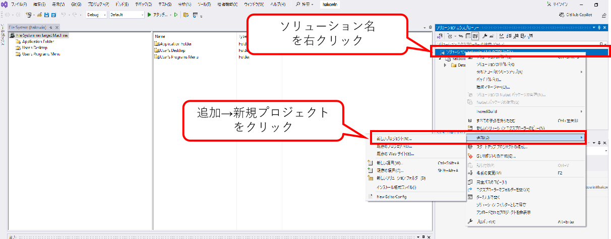

新規プロジェクト追加画面が起動したら、`クラス ライブラリ(.NET Framework)`を検索して、次へをクリックします。ここでは、プロジェクト名を`CustomAction`としてプロジェクトを作成しています。このプロジェクトは、setup.exeから呼び出されるdll形式として作成されます。

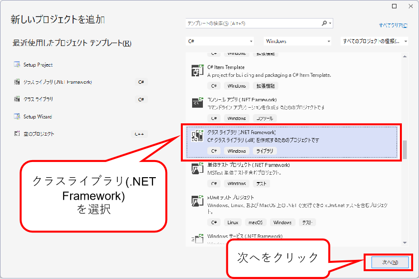

これでカスタム動作用のプロジェクトが追加されました。

### 3.4.2. カスタム動作のプログラムコードの追加

出来上がったカスタム動作用のプロジェクトにインストーラに必要なカスタム動作を追加します。
作成したカスタム動作用のプロジェクトのソリューションエクスプローラの参照部分を右クリックして、参照の追加をクリックします。

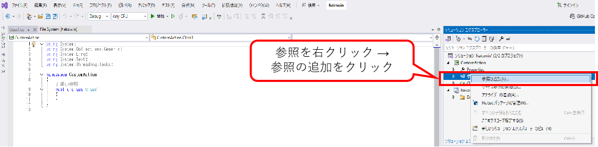

参照の追加画面が起動するの、`System.Configuration.Install`と`System.Windows.Forms`のチェックボックスを押下して、OKをクリックします。

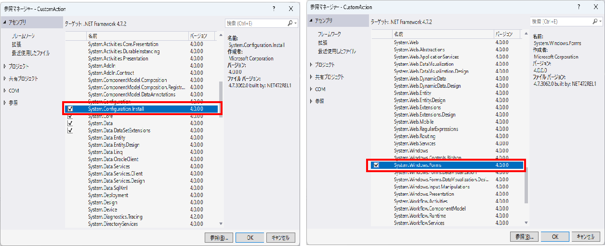

ソリューションエクスプローラにて、追加したプロジェクトのプロジェクト名を右クリックして、追加→クラスを選択します。

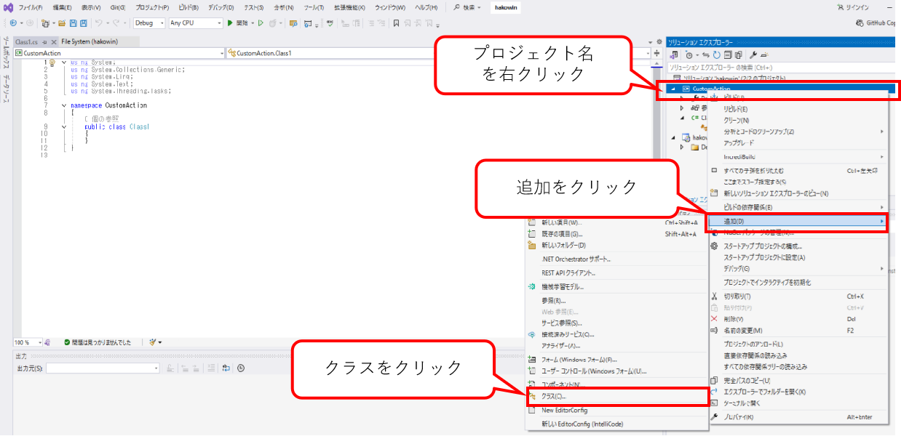

クラスの選択画面が出てきたら、インストーラクラスを探して、選択します。選択後に追加をクリックして、インストーラクラスを追加します。

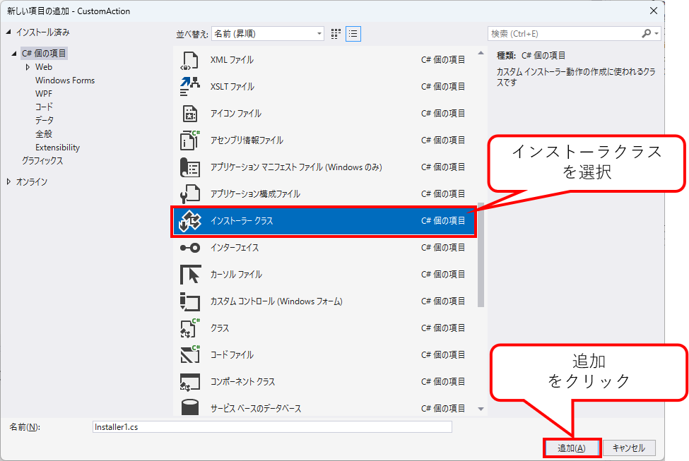

### 3.4.3. カスタム動作の登録

メイン画面のFile Systemタブをクリックして、カスタム動作用のプロジェクトを登録します。Application Folderを右クリックして、Add→プロジェクト出力をクリックします。

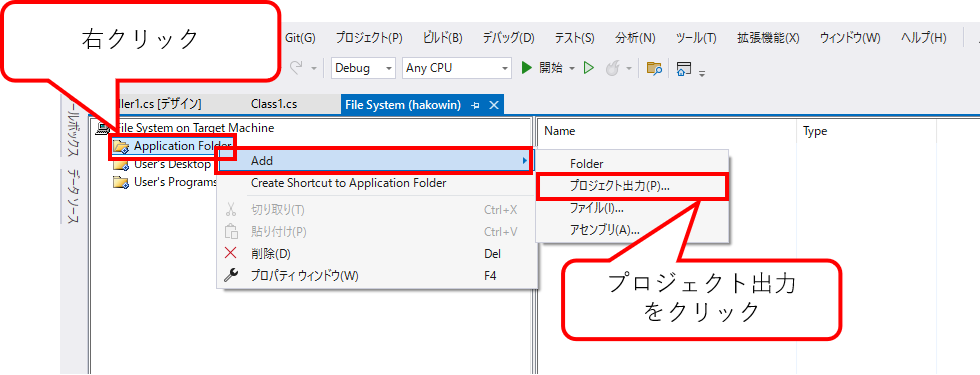


プロジェクト出力グループの追加の画面が出てきたら、プロジェクト名を確認して出力したいプロジェクト名を選択します。プライマリ出力を選択し、構成をアクティブを選択します。

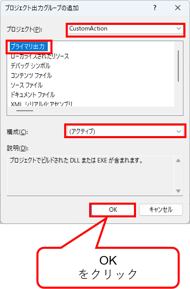

ここまでの操作で、Application Folderに追加することで、インストーラのカスタム動作が登録されました。

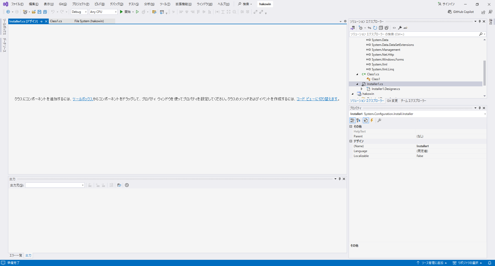

ソリューションエクスプローラのInstller.csとなっている部分を右クリックして、コードの表示をクリックすると、カスタム動作用のプログラムコードが表示されます。ここまでの操作ではデフォルトのプログラムコードとなっているため、インストールに必要なカスタム用のプログラムコードはない状態となっています。

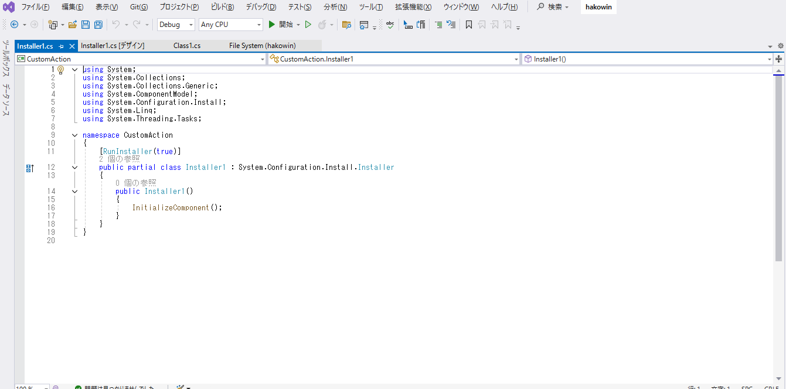

### 3.4.4. Setup Projectへのカスタム動作登録

ここまでの操作で、インストーラのカスタム動作用のプロジェクトの登録ができました。ここからは、実際にインストーラでのカスタム動作をさせるためのアクションを登録します。

ソリューションエクスプローラのSetup Projectで登録したプロジェクトに戻って、右クリックして、View→カスタム動作をクリックします。

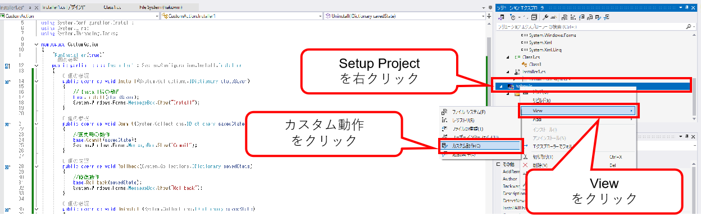

Custom Actionsのタブが表示されます。Installの部分を右クリックして、カスタム動作の追加をクリックします。

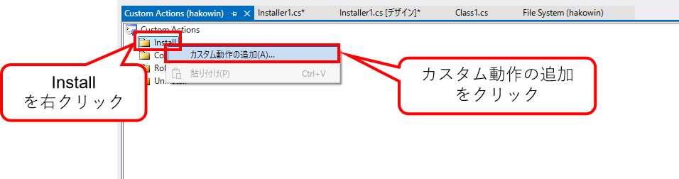

Select Item in Projectの画面が出てくるので、Application Folderをダブルクリックして、Application Folderに登録されているカスタム動作 from CustomActionを選択して、Add Fileをクリックして登録します。

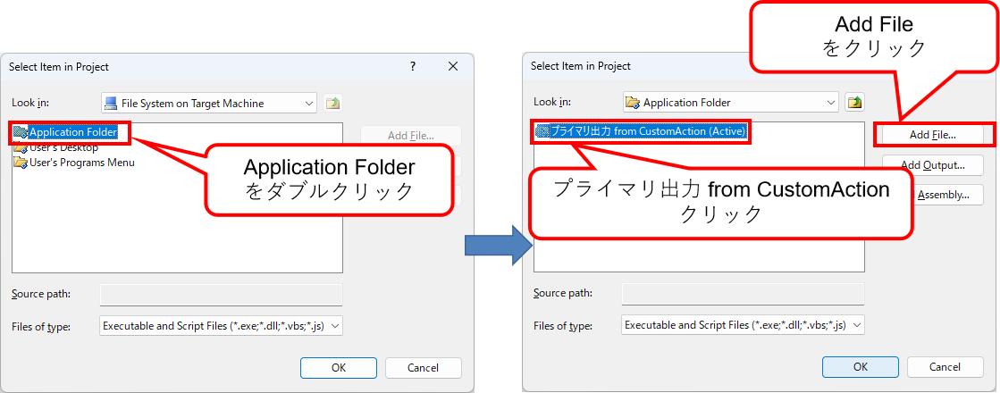

同じ動作をUninstallにも行って、カスタム動作がInstallとUninstallに登録されていることを確認します。

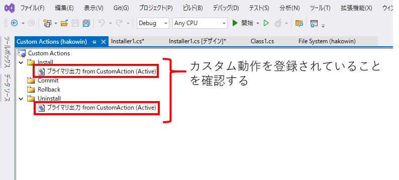


## 3.5. カスタム動作用のプログラムについて

デフォルトで追加したインストーラクラスでは、何もないコードになっています。カスタム動作については、Install(インストール)、Commit(変更)、Rollback(インストール失敗)、Uninstall(アンインストール)それぞれのカスタムアクションに応じたプログラムを追加する必要があります。

### 3.5.1. カスタム動作のサンプルコード

Install(インストール)、Commit(変更)、Rollback(インストール失敗)、Uninstall(アンインストール)のサンプルコードは以下のようになります。

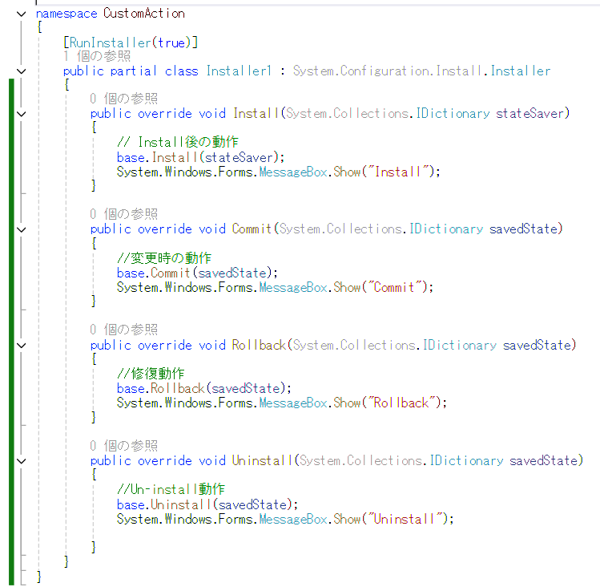

```C#
using System;
using System.Collections;
using System.Collections.Generic;
using System.ComponentModel;
using System.Configuration.Install;
using System.Linq;
using System.Threading.Tasks;

namespace CustomAction
{
    [RunInstaller(true)]
    public partial class Installer1 : System.Configuration.Install.Installer
    {
        // インストール時の動作関数
        public override void Install(System.Collections.IDictionary stateSaver)
        {
            // Install後の動作
            base.Install(stateSaver);
#if DEBUG
            System.Windows.Forms.MessageBox.Show("Install");
#endif
       }

       // インストールの状態を変更する動作関数
       public override void Commit(System.Collections.IDictionary savedState)
       {
           //変更時の動作
           base.Commit(savedState);
#if DEBUG
           System.Windows.Forms.MessageBox.Show("Commit");
#endif
       }

       // インストール失敗時の修復動作関数
       public override void Rollback(System.Collections.IDictionary savedState)
       {
           //修復動作
           base.Rollback(savedState);
#if DEBUG
           System.Windows.Forms.MessageBox.Show("Rollback");
#endif
       }

       // アンインストール時の動作関数
       public override void Uninstall(System.Collections.IDictionary savedState)
       {
           //Un-install動作
           base.Uninstall(savedState);
#if DEBUG
           System.Windows.Forms.MessageBox.Show("Uninstall");
#endif
       }
    }
}
```

### 3.5.2. カスタム動作のデバッグ

Visual Studioのデバッグ動作が利用できないため、MessageBoxを使ったデバッグを行うことになります。Visual Studioのデバッグ用ビルドのみで動作するように、`#if DEBUG ～ #endif`でMessageBoxのコードを括り、デバッグ用ビルド時のみで利用するようにすることができます。

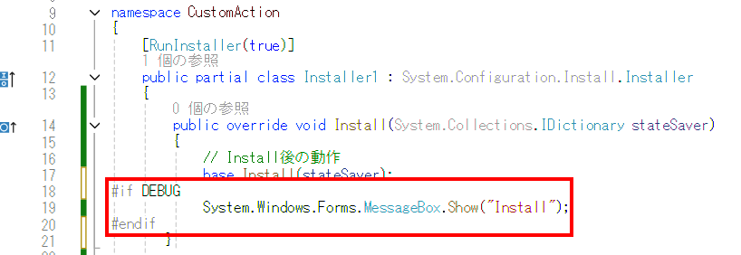

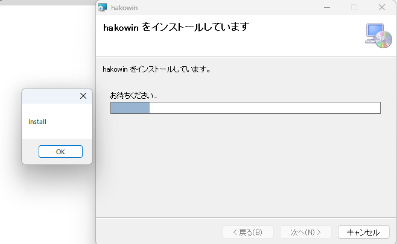

## 3.6. 箱庭ドローンシミュレータ用のインストーラプログラムについて

箱庭ドローンシミュレータ用のインストーラでは、インストール時、アンインストール時のみにカスタム動作をするようなコードになっています。
以下のコードは、`クラス ライブラリ(.NET Framework)`にて追加したプロジェクト`CustomAction`で利用されるプログラムコードになります。動作は、CustomAction.dll内で動作する形になります。


```C#
using System;
using System.Collections;
using System.Collections.Generic;
using System.ComponentModel;
using System.Configuration.Install;
using System.IO;
using System.Linq;
using System.Security.Cryptography;
using System.Threading.Tasks;

namespace CustomAction
{
    [RunInstaller(true)]
    public partial class Installer1 : System.Configuration.Install.Installer
    {
        public override void Install(System.Collections.IDictionary stateSaver)
        {
            // Install後の動作
            base.Install(stateSaver);

            // 環境変数PATHの追加
            string currentPath;
            currentPath = System.Environment.GetEnvironmentVariable("path", System.EnvironmentVariableTarget.User);
            string installPath = this.Context.Parameters["InstallPath"];
            string path = installPath + @"\hakoniwa-px4-win\bin;";
          
            if (currentPath == null)
            {
                currentPath = path;
            }
            else if (currentPath.EndsWith(";"))
            {
                currentPath += path;
            }
            else
            {
                currentPath += ";"+path;
            }

            // 環境変数PATHを設定する
            System.Environment.SetEnvironmentVariable("path", currentPath, System.EnvironmentVariableTarget.User);

            //hakoniwa windows HAKO_BINARY_PATHの設定
            string binpath = installPath + @"\hakoniwa-px4-win\hakoniwa\py\hako_binary\offset";
            System.Environment.SetEnvironmentVariable("HAKO_BINARY_PATH", binpath, System.EnvironmentVariableTarget.User);
#if DEBUG
            System.Windows.Forms.MessageBox.Show(currentPath);
            System.Windows.Forms.MessageBox.Show(path);
            System.Windows.Forms.MessageBox.Show(binpath);
#endif
            //hakoniwa windows HAKO_CONFIG_PATHの設定
            int hako_config = int.Parse(this.Context.Parameters["hakoconfig"]);
            string configpath ;

            if (hako_config == 1)
            {
                configpath = installPath + @"\hakoniwa-px4-win\hakoniwa\config\cpp_core_config.json";
            }
            else if (hako_config == 2)
            {
                configpath = installPath + @"\hakoniwa-px4-win\hakoniwa\config_api\cpp_core_config.json";
            }
            else if (hako_config == 3)
            {
                configpath = installPath + @"\hakoniwa-px4-win\hakoniwa\config_api2\cpp_core_config.json";
            }
            else
            {
                configpath = installPath + @"Error config mode!!";
            }
#if DEBUG
            System.Windows.Forms.MessageBox.Show(configpath);
#endif


            System.Environment.SetEnvironmentVariable("HAKO_CONFIG_PATH", configpath, System.EnvironmentVariableTarget.User);
#if DEBUG
            System.Windows.Forms.MessageBox.Show(configpath);
#endif
            // PYTHONPATHの設定
            string pythonPath;

            pythonPath = System.Environment.GetEnvironmentVariable("PYTHONPATH", System.EnvironmentVariableTarget.User);
            string hakopypath = installPath + @"\hakoniwa-px4-win\hakoniwa\py;";
#if DEBUG
            System.Windows.Forms.MessageBox.Show(hakopypath);
#endif
            if (pythonPath == null)
            {
                pythonPath = hakopypath;
            }
            else if (pythonPath.EndsWith(";"))
            {
                pythonPath += hakopypath;
            }
            else
            {
                pythonPath += ";" + hakopypath;
            }

            // 環境変数PATHを設定する
            System.Environment.SetEnvironmentVariable("PYTHONPATH", pythonPath, System.EnvironmentVariableTarget.User);
#if DEBUG
            System.Windows.Forms.MessageBox.Show(pythonPath);
#endif
        }

        //public override void Commit(System.Collections.IDictionary savedState)
        //{
        //    //コミット動作
        //    base.Commit(savedState);
        //    System.Windows.Forms.MessageBox.Show(“Commit”);
        //}

        //public override void Rollback(System.Collections.IDictionary savedState)
        //{
        //    //失敗時のロールバック動作
        //    base.Rollback(savedState);
        //    System.Windows.Forms.MessageBox.Show(“Rollback”);
        //}

        public override void Uninstall(System.Collections.IDictionary savedState)
        {
            //Un-install動作
            base.Uninstall(savedState);
            
            // 環境変数PATHを編集
            string currentPath;
            currentPath = System.Environment.GetEnvironmentVariable("path", System.EnvironmentVariableTarget.User);
            string installPath = this.Context.Parameters["InstallPath"];
            string path = installPath + @"\hakoniwa-px4-win\bin;";
            currentPath = currentPath.Replace(path, "");
            
            // 環境変数PATHから削除する
            System.Environment.SetEnvironmentVariable("path", currentPath, System.EnvironmentVariableTarget.User);
#if DEBUG
            System.Windows.Forms.MessageBox.Show(currentPath);
            System.Windows.Forms.MessageBox.Show(path);
#endif
            // PYTHONPATHから箱庭関連を消す
            string pythonPath = System.Environment.GetEnvironmentVariable("PYTHONPATH", System.EnvironmentVariableTarget.User);
            string hakopypath = installPath + @"\hakoniwa-px4-win\hakoniwa\py;";
            pythonPath = pythonPath.Replace(hakopypath, "");
#if DEBUG
            System.Windows.Forms.MessageBox.Show(hakopypath);
#endif
            // PYTHONPATHから箱庭関連を削除
            System.Environment.SetEnvironmentVariable("PYTHONPATH", pythonPath, System.EnvironmentVariableTarget.User);
#if DEBUG
            System.Windows.Forms.MessageBox.Show(pythonPath);
            System.Windows.Forms.MessageBox.Show(hakopypath);
#endif
            // hakoniwa関連のPATHを削除する
            System.Environment.SetEnvironmentVariable("HAKO_BINARY_PATH", "", System.EnvironmentVariableTarget.User);
            System.Environment.SetEnvironmentVariable("HAKO_CONFIG_PATH", "", System.EnvironmentVariableTarget.User);
        }
    }
}
```

## 3.7. 箱庭ドローンシミュレータ用の各プロジェクトのカスタマイズ箇所について

標準的に作成されたSetup Projctから、箱庭ドローンシミュレータ用のインストーラに必要になるカスタマイズ箇所について解説します。

### 3.7.1. 箱庭ドローンシミュレータのパッケージ追加

Setup Projectで配布するパッケージを追加する必要があります。箱庭ドローンシミュレータのWindows版のリリース手順に従って、Windows用の箱庭ドローンシミュレータのパッケージを作成します。

[箱庭ドローンシミュレータのWindowsパッケージ作成手順](https://github.com/toppers/hakoniwa-px4sim/tree/main/tools/win)

Windows用の箱庭ドローンシミュレータのパッケージを作成できたら、Setup Projectに追加します。Windows用の箱庭ドローンシミュレータのパッケージのフォルダをドラック＆ドロップで、Application Folderに追加します。

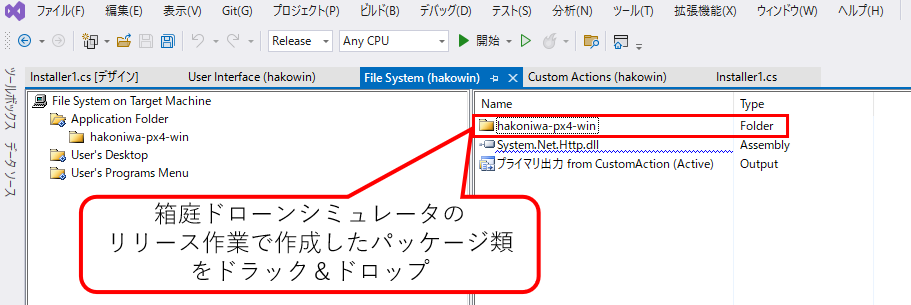


### 3.7.2. Setup Projectのプロパティ情報

Setup Projectで作成したプロジェクトのプロパティを変更します。Setup Projectで作成したプロジェクトをクリックするとプロパティウィンドウに内容が表示されます。
プロパティウィンドでの変更箇所は、以下の図の赤枠部分となります。

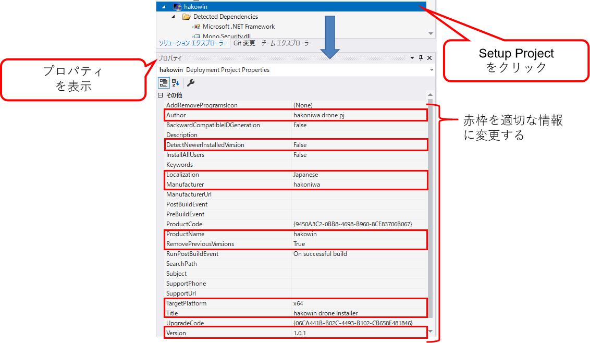

|No|プロパティ名|概要|変更内容|
|:---|:---|:---|:---|
|1|Author|著者|hakoniwa drone pj|
|2|DetectNewerInstalledVersion|上書きインストール可否|False|
|3|Localization|場所|Japanese|
|4|Manufacturer|製造者|hakoniwa|
|5|ProductName|製品名|hakowin|
|6|RemovePrebiousVersion|古いVersion削除可否|True|
|7|TargetPlatform|ターゲットアーキテクチャ|x64|
|8|Title|プログラムタイトル|hakowin drone Installer|
|9|Version|バージョン|1.0.1|

Versionは、リリース毎に変更するのを忘れないようにしてください。Versionが一緒だと上書きでのインストールができない場合があります。


### 3.7.3. 箱庭ドローンシミュレータ用のコンフィグ指定

箱庭ドローンシミュレータでは、複数のコンフィグファイルを利用するため、インストール時にコンフィグを変更できるようにしてあります。

User Interfaceのタブをクリックして、Startを右クリックして、ダイアログを追加をクリックします。Add Dialogの画面が出てきますので、オプションボタン(3)をクリックしてOKボタンをクリックします。

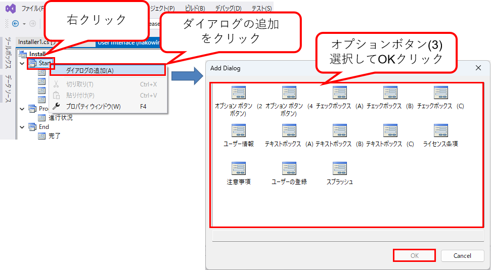

ダイアログを追加したら、インストールの手順で適切な場所に移動します。

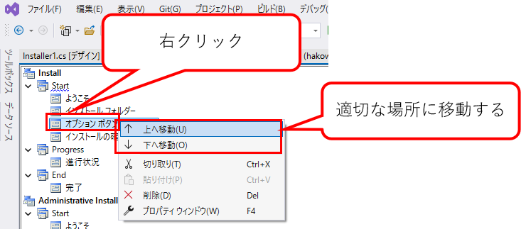

ダイアログのインストール順序場所に移動できたら、プロパティを変更します。オプションボタン (3ボタン)をクリックすると、プロパティウィンドにプロパティが表示されるので、内容を変更します。

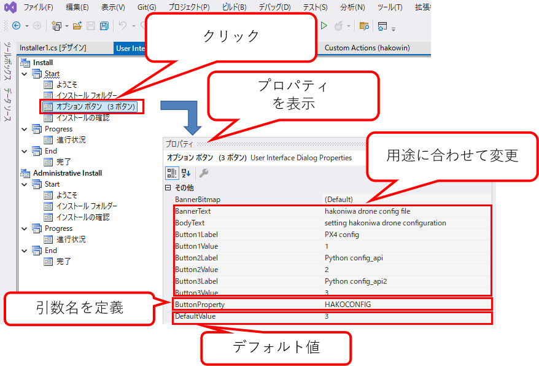

|No|プロパティ名|概要|変更内容|
|:---|:---|:---|:---|
|1|BannerText|ダイアログに表示するバナー内容|hakoniwa drone config file|
|2|BodyText|ダイアログの説明|setting hakoniwa drone configuration|
|3|Button1Label|ラジオボタン1のラベル名|PX4 config|
|4|Button1Value|ラジオボタン1の値|1|
|5|Button2Label|ラジオボタン2のラベル名|Python config_api|
|6|Button2Value|ラジオボタン2の値|2|
|7|Button3Label|ラジオボタン3のラベル名|Python config_api2|
|8|Button3Value|ラジオボタン3の値|3|
|9|ButtonProperty|カスタム動作に渡す引数名|HAKOCONFIG|
|10|DefaultValue|ラジオボタンのデフォルト値|3|

### 3.7.4. プライマリ出力 from CustomActionのプロパティ

Custom Actionsのタブにある、プライマリ出力 from CustomActionのプロパティを変更します。プライマリ出力 from CustomActionをクリックするとプロパティウィンドに内容が表示されます。

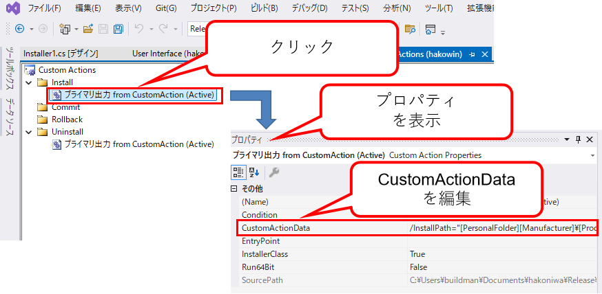

ここで重要になるのが、CustomActionDataのプロパティ値になります。CustomActionDataは、setup.exe→CustomAction.dllに対する引数となります。dll側に渡したい内容を記載することで、カスタム動作を拡張することができます。

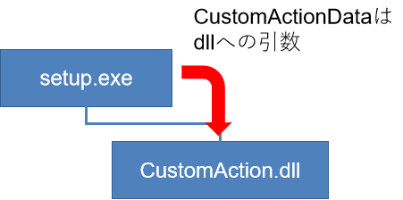


CustomActionDataは、文法があり、以下のように記載する必要があります。

```txt
/”引数名”=”引数内容”
```

実際には、以下のように記載します。

- CustomActionDataの記述内容
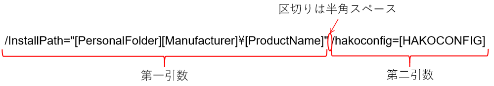

上記の例では、第一引数で、/InstallPathに、インストール先のフォルダ名を指定しており、第二引数では、/hakoconfigにHAKOCONFIGの内容指定してます。InstallPathは、Setup Projectで配布するパッケージのインストール先のパスを指定しています。HAKOCONFIGは、箱庭ドローンシミュレータ用のコンフィグ指定で追加したダイアログからの値取れるように指定をしています。

InstallPathに指定できる値は、以下のMicrosoft社で公開されているプロパティリファレンスのシステムフォルダーのプロパティで定義されている値を指定することができます。

[Microsoft社 プロパティリファレンス](https://learn.microsoft.com/ja-jp/windows/win32/msi/property-reference?redirectedfrom=MSDN)

実際のコードでは、以下のようにカスタム動作で受け取ることができるようになります。

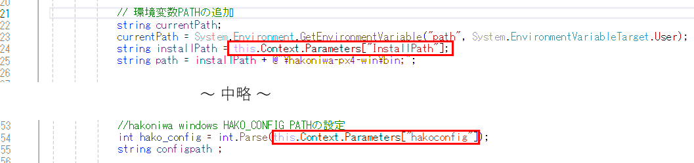

this.Context.Parameters[]の[]内に、/”引数名”で指定した引数名を指定すると指定した引数内容が受け取れるようになります。
