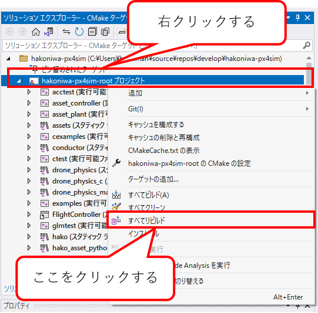

# これは何？

このドキュメントは、ネイティブWindows向けの箱庭ドローンシミュレータのリリースファイル(hakoniwa-px4-win.zip)を作成する方法を説明します。

リリースファイルの作成手順は以下のとおりです。

1. [箱庭ドローンシミュレータ準備編](https://www.jasa.or.jp/dl/tech/drone_simulator_pre-installation_version.pdf)を参照して必要なツール類をインストールします。
2. [箱庭ドローンシミュレータのリポジトリの準備](#箱庭ドローンシミュレータのリポジトリの準備)
3. [hakoniwa-px4simのビルド](#hakoniwa-px4simのビルド)
4. [Unityアプリケーションの作成](#unityアプリケーションの作成)
5. [リリースファイルの作成](#リリースファイルの作成)

# 箱庭ドローンシミュレータのリポジトリの準備

WSL2のUbuntuを起動します。Ubuntuが起動したら、Windowsのドライブ上(本説明ではEドライブとします)で、作業⽤のディレクトリを作成して、箱庭ドローンシミュレータのソースコードをGitHubから⼊⼿します。

* [hakoniwa-px4sim](https://github.com/toppers/hakoniwa-px4sim)
* [hakoniwa-unity-drone-model](https://github.com/toppers/hakoniwa-unity-drone-model)

作成例（同じ階層に作成してください）：
```
ls /mnt/e/project
hakoniwa-px4sim
hakoniwa-unity-drone-model
```

## hakoniwa-px4simのクローン

```
git clone --recursive https://github.com/toppers/hakoniwa-px4sim.git
```

## hakoniwa-unity-drone-modelのクローン

```
git clone --recursive https://github.com/toppers/hakoniwa-unity-drone-model.git
```

# hakoniwa-px4simのビルド

Visual Studio を起動して、`Open a local folder`を選択し、hakoniwa-px4simを開きます。


成功するとこうなります。


ビルドする際には、`x64-Release`としてください。


メニューのBuild/Build All をクリック。



成功すると、以下のディレクトリが作成され、さまざまなexeやdllファイルが作成されます。

```
out/build/x64-Release/
```

# Unityアプリケーションの作成

WSL2 で、hakoniwa-unity-drone-modelのディレクトリへ移動し、インストールツールを実行します。

```
bash install.bash win
```


この状態で Unity Hub で当該プロジェクトを開きましょう。

注意：Unityエディタは、当該CPUアーキテクチャに対応したものをインストールしてご利用ください。

対象フォルダ：hakoniwa-unity-drone-model\plugin\plugin-srcs

Unityのバージョン違いに起因するメッセージ（"Opening Project in Non-Matching Editor Installation"）が出る場合は、「Continue」として問題ありません。

以下のダイアログが出ますが、`Continue` してください。


次に、以下のダイアログが出ますので、`Ignore` してください。


成功するとこうなります。


起動直後の状態ですと、コンソール上にたくさんエラーが出ています。原因は以下の２点です。
リンク先を参照して、順番に対応してください。

* [Newtonsoft.Json が不足している](https://github.com/toppers/hakoniwa-document/tree/main/troubleshooting/unity#unity%E8%B5%B7%E5%8B%95%E6%99%82%E3%81%ABnewtonsoftjson%E3%81%8C%E3%81%AA%E3%81%84%E3%81%A8%E3%81%84%E3%81%86%E3%82%A8%E3%83%A9%E3%83%BC%E3%81%8C%E5%87%BA%E3%82%8B)
* [gRPC のライブラリ利用箇所がエラー出力している](https://github.com/toppers/hakoniwa-document/blob/main/troubleshooting/unity/README.md#grpc-%E3%81%AE%E3%83%A9%E3%82%A4%E3%83%96%E3%83%A9%E3%83%AA%E5%88%A9%E7%94%A8%E7%AE%87%E6%89%80%E3%81%8C%E3%82%A8%E3%83%A9%E3%83%BC%E5%87%BA%E5%8A%9B%E3%81%97%E3%81%A6%E3%81%84%E3%82%8B)(Mac版のみ)


エラーが消えたら、下図のように、Unity のシーン（`Assets/Scenes/ApiDemo`）をダブルクリックします。


ここまで出来たら、あとは、箱庭のUnityアプリケーション作成します。以下の手順です。

1. Unity の Editor/Project Settings/Quality でアプリケーションの設定をする
2. Unity の Editor/Project Settings/Player でアプリケーションの設定をする
3. Unity アプリケーションをビルドする
4. 箱庭の各種設定ファイルをコピーする

## 前提

事前に、Unityエディタの箱庭シーンから、箱庭のコンフィグファイルを `Generate` してください。

Generateすると、`plugin-srcs` 直下に、以下のファイルが出力されます。

```
HakoniwaSimTime.json
LoginRobot.json
RosTopics.json
core_config.json
custom.json
hakoniwa_path.json
inside_assets.json
pdu_channel_connector.json
pdu_configs.json
pdu_readers.json
pdu_writers.json
reader_connector.json
rpc_methods.json
shm_methods.json
writer_connector.json
```

## Unity の Editor/Project Settings/Quality でアプリケーションの設定をする

Quality の設定は、デフォルトですと、`Ultra` になっています。


パソコンの性能が気になる方は、`Very Low` だけ残して、その他は削除することをお勧めします。


## Unity の Editor/Project Settings/Player でアプリケーションの設定をする

Player の設定は、デフォルトですと、下図のようになっています。


以下の項目を変更しましょう。

* Fullscreen Mode
  * Windowed に変更して、Width と Height をお好みの値にしてください。
    * ここでは、1024x640 にします。 
* Resizable Window
  * この項目をチェックすることで、Windowサイズを調整できるようになります。


## Unity アプリケーションをビルドする

File/Build Settings を開き、Add Open Scenes でアプリケーション化したいシーンを選択します。

デフォルトですと、TB3Workが選択されていますので、削除して、ApiDemoを選択します。

その後、Build ボタンをクリックします。

下図のようにダイアログがポップアップされますので、ビルドした結果を格納するディレクトリを選択します。ディレクトリ名は、DroneAppWinとしてください。

成功すると、下図のようにアプリケーションの実行ファイルが生成されます。


## 箱庭の各種設定ファイルをコピーする

前提とする操作で `Generate` した各種設定ファイル（jsonファイル）一式を、ビルドした結果を格納しているディレクトリにコピー配置しましょう。

次に、`plugin-srcs` 配下にある `ros_types` ディレクトリを同様にコピー配置しましょう。


# リリースファイルの作成

WSLで、hakoniwa-px4simのディレクトリに移動します。

ここで、リリーリスファイルの作成先は、Eドライブ(`/mnt/e`)直下に配置する前提で説明します。

以下のコマンドを実行して、リリースファイルを作成します。

```
bash tools/win/create_release.bash  /mnt/e out ../ha
koniwa-unity-drone-model/DroneAppWin
```

成功すると、以下のファイルが作成されます。

```
$ ls /mnt/e/hakoniwa-px4-win
README-ja.txt  README.txt  hakoniwa
```

