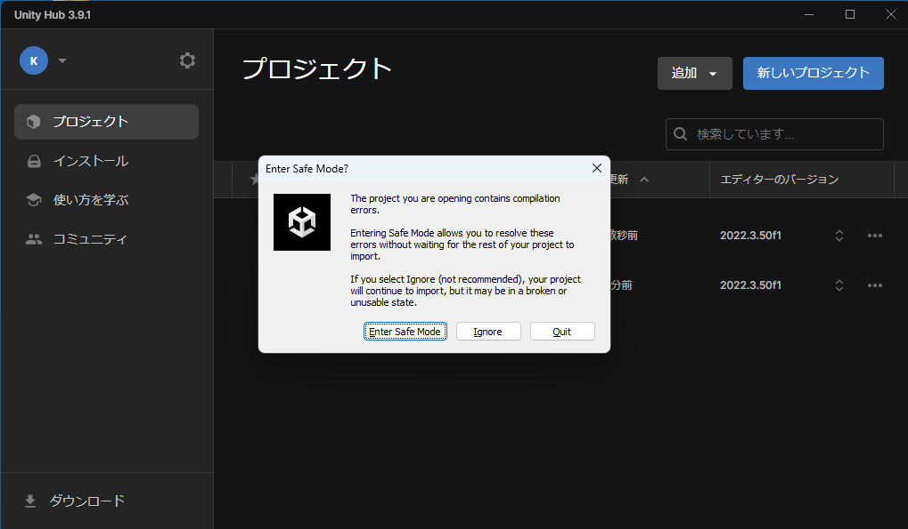

# Windows環境のリリース手順

このドキュメントは、Windows向けの箱庭ドローンシミュレータのリリースファイル(hakoniwa-px4-win)を作成する手順んとなります。

リリースファイルの作成手順は以下のとおりです。

1. [箱庭ドローンシミュレータ準備編](https://www.jasa.or.jp/dl/tech/drone_simulator_pre-installation_version.pdf)を参照して必要なツール類をインストールします。
2. [箱庭ドローンシミュレータのリポジトリの準備](#箱庭ドローンシミュレータのリポジトリの準備)
3. [hakoniwa-px4simのビルド](#hakoniwa-px4simのビルド)
4. [Unityアプリケーションの作成](#unityアプリケーションの作成)
5. [リリースファイルの作成](#リリースファイルの作成)

# 箱庭ドローンシミュレータのリポジトリの準備

WSL2のUbuntuを起動します。Ubuntuが起動したら、Windowsのドライブ上(本説明ではEドライブとします)で、作業⽤のディレクトリを作成して、箱庭ドローンシミュレータのソースコードをGitHubから⼊⼿します。

* [hakoniwa-px4sim](https://github.com/toppers/hakoniwa-px4sim)
* [hakoniwa-unity-drone-model](https://github.com/toppers/hakoniwa-unity-drone-model)

作成例（同じ階層に作成してください）：

```bash
$ ls /mnt/e/project
hakoniwa-px4sim hakoniwa-unity-drone-model
```

## hakoniwa-px4simのクローン

```bash
$ git clone --recursive https://github.com/toppers/hakoniwa-px4sim.git
```

## hakoniwa-unity-drone-modelのクローン

```bash
$ git clone --recursive https://github.com/toppers/hakoniwa-unity-drone-model.git
```

# hakoniwa-px4simのCMakeビルド

CMakeのビルドをするためにx64-Releaseの構成を追加する必要があります。クローンしたhakoniwa-px4simディレクトリにある`tools\win`ディレクトリの`CMakeSettings.json`をhakoniwa-px4simディレクトリ直下にコピーします。


# hakoniwa-px4simのCMakeビルド

Visual Studio2022 Community版を起動して、`Open a local folder`を選択し、hakoniwa-px4simを開きます。


正常に開くと以下のような画面が出ます。


ビルドを開始するためにソリューションエクスプローラの`hakoniwa-px4sim`になっている部分を右クリックして、`Cmakeターゲットビューに切り替える`をクリックします。


構成情報の選択部分で、`x64-Release`を選択してください。


ソリューションエクスプローラの`hakoniwa-px4sim-rootプロジェクト`となっている部分を右クリックして、`すべてリビルド`をクリックします。


ビルドが完了すると、以下のhakoniwa-px4simの直下にoutディレクトリが作成され、さまざまなexeやdllファイルが作成されます。

```
out/build/x64-Release/
```

# Unityアプリケーションの作成

WSL2 で、hakoniwa-unity-drone-modelのディレクトリへ移動し、インストールツールを実行します。

```bash
$ cd hakoniwa-unity-drone-model
$ bash install.bash win
```


成功すると上記のような画面になります。


箱庭用の必要な環境がインストールできたら、Unity Hub で当該プロジェクトを開きます。

注意：Unityエディタは、当該CPUアーキテクチャに対応したものをインストールしてご利用ください。

```txt
当該プロジェクトのフォルダ：hakoniwa-unity-drone-model\plugin\plugin-srcs
```


プロジェクトが追加されると、以下のようになりますので、クリックしてプロジェクトを起動します。


プロジェクトの起動画面で、UnityのVersionが違う旨の警告が出ますので、インストールしているversionを選択して起動します。


Unityのバージョン違いに起因するメッセージ（"Opening Project in Non-Matching Editor Installation"）が出る場合は、「Continue」として問題ありません。

以下のダイアログが出ますが、`Continue` してください。


次に、Unityのバージョン違いにより、`Safe Mode`で開くか？のダイアログが出ますので、`Ignore` してください。




ダイアログを閉じて、ドローン用のシーンを開きます。`plugin→plugin-srcs→Assets→Seenes`のApiDemo.unityを開きます。


ドローン用のシーンを開くと、以下のような画面になります。


起動直後の状態ですと、コンソール上にたくさんエラーが出ています。原因は以下の２点になります。

リンク先を参照して、順番に対応してください。

* [Newtonsoft.Json が不足している](https://github.com/toppers/hakoniwa-document/tree/main/troubleshooting/unity#unity%E8%B5%B7%E5%8B%95%E6%99%82%E3%81%ABnewtonsoftjson%E3%81%8C%E3%81%AA%E3%81%84%E3%81%A8%E3%81%84%E3%81%86%E3%82%A8%E3%83%A9%E3%83%BC%E3%81%8C%E5%87%BA%E3%82%8B)

* [gRPC のライブラリ利用箇所がエラー出力している](https://github.com/toppers/hakoniwa-document/blob/main/troubleshooting/unity/README.md#grpc-%E3%81%AE%E3%83%A9%E3%82%A4%E3%83%96%E3%83%A9%E3%83%AA%E5%88%A9%E7%94%A8%E7%AE%87%E6%89%80%E3%81%8C%E3%82%A8%E3%83%A9%E3%83%BC%E5%87%BA%E5%8A%9B%E3%81%97%E3%81%A6%E3%81%84%E3%82%8B)


gRPC設定をしないとエラーが消えないので必ず対応するようにしてください。


エラーが消えたら、箱庭のUnityアプリケーション作成します。

下記が手順となります。

1. Unity の Editor/Project Settings/Quality でアプリケーションの設定をする
2. Unity の Editor/Project Settings/Player でアプリケーションの設定をする
3. Unity アプリケーションをビルドする
4. 箱庭の各種設定ファイルをコピーする

## 前提

最初に、Unityエディタの箱庭シーンから、箱庭のコンフィグファイルを `Generate` します。Unityメニューの`Window`→`hakoniwa`→`generate`をクリックします。


Generateすると、`plugin-srcs` 直下に、以下のファイルが出力されます。

```jsonファイル
HakoniwaSimTime.json
custom.json
lidar2d_spec.json
pdu_readers.json
shm_methods.json
LoginRobot.json
drone_config.json
lidar2d_tb3_spec.json
pdu_writers.json
writer_connector.json
RosTopics.json
hakoniwa_path.json
pdu_channel_connector.json
reader_connector.json
core_config.json
inside_assets.json
pdu_configs.json
rpc_methods.json
```

## UnityのQualityでUnityアプリケーションの画像品質を設定

Unityのメニューから、`Editor`→`Project Settings`→`Quality`を選択します。
Qualityの設定は、デフォルトですと、`Ultra` になっています。


パソコンの性能が気になる方は、`Very Low` だけ残して、その他は削除することをお勧めします。


## UnityのPlayerでアプリケーションの解像度を設定
Unityのメニューから`Editor`→`Project Settings`→`Player`→`Resolution and Presentation`を選択します。

Resolution and Presentationの設定は、デフォルトですと、下図のようになっています。


以下の項目を変更しましょう。

* Fullscreen Mode
  * Windowed に変更して、Width と Height をお好みの値にしてください。
    * ここでは、1024x640 にします。 
* Resizable Window
  * この項目をチェックすることで、Windowサイズを調整できるようになります。


## Unity アプリケーションをビルドする

Unityメニューの`File`→`Build Settings`を開きます。


デフォルトの状態ですと、TB3が選択されているので、選択してdelキーで削除します。


次に、Add Open Scenes でアプリケーション化したいシーンを選択します。今回はApiDemoを追加します。


Sceneが追加できたら、Build ボタンをクリックします。Buildボタンをクリックするとビルド結果を格納するためのダイアログがポップアップされます。右クリックして、新規フォルダ作成をして、DroneAppWinを作成して、選択します。


成功すると、下図のようにアプリケーションの実行ファイルが生成されます。


## 箱庭の各種設定ファイルをコピーする

前提とする操作で `Generate` した各種設定ファイル（jsonファイル）一式と`plugin-srcs` 配下にある `ros_types` ディレクトリをDronwAppWinディレクトリにコピーします。

```bash
$ hakoniwa-unity-drone-model/
$ bash update_configs_for_native.bash plugin/plugin-srcs/DroneAppWin/
```


# リリースファイルの作成

WSLで、hakoniwa-px4simのディレクトリに移動します。

```bash
$ cd hakoniwa-px4sim
```

ここで、Windows用のリリース環境は作成する場所を指定する必要がありまｓ。本ドキュメントでは、Cドライブ ユーザのドキュメントフォルダのReleaseに配置(`/mnt/c/Users/buildman/Documents/Release`)することを前提としています。

WSL上でリリース用のコマンドを実行して、リリース環境を作成します。

```bash
$ bash tools/win/create_release.bash /mnt/c/Users/buildman/Documents/Release out ../hakoniwa-unity-drone-model/plugin/plugin-srcs/DroneAppWin/
```

成功すると、以下のファイルが作成されます。

```bash
$ ls /mnt/c/Users/buildman/Documents/Release/hakoniwa-px4-win
README-ja.txt  README.txt  hakoniwa
```

